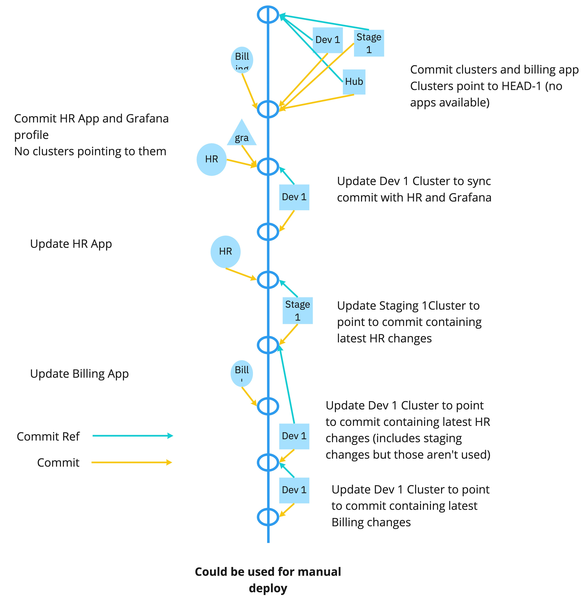
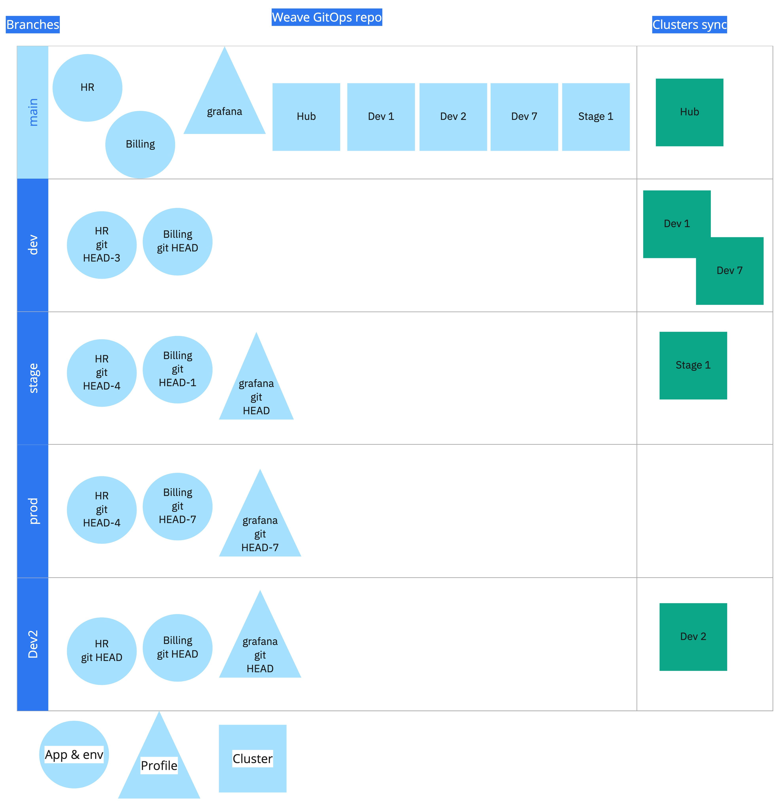

# 7. Directory Layout

Date: 2021-08-16

## Status

Accepted

## Context

The current [directory structure][wep-dir] introduces new terminology - "target", doesn't support environment customizations, doesn't provide a solution for application versions, lacks a solution for storing the GitOps Runtime (GORT), and creates a tight coupling between applications (apps) and clusters. 

Here is an example with a single application deployed to a kind cluster:
```bash
.wego/
├── apps
│   └── podinfo-deploy
│       └── app.yaml
└── targets
    └── kind-wego2
        └── podinfo-deploy
            └── podinfo-deploy-gitops-runtime.yaml
```
In this example, the cluster is kind-wego2 and has the podinfo-deploy application deployed to it.  When deploying to another cluster, another <cluster>/podinfo-deploy/ is created. Having this duplicated will be an issue as the number of clusters increases.  Also, this structure makes it cumbersome to specialize the podinfo-deploy application for multiple environments.  As the list of applications and clusters grows, this problem only gets worse.

This ADR describes the new layout to solve those issues plus provide support for profiles. 

While not covered in this ADR, the new structure is easier to parse programmatically.  A library will be developed to standardize the interaction with the structure.  i.e., we can abstract the directory and files to enable us to work with golang structs instead.

For this ADR, we are trying a new approach.  Instead of long prose describing the context, we have created an FAQ on how the updated directory structure addresses common questions and shortcomings we've encountered.

### Glossary
* **Application** a collection of Kubernetes manifests. Stored in .weave-gitops/apps/&lt;app name&gt;.
* **CAPI Cluster** a Kubernetes cluster with lifecycle management controlled via Cluster API (CAPI).  The CAPI provider is either installed as a profile or added directly via `clusterctl`.  The templates for creating CAPI clusters are stored in .weave-gitops/apps/capi.  The rendered template for a cluster is stored in .weave-gitops/apps/capi/&lt;cluster name&gt;.yaml
* **Cluster** a Kubernetes cluster.  Stored in .weave-gitops/clusters/&lt;cluster name&gt;.
* **Environment** a configuration of an application that can be applied to one or more clusters.  Stored in .weave-gitops/apps/&lt;app name&gt;/env
* **GOAT** GitOps AuTomation - representing the resources needed to drive the GitOps pipeline.  Specifically, Flux source resources (GitRepository, Bucket, etc.), Flux Kustomization resources, and potentially HelmReleases.
* **GORT** GitOps RunTime - the CRDs, controllers, RBAC, service accounts, etc., necessary to operate the GOAT resources.
* **Profile** a software package  stored in .weave-gitops/profiles/&lt;profile name&gt; see https://profiles.dev/ for complete details.  Profiles can have versions and environments which follow the same pattern as apps.  Profiles are comprised of one or more of the following:
    * Kubernetes manifests
    * helm charts
    * other profiles.
* **Version** an app or profile may append `@semver` to the name to indicate a new version.  Note: the use of versions is optional. Their use would likely only be used in environments where the list of applications is small and change infrequently.  See the FAQ below on using branches or tags to achieve a more traditional git experience. Appending this to a name of an application is considered a new application.  The syntax is a suggestion of one way to denote the application has changed.  

### FAQ
**Q. I have a few manifests, what's the easiest way to deploy them?**

**A.** Commit your manifests in clusters/&lt;name&gt;/user directory and they will be deployed to the cluster

**Q. I want to keep my manifests in a repo other than the Weave GitOps repo?**

**A.** When adding your application, Weave GitOps will create a source and kustomize resource under the name of your app in /apps.

**Q. I have environment kustomizations for my application manifests which live in a different repo?**

**A.** Using wego, you will create a new environment under your application name.  This will contain a kustomize resource definition that refers to the path in your remote repo containing the kustomization.  You can then use this environment to deploy to a cluster(s)

**Q. How do I have multiple releases of my app?**

**A.** When adding your app using wego, append an `@` + your version to the name of your app (e.g., myapp@v0.2.0). After this, you can define environments and apply to clusters like all other apps. As mentioned in the glossary, this is considered another application.

**Q. Do I have to have an environment to deploy my app to a cluster?**

**A.** No.  The kustomize file in the cluster can refer to your application directory directly.

**Q. When creating a cluster using MCCP where are my CAPI manifests stored?**

**A.** They are stored in a special application named `capi`.  They are named based on the cluster name you give.

**Q. What are the extra characters on the directory names of my clusters?**

**A.** Clusters are considered ephemeral and Weave GitOps appends those characters to keep the cluster name unique.

**Q. When should I put manifests in cluster/&lt;name&gt;/system vs cluster/&lt;name&gt;/user?**

**A.** Typically, you want system or OS level workloads defined in system/ and user workloads or applications stored in user/.  You can configure user/ and system/ to sync on different intervals.

**Q. What does the directory structure look like if I'm using team workspaces?**

**A.** TBD. One alternative is to create a workspaces directory containing the definition of the workspace plus a kustomization that pulls in workloads similar to how a cluster works.

**Q. How do I remove an application from a specific cluster**

**A.** Edit the kustomization.yaml file and remove the line pulling in the application.

**Q. My application manifests and Kustomizations live in an application repo.  How do environments work in this case?**

**A.** When adding the app, the source resource will be stored in the apps/&lt;name&gt;/ directory.  For each kustomization in your application repo you will want to create an environment and kustomization file that informs Weave GitOps where to find the kustomzation overlay files.

**Q. When does this directory structure get created?**

**A.** TBD.  One alternative is a new command `wego gitops init` which creates the directory structure and optionally the initial cluster.

**Q. Is `-hub` required for my management cluster?**

**A.** No.  The management cluster can be named anything you like.

**Q. With this being a single repository, how can I restrict who can make changes to apps, clusters, system workloads, etc?**

**A.** We recommend using the code owners facility from your git server.

**Q. Can a cluster refer to more than one Weave GitOps repo?**

**A.** Not currently. However, we do plan to support this.  We can envision a platform team building clusters for use by other teams.  That platform team would have their own Weave GitOps repo, provision the cluster, then make the cluster available to the team to use.  In this initial release the platform team would be responsible for system workloads and we recommend using the Code Owners facility to manage access.

**Q. If one of my apps is comprised of a helm chart, where should my values.yaml file live?**

**A.** If the values change depending on the environment the chart is deployed into (dev vs stage) then the best practice is to put the values.yaml file in the environment directory.

**Q. Could my rendered cluster manifests live in another directory**

**A.** Yes.  One way would be for you to `wego app add` your other repository and Weave GitOps will setup the source and kustomization resources for you.

**Q. Is there any support for dependencies between applications and profiles?**

**A.** Not currently.  These are treated independently. Additionally, a profile can't depend on an application.

**Q. Could the profiles directory be considered a "profile catalog" for profiles available to this Weave GitOps environment?**

**A.** Yes, that is certainly possible.  We can look into supporting that in the near future.

**Q. Where are secrets stored in this layout**

**A.** We are striving to keep secrets outside the git repository and, therefore this structure.  However, we don't enforce that the user uses solutions like SOPS or sealed secrets with their application manifests.

**Q. With the Weave GitOps repo containing configuration for numerous clusters, it seems like it could be easy to cause a lot of damage in a single commit**

**A.** This is true.  We recommend that you have a limited set of maintainers for the repository and don't allow direct commits to the branch(s) storing the configurations. Additionally, you can take advantage of code owners in [GitHub][co-github] and [GitLab][co-gitlab].

Example CODEOWNERS file in GitHub
```bash
# clusters are controlled by the SRE team
/.weave-gitops/clusters/ @sreteam

# apps are controlled by the APP team
/.weave-gitops/apps/ @appteam
```

**Q. My organization uses branches instead of directories for different environments/configs.  Is this possible with Weave GitOps**

**A.** Yes.  There are several alternatives for making this work.  A key piece of the configuration is to make sure the `*-flux-source-resource.yaml` files refer to the git ref (tag, commit) of the Weave GitOps repo. One alternative -
* add all the apps on the main branch
* create a branch for each cluster
* add your cluster(s) that will have the same configuration to the branch
* customize and deploy your applications
* repeat for each environment/cluster
* when your applications need updating, modify the main branch and merge into the branch or cherry-pick changes to the branch

**Q. Are envs 1-1 for clusters?**

**A.** No.  The env directory is used to specialize an application for deployment.  For example, when deploying the MCCP in dev you will want to use SQLite; in staging and production, you would use Postgres.  You may have many dev clusters, and they could all point to env/dev.

**Q. What is the difference between apps and profiles?**

**A.** [Profiles][profiles] provide a standard way to package, find, install, define and resolve dependencies, upgrade, version, and configure Kubernetes workloads. They can be composed of yaml manifests, helm charts, and other profiles. Profiles generally are system-level workloads and are primarily referenced from the `system` directory.  Apps are a collection of yaml manifests or a helm chart. Apps are typically user workloads deployed to clusters and primarily referenced from the `user` directory. Another way to think about them is `system` is similar to `/usr/bin` while `user` is similar to `/usr/local/bin`.

**Q. I keep all my application manifests in a mono repo using tags for releases. How can I control what application version is deployed to what cluster?**

**A.** Each application in the wego directory within the wego repo will have a git source and Kustomization. The git source will refer to your mono repo plus a repo ref (commit sha, tag, branch).  The Kustomization file will refer to the path to your application manifests.  Your clusters will have a git source and Kustomization pointing to the wego repo and the path of the application.  

When your app is ready to have a new version deployed, you will update repo ref (commit sha, tag, branch) in the wego application git source resource.
 
By following this git-ref strategy, you can leverage git for operations like diffing changes between versions, cherry-picking changes, and controlling a group of applications and the set of clusters running them.

See [versioning and promotion](#versinoing-and-promotion) later in the ADR 
## Decision

Switch to the directory structure with three top-level entries (apps, clusters, profiles) with support for versions and environments. Leverage kustomize with environments containing overlays to specialize applications for clusters. Clusters have two levels of workloads: System used for cluster-wide and platform level services, and User used for applications. The GOAT(s) for System and User lives in System. The GORT will be a profile in the System.

```bash
.weave-gitops/
├── apps
│   ├── billing@v2
│   │   └── env
│   │       ├── dev
│   │       └── dev-eu
│   └── capi
├── clusters
│   ├── dev-eu-fcabbe8
│   │   ├── system
│   │   └── user
│   └── management-hub
│       ├── system
│       └── user
└── profiles
    ├── loki
    └── platform.wego.weave.works
```
See below for a complete example.

Example kustomization for the System of a management-hub cluster.  This installs five profiles and one application:
```yaml
resources:
- ../../../profiles/capa.wego.weave.works
- ../../../profiles/capd.wego.weave.works
- ../../../profiles/loki
- ../../../profiles/platform.wego.weave.works
- ../../../profiles/prometheus@2.24.0
- ../../../apps/capi
```
* CAPD - CAPI provider for Docker
* CAPA - CAPI provider for Amazon
* loki, prometheus - observability
* platform - the Weave GitOps platform (GORT)
* capi - the application holding rendered CAPI templates

Another example kustomization file from the dev cluster.  This pulls in version 2 of the billing app.  Also, the cluster needs the billing app modifications for running in the EU and therefore pulls the dev-eu environment.
```yaml
resources:
- ../../../apps/billing@v2/env/dev-eu
- ../../../apps/mynginx-with-remote-manifests
```

Manifests for the dev-eu-fcabbe8 cluster:
```bash
.weave-gitops/clusters/dev-eu-fcabbe8/
├── system
│   ├── flux-source-resource.yaml
│   ├── kustomization.yaml
│   ├── system-flux-kustomization-resource.yaml
│   └── user-flux-kustomization-resource.yaml
├── user
│   └── kustomization.yaml
└── wego-cluster.yaml
```
* **flux-source-resource.yaml** This syncs this wego repo
* **system-flux-kustomization-resource.yaml** This provides a kustomization path for the System directory and uses the GitRepository resource defined in flux-source-resource.yaml
* **user-flux-kustomization-resource.yaml** This provides a kustomization path for the User directory and uses the GitRepository resource defined in flux-source-resource.yaml
* **wego-cluster.yaml** Resource definition for the cluster.  _TBD_

_Note: you may have noticed the example cluster name has a random suffix.  Cluster create will likely add a suffix to indicate it is a CAPI cluster._

## Alternatives considered

* [pkg dir for apps and profiles; clusters; targets associate clusters and pkg](https://github.com/weaveworks-gitops-poc/wego-dirs/tree/sep-core-runtime)

```bash
.weave-gitops/
├── cluster
│   ├── capi
│   │   ├── spoke1-cluster.yaml
│   │   ├── spoke1-machines.yaml
│   │   └── spoke1.yaml
│   └── unmanaged
│       └── hub.yaml
├── pkg
│   ├── system
│   │   ├── capd.wego.weave.works
│   │   │   ├── app.yaml
│   │   │   ├── kustomization.yaml
│   │   │   └── template.yaml
│   │   └── platform.wego.weave.works
│   │       ├── app.yaml
│   │       ├── kustomization.yaml
│   │       └── platform.yaml
│   └── user
│       └── mynginx
│           └── app.yaml
└── target
    ├── hub
    │   └── system
    │       ├── capd.wego.weave.works
    │       │   └── kustomization.yaml
    │       ├── cluster-kustomize-resource.yaml
    │       ├── kustomize-resouce.yaml
    │       ├── platform.wego.weave.works
    │       │   └── kustomization.yaml
    │       ├── source-resouce.yaml
    │       └── user-kustomize-resource.yaml
    └── spoke1
        ├── system
        │   ├── kustomize-resouce.yaml
        │   ├── platform.wego.weave.works
        │   │   └── kustomization.yaml
        │   ├── source-resouce.yaml
        │   └── user-kustomize-resource.yaml
        └── user
            └── mynginx
                └── mynginx-gitops-runtime.yaml
```

* [Add base dirs to targets for kustomization](https://github.com/weaveworks-gitops-poc/wego-dirs/tree/add-bases)

```bash
└── target
    ├── _base
    │   ├── kustomization.yaml
    │   └── system
    │       ├── platform.wego.weave.works
    │       │   └── kustomization.yaml
    │       └── source-resouce.yaml
    ├── _manager
    │   ├── kustomization.yaml
    │   └── system
    │       └── cluster-kustomize-resource.yaml
    ├── hub
    │   ├── kustomization.yaml
    │   └── system
    │       ├── capd.wego.weave.works
    │       │   └── kustomization.yaml
    │       ├── kustomize-resouce.yaml
    │       └── user-kustomize-resource.yaml
    └── spoke1
        ├── kustomization.yaml

```

* [apps, clusters, profiles with versioning and environments](https://github.com/weaveworks-gitops-poc/wego-dirs/tree/clusters-versioned-profiles)

```bash
.weave-gitops/
├── apps
│   ├── billing
│   │   └── environments
│   │       ├── dev
│   │       │   └── kustomization.yaml
│   │       ├── production-eu
│   │       │   └── kustomization.yaml
│   │       ├── production-us
│   │       │   └── kustomization.yaml
│   │       └── staging
│   │           └── kustomization.yaml
│   └── humanresources
│       └── environments
│           └── production
│               └── kustomization.yaml
├── clusters
│   ├── management-hub
│   │   └── user
│   └── us-east-eks-c1a4f
│       ├── kustomization.yaml
│       └── observability-config.yaml
└── profiles
    └── observability
        ├── v1
        │   └── kustomization.yaml
```
* [resources and overlays](https://github.com/weaveworks-gitops-poc/wego-dirs/tree/resources-and-overlays)

Notes:
* pkg becomes resource
* An environment can reference 0,1, many overlays.
* Overlays are optional - a way to keep things DRY
* Overlays can reference other overlays - i.e., the dev overlay references
the wego-base
* resource/system contains wego-specific workloads
* I feel like profiles would be a better name for overlays :)
* Not certain the value resource/(platform, system, user) bring.  When we talk about this classification/grouping, it usually centers around a set of resources (and their configuration) for an environment.  i.e., an overlay (or, as I mentioned above - profile _feels_ like a better name)

```bash
.weave-gitops/
├── cluster
│   ├── managed
│   │   └── spoke1
│   └── unmanaged
│       └── hub
├── environment
│   ├── dev-eu
│   │   ├── environment.yaml
│   │   ├── kustomization.yaml
│   │   ├── system
│   │   │   ├── kustomize-resouce.yaml
│   │   │   └── user-kustomize-resource.yaml
│   │   └── user
│   │       └── mynginx
│   │           └── mynginx-gitops-runtime.yaml
│   └── hub
│       ├── environment.yaml
│       ├── kustomization.yaml
│       └── system
│           ├── capi-manager
│           │   └── kustomization.yaml
│           ├── kustomize-resouce.yaml
│           └── user-kustomize-resource.yaml
├── overlay
│   ├── capi-manager
│   │   └── kustomization.yaml
│   ├── dev
│   │   └── kustomization.yaml
│   ├── observability
│   │   └── kustomization.yaml
│   └── wego-base
│       └── kustomization.yaml
└── resource
    ├── platform
    │   ├── loki
    │   │   ├── kustomization.yaml
    │   │   ├── loki-hr.yaml
    │   │   ├── loki-promtail-hr.yaml
    │   │   └── namespace.yaml
    │   └── prometheus
    │       ├── kustomization.yaml
    │       └── profile.yaml
    ├── system
    │   ├── capa.wego.weave.works
    │   │   ├── app.yaml
    │   │   ├── kustomization.yaml
    │   │   └── template.yaml
    │   ├── capd.wego.weave.works
    │   │   ├── app.yaml
    │   │   ├── kustomization.yaml
    │   │   └── template.yaml
    │   └── platform.wego.weave.works
    │       ├── app.yaml
    │       ├── kustomization.yaml
    │       └── platform.yaml
    └── user
        └── mynginx
            └── app.yaml
```

* [add versions and profiles]()

Notes:
* rename cluster to metadata
* mv resource to workload
* add profile under workload
* show multi-version kustomization capability with billing app
* show a profile in the dev-eu cluster

```bash
.weave-gitops/
├── cluster
│   ├── dev-eu
│   │   ├── environment.yaml
│   │   ├── kustomization.yaml
│   │   ├── profile
│   │   │   └── loki
│   │   │       └── kustomization.yaml
│   │   ├── system
│   │   │   ├── kustomize-resouce.yaml
│   │   │   ├── observability
│   │   │   │   └── kustomization.yaml
│   │   │   ├── user-kustomize-resource.yaml
│   │   │   └── wego-base
│   │   │       └── kustomization.yaml
│   │   └── user
│   │       ├── billing@v2
│   │       │   └── kustomization.yaml
│   │       └── mynginx
│   │           └── mynginx-gitops-runtime.yaml
│   └── hub
│       ├── environment.yaml
│       ├── kustomization.yaml
│       └── system
│           ├── capi-manager
│           │   └── kustomization.yaml
│           ├── kustomize-resouce.yaml
│           ├── metadata-kustomize-resource.yaml
│           ├── user-kustomize-resource.yaml
│           └── wego-base
│               └── kustomization.yaml
├── metadata
│   ├── cluster
│   │   ├── managed
│   │   │   └── dev-eu
│   │   │       ├── cluster.yaml
│   │   │       ├── machines.yaml
│   │   │       └── wego-cluster.yaml
│   │   └── unmanaged
│   │       └── hub
│   │           └── wego-cluster.yaml
│   └── wego-configmap.yaml
└── workload
    ├── profile
    │   ├── loki
    │   │   ├── kustomization.yaml
    │   │   ├── loki-hr.yaml
    │   │   ├── loki-promtail-hr.yaml
    │   │   ├── namespace.yaml
    │   │   └── profile.yaml
    │   └── prometheus
    │       ├── kustomization.yaml
    │       └── profile.yaml
    ├── system
    │   ├── capa.wego.weave.works
    │   │   ├── app.yaml
    │   │   ├── kustomization.yaml
    │   │   └── template.yaml
    │   ├── capi-manager
    │   │   └── kustomization.yaml
    │   └── platform.wego.weave.works
    │       ├── app.yaml
    │       ├── kustomization.yaml
    │       └── platform.yaml
    └── user
        ├── billing
        │   ├── env
        │   │   └── dev
        │   │       ├── common
        │   │       │   └── replica_count.yaml
        │   │       ├── v1
        │   │       │   └── kustomize.yaml
        │   │       └── v2
        │   │           └── kustomize.yaml
        │   ├── v1
        │   │   ├── configmap.yaml
        │   │   ├── deployment.yaml
        │   │   ├── kustomize.yaml
        │   │   └── service.yaml
        │   └── v2
        │       ├── configmap.yaml
        │       ├── deployment.yaml
        │       ├── kustomize.yaml
        │       └── service.yaml
        └── mynginx
            └── app.yaml

```

## Consequences

This supersedes the directory structure from the original [WEP document][wep-dir]

With the new structure, we will need to update existing installations:
* rename `.wego` to `.weave-gitops`
* rename `targets` to `clusters`
* If the app manifests live in a separate repo:
    * separate &lt;app name&gt;-deploy-gitops-runtime.yaml into
        * flux-source-resource.yaml
        * flux-kustomization-resource.yaml
        * if necessary - flux-helm-resource.yaml
    * move the flux-* files into the apps/&lt;app name&gt; directory
    * create a kustomization.yaml file in apps/&lt;app name&gt; directory that lists the flux files and any additional manifests
* if the app manifests live in this repo:
    * create a kustomization.yaml file in apps/&lt;app name&gt; directory that lists the manifests for the application
* in clusters/&lt;cluster name&gt;/user directory, add
    * kustomization.yaml, which refers to apps/&lt;app name&gt;
    * If you want to persist the GOAT:
        * in the clusters/&lt;cluster name&gt;/system directory
            * create flux-source-resource.yaml, which syncs this repo
            * create user-flux-kustomization-resource.yaml, which gives clusters/&lt;cluster name&gt;/user as the path
    * If you **don't** want to persist the GOAT:
        * create flux-source-resource.yaml, which syncs this repo
        * create user-flux-kustomization-resource.yaml, which gives clusters/&lt;cluster name&gt;/user as the path
        * apply these manifests to the cluster

We will need something (wego update, separate script or binary) to update existing installations.

**This ADR is only proposing a change to the directory structure.  It is not implying a cluster can only have a single wego repository; a git repository may only contain a single wego layout;  that we will no longer support storing the GOAT in an application configuration repo that results from using `wego app add .`.  However, these should be considered as this new structure handles these use cases, simplifying our implementation.**

## Complete example

_NOTE: while the example below shows application manifests under the billing application, we recommend the application manifests live outside the .weave-gitops structure._

```bash
.weave-gitops/
├── apps
│   ├── billing
│   │   ├── configmap.yaml
│   │   ├── deployment.yaml
│   │   ├── env
│   │   │   ├── base
│   │   │   │   └── replica_count.yaml
│   │   │   ├── dev
│   │   │   │   └── kustomization.yaml
│   │   │   └── stage
│   │   │       ├── kustomization.yaml
│   │   │       └── replica_count.yaml
│   │   ├── kustomization.yaml
│   │   └── service.yaml
│   ├── billing@v2
│   │   ├── configmap.yaml
│   │   ├── deployment.yaml
│   │   ├── env
│   │   │   ├── dev
│   │   │   │   └── kustomization.yaml
│   │   │   └── dev-eu
│   │   │       └── kustomization.yaml
│   │   ├── kustomization.yaml
│   │   └── service.yaml
│   ├── capi
│   │   ├── app.yaml
│   │   ├── capa-template.yaml
│   │   ├── capd-template.yaml
│   │   ├── dev-eu.yaml
│   │   └── kustomization.yaml
│   └── mynginx-with-remote-manifests
│       ├── app.yaml
│       ├── flux-kustomization-resource.yaml
│       ├── flux-source-resource.yaml
│       └── kustomization.yaml
├── clusters
│   ├── dev-eu-fcabbe8
│   │   ├── system
│   │   │   ├── flux-source-resource.yaml
│   │   │   ├── kustomization.yaml
│   │   │   ├── system-flux-kustomization-resource.yaml
│   │   │   └── user-flux-kustomization-resource.yaml
│   │   ├── user
│   │   │   ├── kustomization.yaml
│   │   │   └── my-random-deployment.yaml
│   │   └── wego-cluster.yaml
│   └── management-hub
│       ├── system
│       │   ├── flux-source-resource.yaml
│       │   ├── kustomization.yaml
│       │   ├── system-flux-kustomization-resource.yaml
│       │   └── user-flux-kustomization-resource.yaml
│       ├── user
│       └── wego-cluster.yaml
└── profiles
    ├── capa.wego.weave.works
    │   ├── kustomization.yaml
    │   ├── profile.yaml
    │   └── template.yaml
    ├── capd.wego.weave.works
    │   ├── kustomization.yaml
    │   ├── profile.yaml
    │   └── template.yaml
    ├── loki
    │   ├── kustomization.yaml
    │   ├── loki-hr.yaml
    │   ├── loki-promtail-hr.yaml
    │   ├── namespace.yaml
    │   └── profile.yaml
    ├── platform.wego.weave.works
    │   ├── kustomization.yaml
    │   ├── platform.yaml
    │   └── profile.yaml
    ├── prometheus
    │   ├── kustomization.yaml
    │   └── profile.yaml
    └── prometheus@v2.24.0
        ├── kustomization.yaml
        └── profile.yaml
```

## Versioning and Promotion

To this point, the ADR has assumed the wego repo would have a single branch main, and the user would version/revise the application via cut and paste, then update the cluster(s) Kustomization files to point at the new application directory.  This method has a couple of apparent drawbacks.  One, cut and pasting can be error-prone and introduces significant duplication.  Two, git tooling doesn't help the user discern changes between the application revisions.  Because of these issues, a user should consider using git references (commit sha or tags) or branches for the wego repo.

### Git references 


Using git references within the git source resources offers several benefits:
* simple promotion model - point at the commit/tag within the repo
* explicit point in time reference
* ability to manually deploy to a cluster(s)
* several clusters can refer to the same tag making it easy to update multiple clusters by moving the tag on the repo
* since there is no merging or cherry-picking of changes when promoting no fear of accidentally overriding configuration for specific environments.  E.g., token in dev gets promoted to stage and breaks the environment.

The approach has a couple of downsides:
* since there is a single linear branch, when you move the git reference forward you can pick up unexpected application and profile changes, e.g., both the billing and hr applications get updated in separate commits. If you move to the latest commit you get the revisions to both applications.
* diffing between two git references will, by default, show all changes in the repo not just the ones for a particular application or cluster.  This can be addressed with wego tooling.


### Git Branches


Using git branches within the git source resources offers several benefits:
* branching is a common, well-known paradigm used with git
* can replace the use of environments within applications as the changes can be made directly on branches

The approach has downsides:
* the branches will diverge, making it difficult to use git tooling (merging, cherry-picking) between environments
since there is a single branch that is linear in time. When you move the git reference forward there is a chance to pick up unexpected application and profile changes.  E.g., both the billing and hr applications get updated in separate commits. If you move to the latest commit, you get the revisions to both applications.

<!-- references -->
[wep-dir]: https://github.com/weaveworks/weave-gitops-private/blob/main/docs/weps/WEP-001-Weave-gitops-core.md#wego-directory-structure
[co-gitlab]:https://docs.gitlab.com/ee/user/project/code_owners.html
[co-github]: https://docs.github.com/en/github/creating-cloning-and-archiving-repositories/creating-a-repository-on-github/about-code-owners
[profiles]: https://profiles.dev/