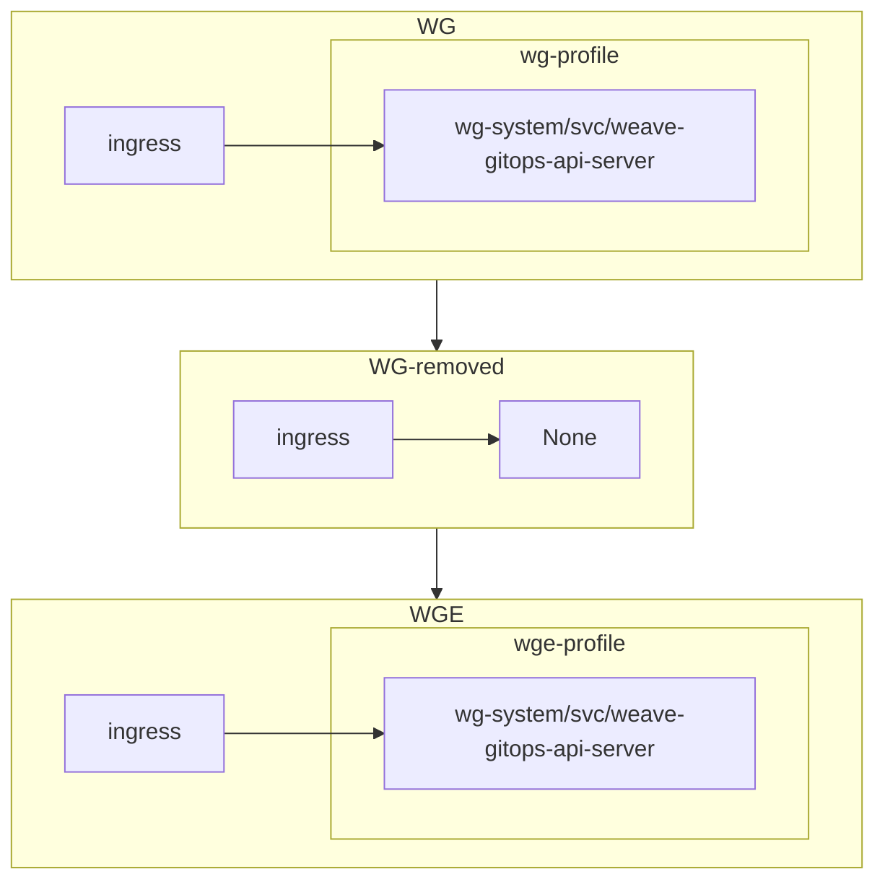
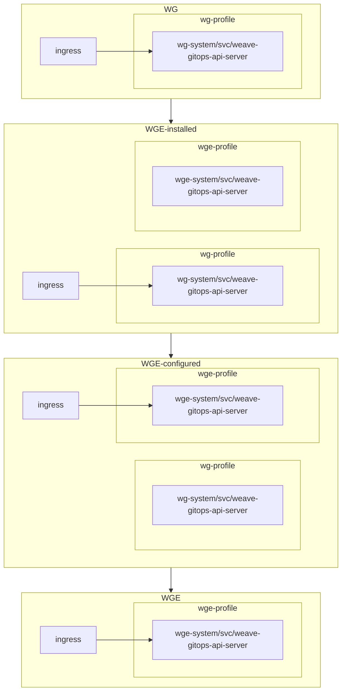
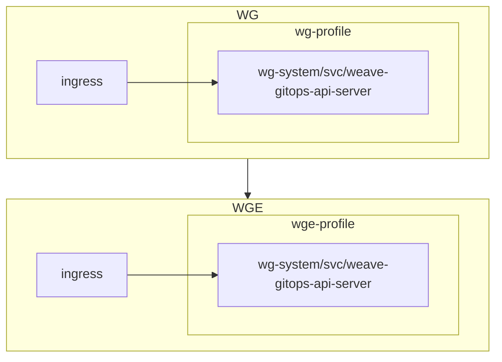
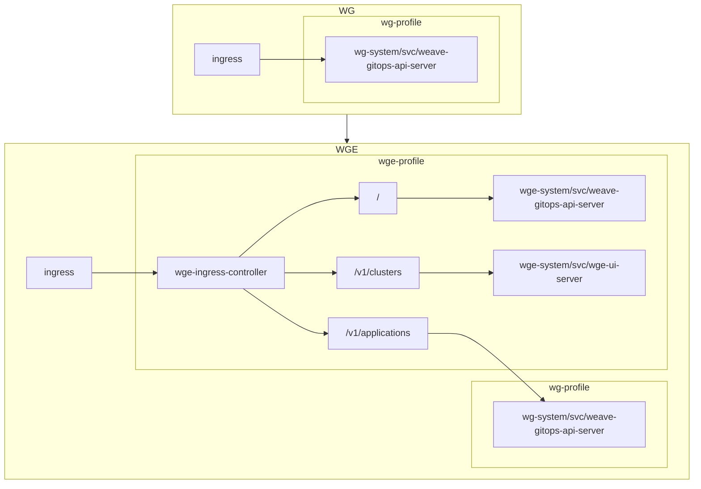

# 2. Upgrade from weave-gitops to weave-gitops-enterprise

Date: 2021-08-11

## Status

Drafting

## Context

Part of our weave-gitops business model is to encourage happy and interested weave-gitops users to upgrade to a paid version with more features. We want to make this option for them visible and easy to take advantage of.

Here we discuss the different potential technical implementations for how a user can upgrade from weave-gitops (WG) to weave-gitops-enterprise (WGE).

### WG

The [proposed](https://github.com/weaveworks/weave-gitops/pull/590) (not current) architecture for WG:

1. the **WG service**: an `api-server` deployment that:
   - hosts HTTP endpoints that talk to git-provider and kubernetes
   - serves a **web-ui** accessed via some ingress that queries this http api
2. cli tool `wego` that:
   - queries the http endpoints of the api-server via some ingress

### How WG and WGE are related

- WG is OSS and WGE is closed source
- WGE will integrate WG functionality at build time. ([WG/WGE UI and server integration ADR](https://github.com/weaveworks/weave-gitops/pull/600))
- WGE will be a standalone profile that will include all WG functionality.

## On upgrading

After upgrading:

- The user should still have all the WG functionality available to them via WGE
- Any state that WG has built up should be inherited and preserved by WGE
  - We don't want to disrupt any user workloads / deployments
  - There might be configuration options / preferences that should be preserved?
  - If WG is installing an OAuth thingy the secrets associated with that should be preserved

## Other supporting services

### Entitlements service

- An entitlements service to generate entitlements (expiration date, enabled feature list) signed by a private key
  - _Note: we have example code to implement this from good old WKP_
  - **UI**: Entitlements should be easy to generate by CX etc. A web UI would be nice.
  - **Entitlement storage**: This might not be a requirement. _Salesforce_ is used to manage customer info and could store entitlements.
- Code in WGE services that includes the public key to validate entitlement authenticity and show an warning if entitlements have expired.
  - _Note: we have example code to implement this from good old WKP_

## Options for the upgrade operation

### 1. Remove WG and install WGE

WG and WGE are not installed at the same time and so can look "more identical", providing k8s service/ingress with the same name/namespace so a replacement would be transparent.

1. Remove WG. If the **WG Service** is distributed as
   - a profile: `pctl remove weave-gitops`
   - a k8s `deployment`: remove it via k8s/gitops
2. Install WGE: `pctl add weave-gitops-enterprise`

**Pros**: Simple.

**Cons**: No UI flow as WG will be removed before another UI is there to replace it.

### 2. Install WGE and remove WG

Both installed at the same time. Ingress is the "control point", the switch that can be flipped, the user would have to reconfigure ingress to point to WGE, then WG could be removed. Allows a nicer UI flow:

1. Instructions to add **entitlement** and **WGE profile catalog** to cluster
2. Opens the WG UI, sees WGE in a list, clicks install
3. WGE is installed alongside WG (in a different namespace perhaps)
   - at this point port-forwarding could be used test the WGE UI.
4. Instructions on how to switch ingress over to WGE
5. Uninstall WG profile via the Applications section in WGE UI

**Pros**: Supports UI flow

**Cons**: Bit more finicky, needs user to know about / configure the ingress point.

### 3. "Replace" WG with WGE

Similar to 1. above, in that we remove WG before installing WGE, but try and pull this off in a single operation / git reconciliation somehow.

A "Replace application" operation in the UI perhaps. Then the UI in the browser could "poll through" the re-deployment of the api-server and eventually reloading the browser would show the new UI.

**Pros**: Supports UI flow

**Cons**: If something goes wrong need to drop down to the CLI to resolve

### 4. Augment the base install

Leave as much of WG intact and add additional functionality.

**Pros**: Additive, feels more like an upgrade.

**Cons**: The UI needs to be replaced somehow. Requires a "flipping of the ingress", e.g. `wego ui` will port-forward to `wego-system/svc/api-server` or something, this should now point to the WGE UI. (Unless `wego ui` always looks for WGE first?)

## Questions

Q. Are there any components of WG that shouldn't be running at the same time if duplicated by WGE, e.g. some `Application` reconcilation loop?

- ?

Q. Will the weave-gitops eco-system make assumptions about its namespace (as flux does w/ flux-system) e.g. for plugins to use so that switching namespaces to `weave-gitops-enterprise-system` or something would cause issues?

- ?

Q. OAuth secrets etc?

- Make sure to _not_ delete certain parts of WG? E.g. secrets its created.
- WG makes sure these aspects are slightly de-coupled from WG profile?

## Decision (and work breakdown)

### Profiles

Write a profile around the WGE helm chart

### Entitlements

Use a similar model to WKP for generation. We want to establish a _convention_ for storing the entitlements so perhaps it tries to create a PR in `weave-gitops-private/entitlements` by default with a `--dry-run` option. Entitlements will provide a _soft enforcement_ and show a warning in the UI and CLI.

_The dockerhub authentication will be removed._

### Upgrade process

Option 3 above, have a tool or instructions on how to create a single PR that removes the WG profile (or deployments) and adds the WGE profile.

The tool might be:

- a command in WG: `wego upgrade`
- a cli command plugin for wego: `wego upgrade`

This tool can also run **Pre-flight** checks, especially which version upgrades are supported etc. (and a `--skip-preflight-checks`)

### Downgrade process

Revert the above PR
