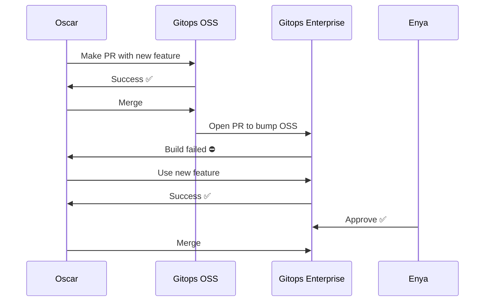
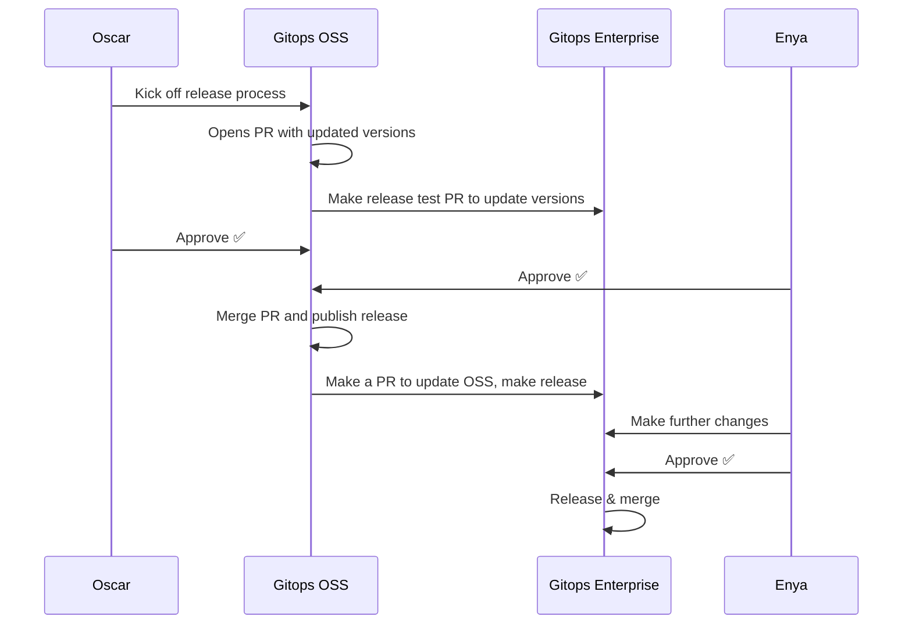

# 12. Couple the Enterprise and OSS development process

Date: 2022-08-12

## Status

Proposed

## Context

Weave Gitops OSS and Weave Gitops Enterprise are in many ways set up
as though they are two independent projects - Enterprise uses stable
releases of OSS, much like it uses stable releases of Flux or Cobra.

However, that doesn't reflect the reality. The reality is that they
are two tightly coupled projects, in several ways. For one thing,
there is a lot of library code in OSS that Enterprise uses - and maybe
there's scope for this to grow. For another thing, there's an
increasing commercial desire to be able to move capabilities between
the two codebases cheaply.

This disconnect between the architecture and engineering reality
wastes time and makes both stakeholders and engineers frustrated. It's
difficult to quantify the exact amount of time wasted, so this instead
describes two scenarios that both are common, and are healthy in a
product before version 1.0.

The first scenario is an Enterprise developer who spots a JS
component in OSS that just need a one line fix to be perfect for the
developer's current ticket. They are faced with two choices:

* Either they have to make a pull request, then wait for the next time
  OSS makes a release, and then finish their ticket.
* Or, they have to copy-paste the whole component into a "vendored"
  one.

The other scenario is a developer working on an OSS feature that uses
shared code with Enterprise wants to make an API change. They have
three options:

 * They can spend time making it backwards compatible so Enterprise doesn't
   need to change, leaving 2 implementations of the feature inside OSS
 * They can try to remember to submit a pull request to Enterprise
   the next time OSS makes a release
 * They can just leave it for the Enterprise developers to figure out
   and fix.

In both cases, the developer is faced with the choice to accrue tech
debt at a frightening rate, or slow down the Enterprise process.

## Decision

We will accept the fact that the two code bases are so tightly
coupled, and embrace it.

The enterprise `main` branch will start tracking the OSS `main`
branch, in both javascript and go. This will be accomplished with a
github action that creates or updates a PR in Enterprise with the
latest OSS main, which kicks off Enterprise's CI, and if it fails the
developer who changed OSS will be notified and be able to fix the
breakage directly, while the context is still in their brain.

This tries to illustrate the proposed flow when OSS Oscar works on a
new feature that changes APIs that Enterprise is using - when Enterprise
Enya next wants to upgrade OSS, Oscar has already pushed an API migration.

This means that OSS's release process needs to similarly kick off an
Enterprise release process - when OSS forks a branch to release, that
triggers another action that does the same for Enterprise. When OSS
decides to approve the release, the Enterprise PR is updated with the
stable tags for OSS.

This tries to illustrate the proposed release process - as it is
Enterprise that depends on OSS, Oscar must launch the process, but as
soon as it's begun Enya is able to start testing the release in
Enterprise. When OSS has finished publishing its release, Enya is able
to just release the PR that OSS generated automatically.

In both cases, the automation doesn't go as far as to change
Enterprise - it will merely make pull requests for human review.

## Consequences

This is intended to be a pragmatic decision that can be implemented
very quickly, that helps unblock our developers today. It recognizes
that the boundary between OSS and Enterprise isn't technical but
rather driven by commercial strategy, and as a result isn't sitting
right for the engineers working in it every day. It's very easy to
come up with multiple proposals that are better, however those
proposals would take more work, time, and decisions - this proposal
can be implemented now, and would let most developers continue working
the way they do today, just faster.

The main upside is that changes in OSS will be available to use in
Enterprise in about 15 minutes, compared to weeks today. This is the
kind of improvement that's so big that it's not just about "closing
tickets faster" - it would get rid of entire classes of problems
and sources of frustration to do with migrations and API stability. If
a developer wants to change an API that's used in both, they can fix
both and have them merged before lunch.

As a result, this would bring some of the benefits we could get from
setting up a monorepo for both OSS and Enterprise, but this could be
done very quickly, with very little changes to existing workflows.

One downside is that this holds the developer working on OSS
responsible for making sure their changes work with Enterprise. This
is a little bit of a roadblock for developers primarily working on
OSS, however it's not unreasonable to ask developers to make sure the
product still works with their changes - you wouldn't expect a
developer primarily working on backend to merge API changes that break
the frontend and move on without further conversations.

The biggest challenge is that it would couple releases between OSS and
Enterprise. Enterprise's main branch today can always be released
using a stable OSS release - with this change, Enterprise would have
to choose between releasing with an unstable OSS version, roll back or
backport changes so they work with the last stable OSS release, or ask
OSS to make a stable release. However, it's worth pointing out that
this won't prevent Enterprise from releasing a customer-specific
release - just that the cost of doing that would be slightly
higher in that it needs to verify both OSS and Enterprise
functionality.

However, these release challenges are a new iteration of an old pain
point - both Enterprise and OSS are lacking process for longer-lived
stable branches that are separate from the main feature development
branches so any release includes anything that has landed in main.
It is assumed that both projects will need to solve that.  Discussions
about how to do that are already happening, but are out of scope or
this ADR. Until then, both OSS and Enterprise should agree to try to
do a stable release every 2 weeks, whether there are new features or
not, as long as there's no blocking bugs. This synchronization only
happens between the release management function in the respective
project, instead of all developers being subject to this
synchronization overhead.
