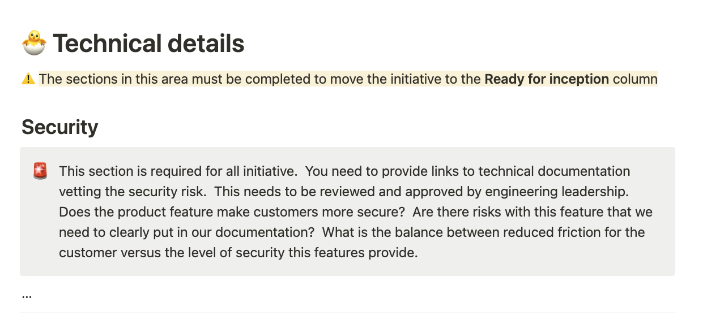

# 18. 

Date: 2023-03-XX

## Status

Proposed

## Context

We are in a trend of continuously improving our product and engineering ways of working. We 
currently define the problem space in [product initiatives](https://www.notion.so/weaveworks/1092ccadb5924984b44dd3abc781c429?v=207668f2ece643af991a2d231e327eff&pvs=4).
Once the problem space has been defined, a solution is designed and delivered. 

For product discovery,the initiative template represents the organisation-wide agreed guidance 
and common baseline that any discovery should have. For engineering discovery, we haven't yet set that org-wide baseline, 
meaning that depending on the initiative, we could end up in different states on things that matter to us.

At the same time, this `matters to us` has not always been a static interpretation varying on the nature of our company. 
For example, we  have seen how in second half of 2022 what matters to us meant delivering features to enhance sales demos. Whilst 
2023 we are more looking for more stable, enterprise-ready part of our product. This involves, for example, a change in the 
priorities for non-functional requirements. 

With the aim to set that organisational-wide expectations for the engineering discover and discovery we raise this ADR.

## Decision

In order align around engineering discovery we take the following actions:

1. To provide [guidance](../README.md) for the engineering design process once the product initiative has been flushed.
2. The guidance set a set common baseline topics that we think beneficial each engineering design should consider. We add
them through our existing templates:
   1. [ADR template](./0001-record-architecture-decisions.md)
   2. [RFC template](../rfcs/template.md)
3. Add a section in the product initiative to create the connection between the engineering design docs.

## Consequences

Given that we have linked product initiative and design docs, we are a step closer to make the product
initiative the single source of truth that any stakeholder looking for a holistic picture of it could find.

Leveraging templates, we are able to make more explicit the priorities at any point of time. 

Given that we have guidelines and a common baseline to help us in our development process: 
- Guidelines help us to get started when in a consistent manner. 
- A common baseline allows consistency across initiatives and any stakeholder 
 is able to find the information which is relevant for them.