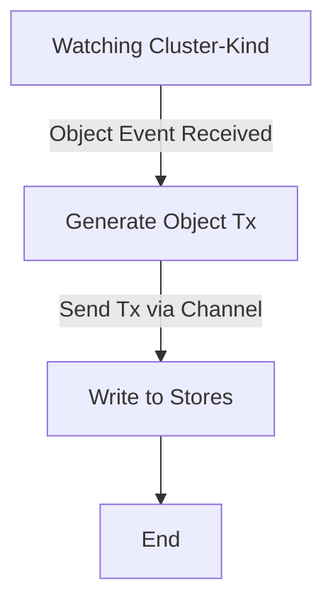

# 19. Explorer Metrics 

Date: 2023-05-XX

## Status

Proposed

## Context

[Tangerine team](https://www.notion.so/weaveworks/Team-Tangerine-f70682867c9f4264ada9b678584e89cf?pvs=4) is working on 
scaling multi-cluster querying [initiative](https://www.notion.so/weaveworks/Scaling-Weave-Gitops-Observability-Phase-3-7e0a1cfcc89641c9bb05a05c5356af34?pvs=4) 
also known by explorer capability. 

During q1 we have worked on getting an initial functional iteration that validates we could solve the latency 
and loading problems as part of [release v0.1](https://www.notion.so/weaveworks/Scaling-Weave-Gitops-Observability-Phase-3-7e0a1cfcc89641c9bb05a05c5356af34?pvs=4#270880bd0c4044c5b426eb0d8fb92faa).

In q2, we are looking to move towards a new [iteration v1.0](https://www.notion.so/weaveworks/Scaling-Weave-Gitops-Observability-Phase-3-7e0a1cfcc89641c9bb05a05c5356af34?pvs=4#d175338bd2004544ac8d52764ce26140) 
to complete the solution and make ir production ready, where reliability is first-class concerns and observability and metrics as part of it. 

This ADR writes the direction we are tacking to address metrics for observability for explorer. 

## Decision

[Explorer architecture](https://github.com/weaveworks/weave-gitops-enterprise/blob/main/docs/architecture/explore.md#explorer) has 
two main path: querying and collecting that we need to monitor. 

## Metrics for Querying

There are different components in the querying path:

### Query Service

It is a sync request/response driven system that we could monitor by its [golden signals](https://sre.google/sre-book/monitoring-distributed-systems/#xref_monitoring_golden-signals):
In particular the regular latency, rate, errors and saturation. At this stage we will calculate from the api server serving 
the request and using the [search endpoints](https://github.com/weaveworks/weave-gitops-enterprise/blob/main/api/query/query.proto)

Given that [OSS already supports metrics](https://github.com/weaveworks/weave-gitops/blob/260e28e07c35396f0bbabc2aeaa3bed38fc5615e/cmd/gitops-server/cmd/cmd.go#L268) 
we follow its approach for consistency:

1) Configuration flag to enable / disable metrics.
2) Using same [OSS library](https://github.com/weaveworks/weave-gitops/blob/260e28e07c35396f0bbabc2aeaa3bed38fc5615e/go.mod#L44)
3) Instrumenting the `/v1` api endpoint to get the metrics as done for [OSS](https://github.com/weaveworks/weave-gitops/blob/f69ed59f72e682330022dd7ce8217341944e0e8a/cmd/gitops-server/cmd/cmd.go#L268)

An example of the metrics family are:

```
http_request_duration_seconds_bucket{code="200",handler="/v1/clusters",method="GET",service="",le="0.005"} 0
http_request_duration_seconds_bucket{code="200",handler="/v1/config",method="GET",service="",le="0.005"} 0
...
http_request_duration_seconds_bucket{code="200",handler="/v1/query",method="POST",service="",le="0.05"} 0
http_request_duration_seconds_sum{code="200",handler="/v1/query",method="POST",service=""} 10.088081923
http_request_duration_seconds_count{code="200",handler="/v1/query",method="POST",service=""} 51
```

Where we could take the golden signals from, and we could [dashboard](./resources/dashboard.json) as usual via grafana


### Store

Inorder to monitor objects are being written to different stores successfully, we need to monitor latency, errors and requests per each store. 

Starting with the Adding/Inserting functionality, we calculate the time to process object and we count errors.

```golang
func NewRecorder(register bool, subsystem string) (Recorder) {
	storeLatencyHistogram := prometheus.NewHistogramVec(prometheus.HistogramOpts{
		Subsystem: subsystem,
		Name:    "latency_seconds",
		Help:    "Store latency",
		Buckets: prometheus.LinearBuckets(0.001, 0.001, 10),
	}, []string{"action"})

	requestCounter := prometheus.NewCounterVec(prometheus.CounterOpts{
		Subsystem: subsystem,
		Name: "requests_total",
		Help: "Number of requests",
	}, []string{"action", "status"})

	inflightRequests := prometheus.NewGaugeVec(prometheus.GaugeOpts{
		Subsystem: subsystem,
		Name: "inflight_requests_total",
		Help: "Number of in-flight requests.",
	}, []string{"action"})


	_ = prometheus.Register(storeLatencyHistogram)
	_ = prometheus.Register(requestCounter)
	_ = prometheus.Register(inflightRequests)

	record := Recorder{
		storeLatencyHistogram: storeLatencyHistogram,
		requestCounter: requestCounter,
		inflightRequests: inflightRequests,
	}
		

	return record
}
```

Where action is "add | remove | search".

Metrics List:

**explorer_indexer_latency_seconds** to store the latency per action for indexer in seconds.

**explorer_indexer_requests_total** to get the total number of requests per request status "success | error".

**explorer_indexer_inflight_requests_total** to track the number of requests that are currently in progress or "in flight".

**explorer_datastore_latency_seconds** to store the latency per action for datastore in seconds.

**explorer_datastore_requests_total** to get the total number of requests per request status "success | error".

**explorer_datastore_inflight_requests_total** to track the number of requests that are currently in progress or "in flight".


#### Indexer

We intiate prometheus-recorder with NewIndexer():
```golang
func NewIndexer(s Store, path string) (Indexer, error) {
	...

	return &bleveIndexer{
		idx:   index,
		store: s,
		recorder: metrics.NewRecorder(true, "explorer_indexer"),
	}, nil
}
```

Here how we get the values for metrics:
```golang
func (i *bleveIndexer) Add(ctx context.Context, objects []models.Object) error {
	start := time.Now()
	const action = "add"
	
	i.recorder.InflightRequests(action, 1)
	
	var err error
	defer func() {
		i.recorder.SetStoreLatency(action, time.Since(start))
		i.recorder.InflightRequests(action, -1)
		if err != nil {
			i.recorder.IncRequestCounter(action, "error")
			return
		}
		i.recorder.IncRequestCounter(action, "success")
	}()

	...
	
	return nil
}
```

#### Data Store

We intiate prometheus-recorder with NewSQLiteStore():
```golang
func NewSQLiteStore(db *gorm.DB, log logr.Logger) (*SQLiteStore, error) {
	return &SQLiteStore{
		db:    db,
		log:   log.WithName("sqllite"),
		debug: log.WithName("sqllite").V(logger.LogLevelDebug),
		recorder: metrics.NewRecorder(true, "explorer_datastore"),
	}, nil
}
```

Here how we get the values for metrics:

```golang
func (i *SQLiteStore) StoreObjects(ctx context.Context, objects []models.Object) error {
	start := time.Now()
	const action = "store_objects"

	i.recorder.InflightRequests(action, 1)

	var err error
	defer func() {
		i.recorder.SetStoreLatency(action, time.Since(start))
		i.recorder.InflightRequests(action, -1)
		if err != nil {
			i.recorder.IncRequestCounter(action, "error")
			return
		}
		i.recorder.IncRequestCounter(action, "success")
	}()

	...
	return nil
}

```

## Metrics for Collection 

The pipeline for collecting is


Monitor health of the pipeline means that we understand health of:
- Cluster watcher manager: manages the lifecycle of a cluster watcher: watch, unwatch, etc
- Clusters watchers to ensure we receive object events.
- Cluster reconciler to ensure we process object events and generate object transactions.
- Object transactions channel to ensure transactions are being sent. 
- Object transactions process to ensure we process and write them to the store. 
- Stores health to ensure that we write them.

### Cluster Watcher Status

We would like to understand that given a set of gitops clusters we are watching them 
or not. Collector is the cluster watcher manager so we would like to see 
at any moment of time the clusters is watching. 

Given the following interface

```go
// ClusterWatcher defines an interface to watch gitops clusters via kubernetes https://kubernetes.io/docs/reference/using-api/api-concepts/#semantics-for-watch
type ClusterWatcher interface {
	// Watch starts watching the cluster passed as input
	Watch(cluster cluster.Cluster) error
	// Unwatch stops watching the cluster identified by input clusterName.
	Unwatch(clusterName string) error
	// Status return the watcher status for the cluster identified as clusterName.
	Status(clusterName string) (string, error)
}

```
We create the following metrics for that purpose

```go
	depth = prometheus.NewGaugeVec(prometheus.GaugeOpts{
		Subsystem: CollectorSubSystem,
		Name:      "collector_cluster_watcher",
		Help:      "cluster watcher status",
	}, []string{"name","host", "status"})
```

where status is 

```go
const (
	ClusterWatchingStarted ClusterWatchingStatus = "started"
	ClusterWatchingStopped ClusterWatchingStatus = "stopped"
)
```

#### Pro/Cons

(+) Allow us disaggregated to the cluster visibility for the watcher.   
(-) Metrics cardinality would be #number_of_clusters times #watching_status  

#### Alternatives

A few alternatives we could put in place around this scenario: 

- Nothing: we do not need to record telemetry around cluster watcher status.   
- Logging: 
  - we don't record metric at the level of the cluster.
  - we do write a logging event with the status of the cluster watcher.
  - users could create compose metrics on logging events or alert on logging events directly.
- Aggregation: to create an aggregation visibility so we could provide some actionable insight to admins
  - `collector_cluster_watchers_started`: number of watchers in started state.
  - `collector_cluster_watchers_total`: number of total cluster watchers.


### Clusters watcher

Once the cluster watchers has been created, we want to understand the next part of the pipeline: 
we receive object events.  Given that we are leveraging controller-runtime for doing the watching, 
we could leverage its default [metrics](https://book.kubebuilder.io/reference/metrics-reference.html) to cover this concern:

[rest_client_requests_total](https://github.com/kubernetes-sigs/controller-runtime/blob/main/pkg/metrics/client_go_adapter.go#L33)
is the metrics that would allow determine the status of our communication with the cluster beyond whether is established
the connection or not. 

```
rest_client_requests_total{host="https://127.0.0.1:64078/apis?timeout=32s",verb="GET"} 3
rest_client_requests_total{host="https://F97364D6B48F2600864A0272CB4D349F.gr7.eu-north-1.eks.amazonaws.com/apis/acme.cert-manager.io/v1?timeout=30s",verb="GET"} 2
```

### Cluster reconciling

Same as for the previous one, we want to have visiblity in the processing of the watched event. Given 
that this logic is also leveraged to controller-runtime, we could use some of its metrics for it. 

https://book.kubebuilder.io/reference/metrics-reference.html

```
controller_runtime_reconcile_total	Counter	Total number of reconciliations per controller.
controller_runtime_reconcile_errors_total	Counter	Total number of reconciliation errors per controller.
controller_runtime_reconcile_time_seconds	Histogram	Length of time per reconciliation per controller.
```

and also understanding on the queue  

```
# HELP workqueue_longest_running_processor_seconds How many seconds has the longest running processor for workqueue been running.
# TYPE workqueue_longest_running_processor_seconds gauge
workqueue_longest_running_processor_seconds{name="bucket"} 0
workqueue_longest_running_processor_seconds{name="gitrepository"} 0
workqueue_longest_running_processor_seconds{name="helmchart"} 0
workqueue_longest_running_processor_seconds{name="helmrelease"} 0
workqueue_longest_running_processor_seconds{name="helmrepository"} 0
workqueue_longest_running_processor_seconds{name="kustomization"} 0
workqueue_longest_running_processor_seconds{name="ocirepository"} 0

```

### Object Transaction 

In order to have visibility on the transaction generation as it is the unit of processing between 
reconciler and other parts of the pipeline. 

```go

	depth = prometheus.NewCounterVec(prometheus.CounterOpts{
		Subsystem: CollectorSubSystem,
		Name:      "object_tranactions_total",
		Help:      "Current depth of workqueue",
	}, []string{"cluster","type", })
```
Where cluster is the cluster originating the tx and type the type of object tx
We dont include `object` due to be high-cardinality. logging events shoudl have that finer visiiblity. 

### Object transactions channel

In order to monitor the health of the channel we could have a set of metrics like below

```go

var (
    channelLength = prometheus.NewGauge(prometheus.GaugeOpts{
    Name: "channel_length",
    Help: "Current length of the channel",
    })
)

func init() {
    prometheus.MustRegister(channelLength)
}

go func() {
    for {
        // Get the channel length and update the metric
        length := len(myChannel)
        channelLength.Set(float64(length))

        time.Sleep(time.Second)
    }
}()

```
Some other 
In addition to monitoring the length of a channel, there are several other channel metrics that you can consider adding for full visibility. These metrics provide more insights into the behavior and performance of the channel. Here are a few examples:

- Channel Capacity: Monitoring the capacity of a channel can help you understand how close the channel is to reaching its maximum capacity. This metric can be useful for identifying potential bottlenecks or situations where the channel is frequently full. You can define a Prometheus Gauge to track the capacity of the channel.
- Channel Usage: Tracking the usage of a channel can give you an indication of how frequently the channel is being used. This metric can help identify if the channel is consistently busy or if there are periods of low activity. You can define a Prometheus Counter to keep track of the number of times the channel is used.
- Channel Operations: Monitoring the number of successful and failed operations on a channel can provide insights into the reliability and error rates of the channel. This metric can help identify if there are any issues with sending or receiving data through the channel. You can define Prometheus Counter metrics for successful operations and a separate metric for failed operations.
- Channel Blocking: Tracking the number of times a goroutine blocks while waiting to send or receive data on a channel can help identify potential blocking issues or excessive waits. This metric can be useful for identifying performance bottlenecks. You can define a Prometheus Counter to count the number of blocking events.
- Channel Lag: Monitoring the time it takes for data to be processed from the time it is sent on the channel can provide insights into the latency of the channel. This metric can help identify if there are delays or slowdowns in processing the data. You can define a Prometheus Histogram or Summary to track the lag duration.
- Channel Errors: Tracking the number of errors encountered during channel operations can help identify any issues or exceptions occurring within the channel processing. This metric can be useful for debugging and error analysis. You can define a Prometheus Counter to count the number of errors.

These are just a few examples of additional channel metrics you can consider adding to gain full visibility into the channel's behavior. The specific metrics you choose to add will depend on the requirements and characteristics of your application and the channels you are monitoring.

```go
package main

import (
	"fmt"
	"math/rand"
	"net/http"
	"time"

	"github.com/prometheus/client_golang/prometheus"
	"github.com/prometheus/client_golang/prometheus/promhttp"
)

var (
	channelCapacity = prometheus.NewGauge(prometheus.GaugeOpts{
		Name: "channel_capacity",
		Help: "Capacity of the channel",
	})

	channelUsage = prometheus.NewCounter(prometheus.CounterOpts{
		Name: "channel_usage_total",
		Help: "Total number of times the channel is used",
	})

	successfulOperations = prometheus.NewCounter(prometheus.CounterOpts{
		Name: "channel_successful_operations_total",
		Help: "Total number of successful operations on the channel",
	})

	failedOperations = prometheus.NewCounter(prometheus.CounterOpts{
		Name: "channel_failed_operations_total",
		Help: "Total number of failed operations on the channel",
	})

	blockingEvents = prometheus.NewCounter(prometheus.CounterOpts{
		Name: "channel_blocking_events_total",
		Help: "Total number of blocking events on the channel",
	})

	channelLag = prometheus.NewSummary(prometheus.SummaryOpts{
		Name: "channel_lag",
		Help: "Lag duration of the channel",
	})

	channelErrors = prometheus.NewCounter(prometheus.CounterOpts{
		Name: "channel_errors_total",
		Help: "Total number of errors encountered on the channel",
	})
)

func init() {
	prometheus.MustRegister(channelCapacity)
	prometheus.MustRegister(channelUsage)
	prometheus.MustRegister(successfulOperations)
	prometheus.MustRegister(failedOperations)
	prometheus.MustRegister(blockingEvents)
	prometheus.MustRegister(channelLag)
	prometheus.MustRegister(channelErrors)
}

func main() {
	// Start a Goroutine to update the channel metrics
	go updateChannelMetrics()

	// Expose the Prometheus metrics endpoint
	http.Handle("/metrics", promhttp.Handler())
	http.ListenAndServe(":8080", nil)
}

func updateChannelMetrics() {
	rand.Seed(time.Now().UnixNano())

	// Simulate sending and receiving data on a channel
	go func() {
		for {
			// Simulate a data processing delay
			time.Sleep(time.Duration(rand.Intn(1000)) * time.Millisecond)

			// Simulate a successful operation
			if rand.Float32() < 0.8 {
				sendData()
				successfulOperations.Inc()
			} else { // Simulate a failed operation
				fmt.Println("Error: Failed to send data")
				failedOperations.Inc()
				channelErrors.Inc()
			}
		}
	}()

	// Simulate blocking events on the channel
	go func() {
		for {
			// Simulate a blocking event
			if rand.Float32() < 0.2 {
				<-time.After(time.Duration(rand.Intn(1000)) * time.Millisecond)
				blockingEvents.Inc()
			}
		}
	}()

	// Simulate updating channel capacity and usage
	go func() {
		for {
			// Simulate changing channel capacity
			channelCapacity.Set(float64(rand.Intn(100)))

			// Simulate channel usage
			channelUsage.Inc()

			time.Sleep(time.Second)
		}
	}()

	// Simulate channel lag
	go func() {
		for {
			startTime := time.Now()

			// Simulate data processing
			time.Sleep(time.Duration(rand.Intn(1000)) * time.Millisecond)

			lag := time.Since(startTime).Seconds()
			channelLag.Observe(lag)
		}
	}()
}

func sendData() {
	// Simulate sending data on the channel
	fmt.Println("Sending data...")
}

```

### Object transactions process to ensure we process and write them to the store.

TBA with Saeed

### Stores health to ensure that we write them.

TBA with Saeed 


## Consequences

- We enable metrics not only for explorer but also for core components of WGE like its api server that so far was not enabled. 
- We have consistency between OSS and EE. However, there is an opportunity to revisit whether to use [slok library](https://github.com/slok/go-http-metrics) 
vs standard [promhttp](https://pkg.go.dev/github.com/prometheus/client_golang/prometheus/promhttp) middleware.   

