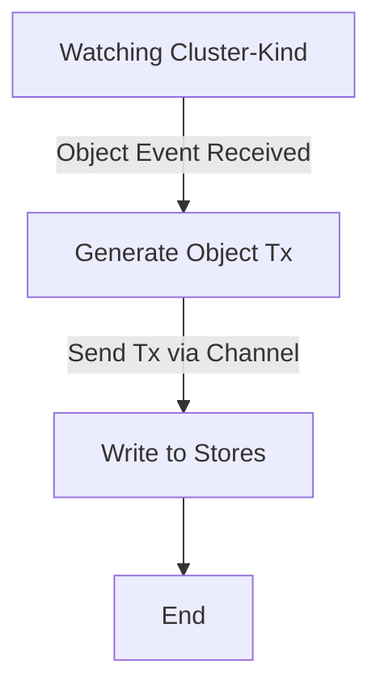

# 19. Explorer Metrics 

Date: 2023-05-XX

## Status

Proposed

## Context

[Tangerine team](https://www.notion.so/weaveworks/Team-Tangerine-f70682867c9f4264ada9b678584e89cf?pvs=4) is working on 
scaling multi-cluster querying [initiative](https://www.notion.so/weaveworks/Scaling-Weave-Gitops-Observability-Phase-3-7e0a1cfcc89641c9bb05a05c5356af34?pvs=4) 
also known by explorer capability. 

During q1 we have worked on getting an initial functional iteration that validates we could solve the latency 
and loading problems as part of [release v0.1](https://www.notion.so/weaveworks/Scaling-Weave-Gitops-Observability-Phase-3-7e0a1cfcc89641c9bb05a05c5356af34?pvs=4#270880bd0c4044c5b426eb0d8fb92faa).

In q2, we are looking to move towards a new [iteration v1.0](https://www.notion.so/weaveworks/Scaling-Weave-Gitops-Observability-Phase-3-7e0a1cfcc89641c9bb05a05c5356af34?pvs=4#d175338bd2004544ac8d52764ce26140) 
to complete the solution and make ir production ready, where reliability is first-class concerns and observability and metrics as part of it. 

This ADR writes the direction we are tacking to address metrics for observability for explorer. 

## Decision

[Explorer architecture](https://github.com/weaveworks/weave-gitops-enterprise/blob/main/docs/architecture/explore.md#explorer) has 
two main path: querying and collecting that we need to monitor. 

## Metrics for Querying

There are different components in the querying path:

### Query Service

It is a sync request/response driven system that we could monitor by its [golden signals](https://sre.google/sre-book/monitoring-distributed-systems/#xref_monitoring_golden-signals):
In particular the regular latency, rate, errors and saturation. At this stage we will calculate from the api server serving 
the request and using the [search endpoints](https://github.com/weaveworks/weave-gitops-enterprise/blob/main/api/query/query.proto)

Given that [OSS already supports metrics](https://github.com/weaveworks/weave-gitops/blob/260e28e07c35396f0bbabc2aeaa3bed38fc5615e/cmd/gitops-server/cmd/cmd.go#L268) 
we follow its approach for consistency:

1) Configuration flag to enable / disable metrics.
2) Using same [OSS library](https://github.com/weaveworks/weave-gitops/blob/260e28e07c35396f0bbabc2aeaa3bed38fc5615e/go.mod#L44)
3) Instrumenting the `/v1` api endpoint to get the metrics as done for [OSS](https://github.com/weaveworks/weave-gitops/blob/f69ed59f72e682330022dd7ce8217341944e0e8a/cmd/gitops-server/cmd/cmd.go#L268)

An example of the metrics family are:

```
http_request_duration_seconds_bucket{code="200",handler="/v1/clusters",method="GET",service="",le="0.005"} 0
http_request_duration_seconds_bucket{code="200",handler="/v1/config",method="GET",service="",le="0.005"} 0
...
http_request_duration_seconds_bucket{code="200",handler="/v1/query",method="POST",service="",le="0.05"} 0
http_request_duration_seconds_sum{code="200",handler="/v1/query",method="POST",service=""} 10.088081923
http_request_duration_seconds_count{code="200",handler="/v1/query",method="POST",service=""} 51
```

Where we could take the golden signals from, and we could [dashboard](./resources/dashboard.json) as usual via grafana


### Indexer

TBA

### Data Store

TBA

## Metrics for Collection 

The pipeline for collecting is


Monitor health of the pipeline means that we understand health of:
- Clusters watchers to ensure we receive object events.
- Cluster reconciler to ensure we process object events and generate object transactions.
- Object transactions channel to ensure transactions are being sent. 
- Object transactions process to ensure we process and write them to the store. 
- Stores health to ensure that we write them.

### Clusters watcher 

Based on kubernetes watching api server we could monitor it via default [controller-runtime metrics](https://book.kubebuilder.io/reference/metrics-reference.html)

That allows to monitor a watcher queue and rest client with the following example

```
# HELP workqueue_longest_running_processor_seconds How many seconds has the longest running processor for workqueue been running.
# TYPE workqueue_longest_running_processor_seconds gauge
workqueue_longest_running_processor_seconds{name="bucket"} 0
workqueue_longest_running_processor_seconds{name="gitrepository"} 0
workqueue_longest_running_processor_seconds{name="helmchart"} 0
workqueue_longest_running_processor_seconds{name="helmrelease"} 0
workqueue_longest_running_processor_seconds{name="helmrepository"} 0
workqueue_longest_running_processor_seconds{name="kustomization"} 0
workqueue_longest_running_processor_seconds{name="ocirepository"} 0


rest_client_request_duration_seconds_sum{host="https://127.0.0.1:64078/apis?timeout=32s",verb="GET"} 0.006088166000000001
rest_client_request_duration_seconds_count{host="https://127.0.0.1:64078/apis?timeout=32s",verb="GET"} 3

rest_client_request_duration_seconds_sum{host="https://F97364D6B48F2600864A0272CB4D349F.gr7.eu-north-1.eks.amazonaws.com/apis/acme.cert-manager.io/v1?timeout=30s",verb="GET"} 0.207082708
rest_client_request_duration_seconds_count{host="https://F97364D6B48F2600864A0272CB4D349F.gr7.eu-north-1.eks.amazonaws.com/apis/acme.cert-manager.io/v1?timeout=30s",verb="GET"} 2

```

That out of the box, with the current implementation we have seggregation by cluster on rest_client but not in queue related metrics.

As controller runtime queue metrics look 

```go
	depth = prometheus.NewGaugeVec(prometheus.GaugeOpts{
		Subsystem: WorkQueueSubsystem,
		Name:      DepthKey,
		Help:      "Current depth of workqueue",
	}, []string{"name"})
```


and rest client 

```go
	responseSize = prometheus.NewHistogramVec(
		prometheus.HistogramOpts{
			Name: "rest_client_response_size_bytes",
			Help: "Response size in bytes. Broken down by verb and host.",
			// 64 bytes to 16MB
			Buckets: []float64{64, 256, 512, 1024, 4096, 16384, 65536, 262144, 1048576, 4194304, 16777216},
		},
		[]string{"verb", "host"},
	)
```

opens the question of what to have that cluster visibiltiy?


https://github.com/kubernetes-sigs/controller-runtime/pull/2207


Queue metrics 

#### Number of clusters being watched = to understand

Type = state metric
Description = allow us to understand clusters being watched

options 
a) Dderived from controller runtime as distinct values or from CollectorWatcher
b) custom so  colllector watch should increase counter and collector unwatch should decrese counter

#### Number active watchers = tell us  

Type = state metric
Description = allow us to understand kinds being watched for a cluster 

As cluster times kind = derived from controller runtime as distinct values or from Collector

```go
func defaultNewWatcherManager(opts WatcherManagerOptions) (manager.Manager, error) {

	//create reconciler for kinds
	for _, kind := range opts.Kinds {
		rec, err := reconciler.NewReconciler(opts.ClusterName, kind, mgr.GetClient(), opts.ObjectsChannel, opts.Log)
		if err != nil {
			return nil, fmt.Errorf("cannot create reconciler: %w", err)
		}
		err = rec.Setup(mgr)
		if err != nil {
			return nil, fmt.Errorf("cannot setup reconciler: %w", err)
		}

	}
```


https://github.com/kubernetes-sigs/cluster-api/pull/2496

Watcher Updates per minute
Update write failure rate

### Cluster reconciler 

Queue metrics


### Object transactions channel

Queue metrics 


### Object transactions processor

Queue metrics

### Indexer and Data Store

Request/response metrics

Cluster -> 

Collector:


### watching resource events


//TODO define which ones

### process or reconcile the events

once the event has been received it is then queued for processing, the queing and processing could be monitored
by metrics provided too by controller-runtime

//TODO define which ones

### watching events channel


### write them to the correct remote store

last step is to store in the right targets that could be monitor based on their clients 

//TODO define which ones

// authz store client metrics 
// index client metrics


## Consequences

- We enable metrics not only for explorer but also for core components of WGE like its api server that so far was not enabled. 
- We have consistency between OSS and EE. However, there is an opportunity to revisit whether to use [slok library](https://github.com/slok/go-http-metrics) 
vs standard [promhttp](https://pkg.go.dev/github.com/prometheus/client_golang/prometheus/promhttp) middleware.   

