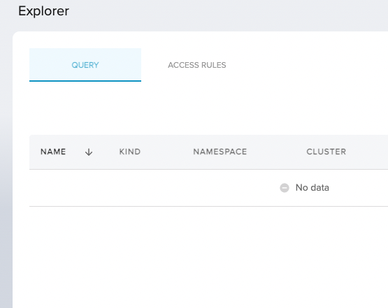

# 19. Explorer Monitoring 

Date: 2023-06-XX

## Status

Proposed

## Context

[Tangerine team](https://www.notion.so/weaveworks/Team-Tangerine-f70682867c9f4264ada9b678584e89cf?pvs=4) is working on
scaling multi-cluster querying [initiative](https://www.notion.so/weaveworks/Scaling-Weave-Gitops-Observability-Phase-3-7e0a1cfcc89641c9bb05a05c5356af34?pvs=4)
also known by Explorer. During Q1 we have worked on getting an initial functional iteration that validates we could solve the latency
and loading problems as part of [release v0.1](https://www.notion.so/weaveworks/Scaling-Weave-Gitops-Observability-Phase-3-7e0a1cfcc89641c9bb05a05c5356af34?pvs=4#270880bd0c4044c5b426eb0d8fb92faa).

In Q2, we are looking to move towards a new [iteration v1.0](https://www.notion.so/weaveworks/Scaling-Weave-Gitops-Observability-Phase-3-7e0a1cfcc89641c9bb05a05c5356af34?pvs=4#d175338bd2004544ac8d52764ce26140)
to complete the solution and make ir production ready, where monitoring is a first-class concern. In order to setup a direction 
that guides implementation we have worked in a vision. The outcome we used to drive the vision is to enable a platform engineer to troubleshoot Explorer
using telemetry and the monitoring artifacts provided. The working artifact is a miro board here https://miro.com/app/board/uXjVPiZGkZU=/?share_link_id=169655763202.

This ADR records the vision.

## Decision

As platform engineer, I have at least two potential troubleshooting scenarios that would need to address:

**Platform issues**

With some of its characteristics like:

- The issue is around one or multiple platform components.
- Impacts a group of requests from different users.
- Notified via alerting or multiple customer reporting failures.
- Telemetry at the level of a component is required to follow the journey along the system.

**Request issues**

With some of its characteristics like:

- The error happens in the context of particular request, for example, from user with userId=123.
- Usually notified via ticketing system as the customer is not able to do an action. 
- Telemetry at the level of a transaction is required to follow the journey along the system.

### Troubleshooting Platform Issues 

#### Background 

As platform engineer, I have setup Explorer monitoring using the guidance in [monitoring documentation](https://docs.gitops.weave.works/docs/next/explorer/operations/#monitoring).
Therefore:

- I am monitoring based on [SLOs](https://sre.google/workbook/implementing-slos/) as a proxy of customer expectations.
- My entry point are Availability SLO and Latency SLO which I could monitor as first row of the monitoring dashboard.  
- I am alerting based on error budget [burn rates](https://sre.google/workbook/alerting-on-slos/) in [Alert Manager](https://prometheus.io/docs/alerting/latest/alertmanager/).

I could find the previous resources as part of [explorer monitoring documentation](https://docs.gitops.weave.works/docs/next/explorer/operations/#monitoring).

#### Troubleshooting an alert

As platform engineer, I've been paged from an explorer alert due to burn rate breach. I 
follow the alert runbook that indicates the following:

1. Go to Explorer Dashboard
2. The first row of the dashboard shows you Explorer SLOs:
   - Confirm the alerting event by seeing the impact in the burn rate. 
3. Go to the second row of the dashboard. It shows Explorer querying path health. It will flag whether queries are not being served: 
    - Check Query API endpoint's health via its [RED](https://www.weave.works/blog/the-red-method-key-metrics-for-microservices-architecture/) metrics. 
In case of not healthy, troubleshoot it.
   - Check Indexer reads health via its RED metrics. In case of not healthy, troubleshoot it.
   - Check Datastore reads health via its RED metrics. In case of not healthy, troubleshoot it.
4. Go to the third row of the dashboard. It shows Explorer collecting path health:
   - Check Cluster Watching health. In case of not healthy, troubleshoot it using the following metrics are available:
     - `cluster_watcher`: number of cluster watchers in a given state (via label=state). Useful to verify the health of the cluster watcher infrastructure. 
     - `cluster_watcher_event`: number of cluster watcher events processed. Useful to determine whether an issue with the event processing infrastructure. 
   - Check Indexer writes health via its RED metrics. In case of not healthy, troubleshoot it.
   - Check Datastore writes health via its RED metrics. In case of not healthy, troubleshoot it.

### Troubleshooting Request Issues

As platform engineer, you have received indicating that an Explorer User does not find applications that is expected to see.  
You have the details of the user and a screenshot that shows an empty explorer view.



with a request like 

```
curl 'https://demo3.weavegitops.com/v1/query' \
  -H 'authority: demo3.weavegitops.com' \
  -H 'cookie: id_token=abx' \
  -H 'origin: https://demo3.weavegitops.com' \
  -H 'pragma: no-cache' \
  -H 'referer: https://demo3.weavegitops.com/explorer/query' \
  -H 'user-agent: Mozilla/5.0 (Macintosh; Intel Mac OS X 10_15_7) AppleWebKit/537.36 (KHTML, like Gecko) Chrome/112.0.0.0 Safari/537.36' \
  --data-raw '{"terms":"","filters":[],"limit":25,"offset":0,"orderBy":"","ascending":false}' \
  --compressed
```
with userId 

```
{
  "sub": "user@my-company.com",
  "exp": 1687426449,
  "nbf": 1687419249,
  "iat": 1687419249
}
```
In order to troubleshoot the request, I follow the runbook that says:

**Troubleshoot Application Errors**

1. Retrieve from the access logs the requestId associated with the ticket by using `"sub": "user@my-company.com"`. It is requestId='123abc'. 
2. Retrieve from the application logs if there has been any error with that transaction, for that you could filter by queries 
   like `level:error, requestId=123abc` around the time-window for the issue.  
3. If you find error logs, find the error event in the troubleshooting knowledge base and continue with the steps indicated there.

**Common Errors**

Follow the knowledge base troubleshooting guide on common errors where you could find troubleshoot common scenarios like unauthorised scenarios.

**Other Errors**

If you haven't been able to troubleshoot the issue, try to replicate the query as the user with `debug` level and report it to support.
Debug level gives you the ability to trace end to end the main events associated with the transaction as well as other application 
related tracing events. 

## Consequences

- Tangerine team aligns and knows what needs to implement in terms of telemetry to address the user monitoring concerns.
- A platform engineer is able to troubleshoot an explorer issue or get support in case not able to troubleshoot. 
- Other engineering teams could leverage the approach for defining its own monitoring journeys.