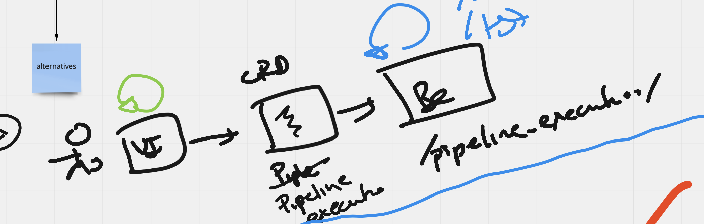
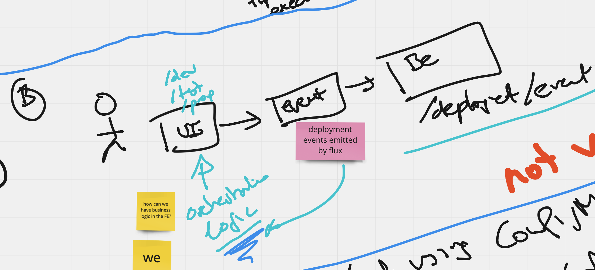
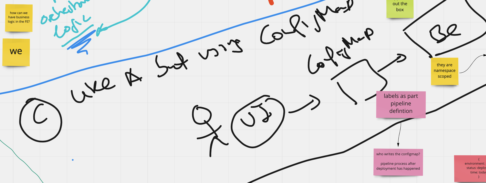

# UI Backend integration spike 
It aims to document the spike done in the context of cd pipelines about integrating pipelines ui and backend. 

## Glossary 

- Pipeline: define application deployment across environment 
- Pipeline Execution: an instance of a pipeline being executed so application being deployed through environments.

## Problem statement 
Two main user stories could be considered within this integration 

1. As gitops user I want to discover pipelines or list pipelines. 
2. As gitops user I want to discover pipeline executions or list pipeline execution.
3. As gitops user I want to follow a pipeline execution or pipeline execution details.

This document focuses on entity pipeline execution so 2) and 3) while 1) should be addressed in the context of [pipeline 
definition spike](https://github.com/weaveworks/weave-gitops-enterprise/issues/1076)

## Assumptions and Dependencies 

This includes the context assumptions or dependencies we need to make in order to complete the picture

- A [pipeline definition](https://github.com/weaveworks/weave-gitops-enterprise/issues/1076) exists from a previous spike
- A `pipeline execution` is the entity/contract between 
  - this spike reads the execution entity and 
  - https://github.com/weaveworks/weave-gitops-enterprise/issues/1083 that might create it
  - https://github.com/weaveworks/weave-gitops-enterprise/issues/1084 that might update it
  - we could resolve `pipelines` from `pipeline executions` 

## Alternatives

In order the UI to follow a pipeline execution, the following three alternatives has been identified 

1. To create an api endpoint that serves `pipeline execution` resources (CRD). 
2. To consume flux/deployment events and do the orchestration logic within the UI.
3. To gather the pipeline execution logic within a configmap. UI to consume these configmaps.  

//TODO diagrams https://github.com/mermaid-js/mermaid#readme

### To create an api endpoint that serves `pipeline execution` resources (CRD).



the api endpoint could look like

```json
 "/v1/pipelines/{name}/executions": {
      "get": {
        "operationId": "Pipelines_GetPipelineExecutions",
        "responses": {
          "200": {
            "description": "A successful response.",
            "schema": {
              "$ref": "#/definitions/GetPipelineExecutionResponse"
            }
          },
        },
        "parameters": [
        // search filters
        ],
      }
    },
``` 

```protobuf
message GetPipelineExecutionResponse {
  ...
  PipelineExecution pipelineExecution;
  ...
}
```

```yaml
apiVersion: gitops.weave.works/v1alpha1
kind: PipelineExecution
metadata:
  name: my-hello-pipeline-execution-abc123
  ...
spec:
  params:
  - name: HELLO
    value: Hello World!
  trigger:
    # info about the trigger
  pipelineRef:
    name: my-hello-pipeline
    namespace: hello-world
status:
  conditions:
  - lastTransitionTime: "2022-04-07T12:34:58Z"
    message: 'Environment Completed: 3 (Failed: 0, Canceled 0), Skipped: 0'
    reason: Succeeded
    status: "True"
    type: Succeeded
  environments:
  - name: dev 
    order: 0 
    status:
      # status field info with for example
      type: Succeeded
      time: now - 2 
  - name: test
    order: 1
    statusInfo: 
      # status field info with for example
      type: Succeeded
      time: now - 1 
```

**Pro** 
- Single document to represent the execution of a pipeline 
- CRD so out of the box CRD benefits like versioning or validation 
//TODO: review  

**Cons**
- TBA

This concept is being for example explored within 

- [Tekton](https://tekton.dev/docs/pipelines/pipelineruns/#overview)


### To consume flux/deployment events and do the orchestration logic within the UI.



**Pro**
- TBA

**Cons**
- Doing the orchestration in the UI translates some business logic responsibility to the UI which is an anti-pattern as 
  - exposing our business logic means to potentially expose our competitive advantage
  - limits extensibility as we cannot integrate with other experience layers or via duplicating effort 

This solution is not viable so no longer explored. 

### To gather the pipeline execution logic within a configmap. UI to consume these configmaps.



the api endpoint could look like

```json
 "/v1/pipelines/{name}/executions": {
      "get": {
        "operationId": "Pipelines_GetPipelineExecutions",
        "responses": {
          "200": {
            "description": "A successful response.",
            "schema": {
              "$ref": "#/definitions/GetPipelineExecutionResponse"
            }
          },
        },
        "parameters": [
        // search filters
        ],
      }
    },
``` 

```protobuf
message GetPipelineExecutionResponse {
  ...
  ConfigMap pipelineExecution;
  ...
}
```

```yaml
apiVersion: v1
kind: ConfigMap
metadata:
  name: my-hello-world-pipeline-execution
data:
  #metadata could be also annotations or similar
  #pipeline ref properties
  pipeline_name: "my-hello-pipeline"
  pipeline_namespace: "hello-world"
  #status examples
  environment_0_name: "dev"
  environment_0_status: "succeded"
  environment_1_name: "test"
  environment_1_status: "succeded"
  
```

**Pro**
- Configmaps are first-class kube citizens so reduces maintenance solution effort.  
- No controller needed

**Cons**
- Validation not out of the box
- They are namespaced so might impose constraints on the access patterns    

## Recommendation (with limitations) 
- To be added once draft is completed

## Path
- Resolve limitations and assumptions section to align and complete this section

## Metadata
- Status: Draft in progress. Depends on previous spikes.

## References

- [Miro Board](https://miro.com/app/board/uXjVOoWHIfg=/?share_link_id=613790573756)
