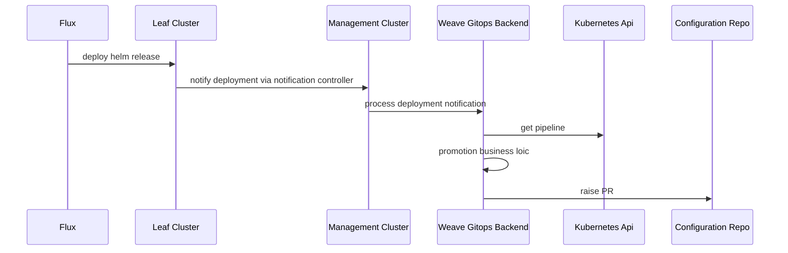
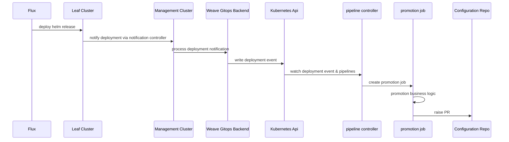
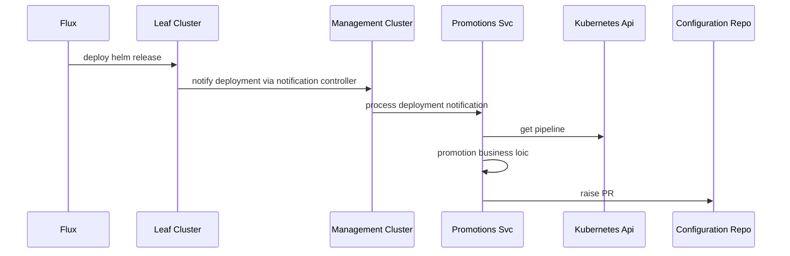

# RFC-0003 Promotion capability for pipelines 

**Status:** provisional

**Creation date:** 2022-10-05

**Last update:** 2022-10-05

## Summary

Given a continuous delivery pipeline is comprised of diffferent environments the application goes trough in
its way to production, there is need for an action to move the application among environments. That concept is known as
promotion and it is a one of the core concepts of a pipelines domain. Current pipelines in weave gitops
does not support promotion.

This RFC addresses it as specified in the [product initiative](https://www.notion.so/weaveworks/Pipeline-promotion-061bb790e2e345cbab09370076ff3258)

## Terminology

- **Pipeline**: a continuous delivery Pipeline declares a series of environments through which a given application is expected to be deployed.
- **Promotion**: action of moving an application from a lower environment to a higher environment within a pipeline.
  For example promote stating to production would attempt to deploy an application existing in staging environment to production environment.
- **Environment**: An environment consists of one or more deployment targets. An example environment could be “Staging”.
- **Deployment target**: A deployment target is a Cluster and Namespace combination. For example, the above “Staging” environment, could contain {[QA-1, test], [QA-2, test]}.
- **Application**: A Helm Release.

## Motivation

Given a continuous delivery pipeline is comprised of diffferent environments the application goes trough in
its way to production, there is need for an action to move the application among environments. That concept is known as
promotion and it is a one of the core concepts of a pipelines domain. Current pipelines in weave gitops 
does not support promotion. 

This RFC addresses it as specified in the [product initiative](https://www.notion.so/weaveworks/Pipeline-promotion-061bb790e2e345cbab09370076ff3258)

### Goals

- Design the e2e solution for promotions on weave gitops pipelines.
- Should support the [scenarios identified](https://www.notion.so/weaveworks/Pipeline-promotion-061bb790e2e345cbab09370076ff3258#5b514ad575544595b1028d73e5b6dd23) 

### Non-Goals

- Anything beyond the scope of promotions.
- Scenarios other than the identified in the product initiative.

## Proposal

The proposed solution architecture is shown below.


With three main responsibilities

1. Notify deployment changes
2. Determine whether a promotion is needed  
3. Execute the promotion 

### Notify deployment changes

The solution leverages [flux native notification capabilities](https://fluxcd.io/flux/components/notification/) for this responsibility. 
An evaluation of different alternatives solutions to this concern could be found [here](detect-deployment-changes.md).

### Determine whether a promotion is needed

This responsibility is assumed by pipeline controller living in the management cluster that 
- would expose a webhook to ingest deployment change events.
- process concurrently these requests 
- determine whether at the back of the event and a pipeline definition, a promotion is required. 

### To execute the promotion

Once the previous evaluation considers that a promotion is required, pipeline controller would be in charge 
of orchestrating and executing the task according to its configuration.

The current solution has been chosen over its alternatives (see alternatives section) due to 

- it enables promotions. 
- it allows to separations roles, therefore permissions between the components notifying the change and executing the promotion.
- it is easier to develop over other alternatives.

On the flip side, the solution has the following constraints:

- there is a need to manage and expose the endpoint for deployment changes separately to weave gitops api.
- non-canonical usage of controllers as its behaviour is driven by ingested event than change in the declared state of a resource.

### Non-functional requirements

Here we try to provide to anticipate some of the non functional requirements 

#### Security 

Promotions have a couple of activities that requires to drill down in terms of security:

1. communication of deployment changes via webhook so over the network. 
2. to create pull requests, so write access to gitops configuration repo.

**Security for deployment changes via webhook**

//TODO complete at the back of https://github.com/weaveworks/weave-gitops-enterprise/issues/1594

**Security for pull request creation**

//TODO complete at the back of https://github.com/weaveworks/weave-gitops-enterprise/issues/1594

#### Scalability

The initial strategy to scale the solution by number of request, would be vertically by using goroutines.

#### Reliability 

It will be implemented as part of the business logic of pipeline controller.  

#### Monitoring 

To leverage existing [kubebuilder metrics](https://book.kubebuilder.io/reference/metrics.html). There will be the need 
to enhance default controller metrics with business metrics like `latency of a promtion by application`.

## Alternatives

Other alternatives solutions have been discovered and discussed  

- Alternative A: to use weave gitops api
- Alternative B: create a new service - promotions service
- Alternative C: weave gitops api + pipeline controller  + promotion executor

### Alternative A: weave gitops api



This solution is different from `pipeline controller` in that the three responsibilities 

1. Notify deployment changes
2. Determine whether a promotion is needed
3. Execute the promotion

are fulfilled within weave gitops backend app.

**Pro**
- Already setup and *should* be more easily exposed. 
- No need to manage other exposed surface, therefore less to secure.
- No need to generate TS client

**Cons**
- Notifier service account needs permissions for promotion resources. 

### Alternative B: weave gitops api + pipeline controller  + promotion executor



This solution is different from `pipeline controller` in that the three responsibilities are split

1. Notify deployment changes: ingestion is done via weave gitops api.
2. Determine whether a promotion is needed: pipeline controller watches for changes in pipeline.
3. Execute the promotion: extracted to a kubernetes job layer. 

**Pro**
- Already setup and *should* be more easily exposed.
- No need to manage other exposed surface, therefore less to secure.
- No need to generate TS client
- Separation of concerns with scalability and fault-tolerance by design

**Cons**
- Needs to write in pipeline resource
- Most complex solution
- Kubernetes jobs not a popular choice

### Alternative C: new service called promotions service


**Pro**
- easiest to dev against

**Cons**
- 1 more component for the team to maintain
- new repo/CI (?)

## Design Details

### Promotions Webhook 

//TBA added at the back of https://github.com/weaveworks/weave-gitops-enterprise/issues/1594

### Pipeline spec changes for promotions

In order to accommodate promotion logic, the pipeline spec would be extended with a `promotion` field as shown below

```yaml
apiVersion: pipelines.weave.works/v1alpha1
kind: Pipeline
metadata:
  name: podinfo
  namespace: default
spec:
  appRef:
    apiVersion: helm.toolkit.fluxcd.io/v2beta1
    kind: HelmRelease
    name: podinfo
  promotion:
  - name: promote-via-pr
    type: pull-request
    url: git@github.com:organization/repo
    branch: main
    secretRef: my-other-deployed-secret
  environments:
  - name: dev
     targets:
     - namespace: podinfo
        clusterRef:
          kind: GitopsCluster
          name: dev
```
The promotion field used to capture the promotion tasks for the next environment in the pipeline after a successful deployment has taken place.
Each task will include the following fields:

- `name`: the task name
- `type`: the task type, either webhook or pull-request
- `url` : the git repository url or the webhook url
- `branch`: the branch to use for the update, defaults to main (only applicable when kind is pull-request)
- `secretRef`: a reference to a secret in the same namespace as the pipeline that holds the authentication credentials for the repository or the webhook.


## Implementation History

- [Promotions Issue](https://github.com/weaveworks/weave-gitops-enterprise/issues/1589)