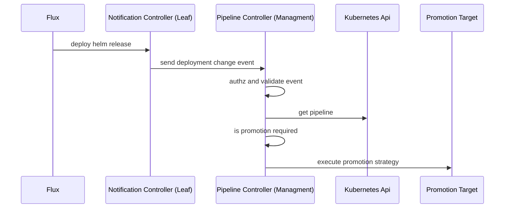
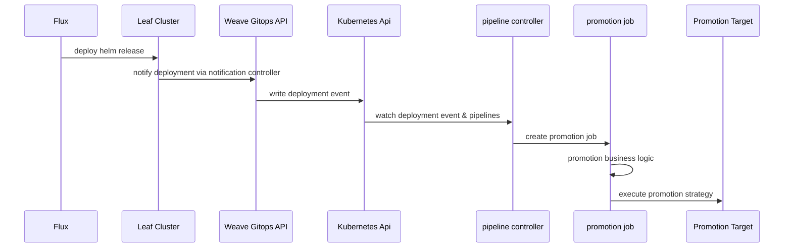
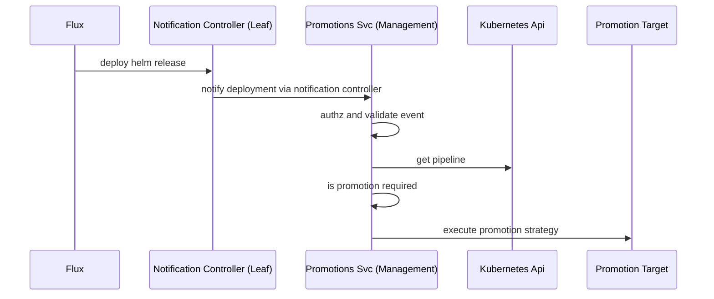

# RFC-0003 Pipeline promotions 

**Status:** provisional

**Creation date:** 2022-10-xx

**Last update:** 2022-10-xx

## Summary

Given a continuous delivery pipeline, the application goes via different environments on its way to production. We 
need an action to signal the intent of deploying an application between environments. That concept is generally known as a
promotion. Current pipelines in weave gitops does not support promotion. This RFC addresses this gap 
as specified in the [product initiative](https://www.notion.so/weaveworks/Pipeline-promotion-061bb790e2e345cbab09370076ff3258).

## Terminology

- **Pipeline**: a continuous delivery Pipeline declares a series of environments through which a given application is expected to be deployed.
- **Promotion**: action of moving an application from a lower environment to a higher environment within a pipeline.
  For example promote staging to production would attempt to deploy an application existing in staging environment to production environment.
- **Promotion Strategy**: a concrete promotion. for example, **create a pull request** could be a promotion strategy 
or promote by calling an external system.
- **Promotion Target**: the entity receiving the action of the promotion. For example, in the context of an strategy `create pull request`
a promotion target will be the configuration git repo. In the example of calling external promotion, for example a jenkins server
could be the promotion target.
- **Environment**: An environment consists of one or more deployment targets. An example environment could be “Staging”.
- **Deployment target**: A deployment target is a Cluster and Namespace combination. For example, the above “Staging” environment, could contain {[QA-1, test], [QA-2, test]}.
- **Application**: A Helm Release.

## Motivation

Given a continuous delivery pipeline, the application goes via different environments in its way to production. We
need an action to sign the intent of deploying an application between environments. That concept is generally known as a
promotion. Current pipelines in weave gitops does not support promotion. 

### Goals

- Design the e2e solution for promotions on weave gitops pipelines.
- Should support the [scenarios identified](https://www.notion.so/weaveworks/Pipeline-promotion-061bb790e2e345cbab09370076ff3258#5b514ad575544595b1028d73e5b6dd23) 

### Non-Goals

- Anything beyond the scope of promotions.
- Scenarios other than the identified in the product initiative.

## Proposal
We propose to use a solution as specified in the following diagram. 



With three main activities

1. Detect deployment changes
2. Determine whether a promotion is needed  
3. Execute the promotion 

### Detect deployment changes

The solution leverages [flux native notification capabilities](https://fluxcd.io/flux/components/notification/) for this responsibility.
Notification controllers in leaf clusters would notify of deployment events to the management cluster via 
a deployment webhook. The management cluster will ingest and validate these deployment events. 

A deeper look into this part of the solution could be found [here](detect-deployment-changes.md).

### Determine whether a promotion is needed

This responsibility is assumed by the `pipeline controller` running in the management cluster that
determines whether, at the back of the deployment event and a pipeline definition, a promotion is required and 
initialise the promotion. 

A deeper look into this part of the solution could be found [here](determine-promotion-needs.md).

### To execute the promotion

Once the previous evaluation considers that a promotion is required, pipeline controller would be in charge 
of orchestrating and executing the promotion. The promotion configuration will be added as part of the pipeline spec. 

A deeper look into this part of the solution could be found [here](execute-promotion.md).

### Non-functional requirements

This section does a quick look into non-functional requirements for the solution at glance. 

#### Security

The solution is secured by design as 

1. Communication between leaf and management clusters are via https channel with endpoint authz via HMAC.
2. Deployment events are validated to reduce the risks of impersonation.  
3. Each promotion strategy will have their own security configuration. 

#### Scalability

The solution is scalable by design as 

- It could horizontally scale by the number of replicas of pipeline controller.
- It could vertically scale by using `goroutines` to concurrently handle promotion requests.  

#### Reliability

Pipeline controller will need to implement the fault tolerance and reliability features within its business logic per 
promotion strategy. For example, in the context of opening a pr against github, it will require to manage retries to 
recover from api rate limiting.

#### Monitoring

To leverage existing [kubebuilder metrics](https://book.kubebuilder.io/reference/metrics.html). There will be the need
to enhance default controller metrics with business metrics like `latency of a promotion by application`.

### Why this solution

The current solution has been chosen over its alternatives (see alternatives section) due to

- It enables promotions.
- It allows to separations roles, therefore permissions between the components notifying the change and executing the promotion.
- It follows [notification controller pattern](https://fluxcd.io/flux/guides/webhook-receivers/#expose-the-webhook-receiver).
- It is easier to develop over other alternatives.
- It keeps split user-experience and machine-experience apis.

On the flip side, the solution has the following constraints:

- Platform operators needs to manage another api surface, in this case, the `promotion webhook` endpoint.
- Non-canonical usage of controllers as its behaviour is driven by ingested event than change in the declared state of a resource.
  - We accept this tradeoff as pipeline controller provides us with a balanced approach between tech-debt and easy to start delivering
  over other alternatives (like creating another component).

## Alternatives

This solution is the result of two different alternative evaluations:
1. Alternatives to detect deployment changes. 
2. Alternatives to process and execute promotions.

### Alternatives to detect deployment changes.

This approach suggests the creation of [kubernetes watchers](https://kubernetes.io/docs/reference/using-api/api-concepts/#efficient-detection-of-changes)
per remote cluster. Each watcher would get notified whenever a Helm release in the remote cluster changes
and take an action to start the next promotion based on the Pipeline definition.

[Tracking issue](https://github.com/weaveworks/weave-gitops-enterprise/issues/1481)

#### Sequence diagram

```mermaid
   sequenceDiagram
    actor U as operator
    U->>+API Server: creates Pipeline
    participant PC as Pipeline Controller
    participant PS as Promotion Strategy
    API Server->>+PC: notifies
    participant dt1 as dev/target 1
    
    rect rgb(67, 207, 250)
    note right of PC: setup phase
    note right of PC: pipelines.wego.weave.works/name<br/>pipelines.wego.weave.works/env<br/>pipelines.wego.weave.works/target
    PC->>+dt1: label AppRef with metadata
    participant dt2 as dev/target 2
    PC->>+dt2: label AppRef with metadata
    participant pt1 as prod/target 1
    PC->>+pt1: label AppRef with metadata
    end
   
    rect rgb(50, 227, 221)
    note right of PC: promotion phase
    PC-->>+dt1: watches HelmRelease and Kustomizations changes
    PC-->>+dt2: watches HelmRelease and Kustomizations changes
    PC-->>+pt1: watches HelmRelease and Kustomizations changes
    end


    dt1->>+PC: update events from AppRef
    PC ->>PC: filter upgrade events 
    PC ->>PC: extract metadata 
    PC->>+PS: kicks off
  ```

#### Evaluation

**Advantages**

1. Plug n play: no further configurations or setup is needed to get updates.
1. Simple authentication: No need to worry about who triggered the event, since we are talking directly with the target.

**Disadvantages and Mitigations**

1. Requires Flux on all leaf clusters.
2. Scalability is unclear, we don't know the threshold at which the controller will be able to handle without issues.
3. There is no way to kick off promotions externally

### Alternatives to process and execute promotions.

They difference among them is around 
the component serving the promotion logic, therefore the alternatives names are based on it.

- Alternative A: weave gitops backend
- Alternative B: weave gitops api + pipeline controller  + promotion executor
- Alternative C: promotions service (new service)

#### Alternative A: weave gitops backend

```mermaid
   sequenceDiagram
    participant F as Flux
    participant LC as Notification Controller (Leaf)
    F->>LC: deploy helm release
    LC->>wge: send deployment change event
    participant wge as Weave Gitops Backend (Managment)
    wge->>wge: authz and validate event
    participant k8s as Kubernetes Api
    wge->>k8s: get pipeline
    wge->>wge: is promotion required
    participant k8s as Kubernetes Api
    wge->>promotionTarget: execute promotion strategy 
    participant promotionTarget as Promotion Target
```

This solution is different from `pipeline controller` in that the three responsibilities: 

1. Notify deployment changes
2. Determine whether a promotion is needed
3. Execute the promotion

are fulfilled within weave gitops backend app.

**Pro**
- Already setup and *should* be more easily exposed. 
- No need to manage other exposed surface, therefore less to secure.

**Cons**
- Notifier service account needs permissions for promotion resources.
- Current api layer is designed as an experience layer for users (humans) while the promotion webhook is intended for machines.
- Extends the api layer with rest api so it would require to manage both grpc and rest apis that would increase maintainability costs.  


#### Alternative B: weave gitops api + pipeline controller  + promotion executor



This solution is different from `pipeline controller` in that the three responsibilities are split

1. Notify deployment changes: ingestion is done via weave gitops api. The event is written in pipeline resource. 
2. Determine whether a promotion is needed: pipeline controller watches for changes in pipeline.
3. Execute the promotion: extracted to a kubernetes job layer. 

**Pro**
- Using ingestion layer so not increased operational costs.  
- No need to generate TS client
- Pipeline controller with reconcile loop so canonical usage. 
- Scalability and fault-tolerance by design.

**Cons**
- Needs for writing the pipeline resource.
- The most complex alternative. 
- To extract the promotion execution logic into an external component, would require to also create a management layer 
between pipeline controller to the execution layer. 

#### Alternative C: promotions service

This solution would be to create a new component with the promotions responsibility. 


**Pro**
- Easiest to dev against (vs api solution).
- No controller so no reconcile loop executed (vs pipeline controller solution). 

**Cons**
- Ee would need to create it from scratch. 
- One more component to manage. 

## User Stories 

This section shows how the current proposal addresses the different scenarios specified in the [product
initiative](https://www.notion.so/weaveworks/Pipeline-promotion-061bb790e2e345cbab09370076ff3258#5b514ad575544595b1028d73e5b6dd23).
It serves as part of the acceptance of the current design.

### Promotion for a pipeline with a single deployment target per environment

The original scenario is specified [here](https://www.notion.so/weaveworks/Pipeline-promotion-061bb790e2e345cbab09370076ff3258#0c0d8c38b42b4b1eb8c5fa7ff3a2ac31).

An example of a pipeline for this scenario is shown below.

```yaml
apiVersion: pipelines.weave.works/v1alpha1
kind: Pipeline
metadata:
  name: search
  namespace: search
spec:
  appRef:
    kind: HelmRelease
    name: search-helmrelease
    apiVersion: helm.toolkit.fluxcd.io/v2beta1
  promotion:
    pullRequest:
      url: https://github.com/organisation/gitops-configuration-monorepo.git
      branch: main
  environments:
    - name: dev
      targets:
        - namespace: search
          clusterRef:
            kind: GitopsCluster
            name: dev
            namespace: flux-system
    - name: prod
      targets:
        - namespace: search
          clusterRef:
            kind: GitopsCluster
            name: prod
            namespace: flux-system
```

It is covered by [promotion business rules](determine-promotion-needs.md#promotion-decisions-business-logic) where 
we want to execute promotions by environment and by deployment target. This is the base scenario. 


### Promotion for a pipeline with multiple deployment target per environment

Original scenario specified [here](https://www.notion.so/weaveworks/Pipeline-promotion-061bb790e2e345cbab09370076ff3258#2ffaf6d0bdc144269e39f5a44acb0dc3)

An example of a pipeline for this scenario is shown below.

```yaml
apiVersion: pipelines.weave.works/v1alpha1
kind: Pipeline
metadata:
  name: search-multiple-targets
  namespace: search
spec:
  appRef:
    kind: HelmRelease
    name: search-helmrelease
    apiVersion: helm.toolkit.fluxcd.io/v2beta1
  promotion:
    pullRequest:
      url: https://github.com/organisation/gitops-configuration-monorepo.git
      branch: main
  environments:
    - name: dev
      targets:
        - namespace: search
          clusterRef:
            kind: GitopsCluster
            name: dev
            namespace: flux-system
    - name: test
      targets:
        - namespace: search
          clusterRef:
            kind: GitopsCluster
            name: qa
            namespace: flux-system
        - namespace: search
          clusterRef:
            kind: GitopsCluster
            name: perf
            namespace: flux-system
```
The particularity of this scenario is that we want to raise a PR for each of the deployment targets that we have. This is
covered by [promotion business rules](determine-promotion-needs.md#promotion-decisions-business-logic) rule #1

>1. Promotion tasks are applied to deployment targets.

### Promotion for a pipeline with multiple deployment target per environment

Original scenario specified [here](https://www.notion.so/weaveworks/Pipeline-promotion-061bb790e2e345cbab09370076ff3258#3ea85277de5543d69a9e19407e69c84b)

An example of a pipeline representing this scenario could be found 

```yaml
apiVersion: pipelines.weave.works/v1alpha1
kind: Pipeline
metadata:
  name: search-multiple-targets
  namespace: search
spec:
  appRef:
    kind: HelmRelease
    name: search-helmrelease
    apiVersion: helm.toolkit.fluxcd.io/v2beta1
  promotion:
    pullRequest:
      url: https://github.com/organisation/gitops-configuration-monorepo.git
      branch: main
  environments:
    - name: dev
      targets:
        - namespace: search
          clusterRef:
            kind: GitopsCluster
            name: dev
            namespace: flux-system
    - name: test
      targets:
        - namespace: search
          clusterRef:
            kind: GitopsCluster
            name: qa
            namespace: flux-system
        - namespace: search
          clusterRef:
            kind: GitopsCluster
            name: perf
            namespace: flux-system
    - name: prod
      targets:
        - namespace: search
          clusterRef:
            kind: GitopsCluster
            name: prod
            namespace: flux-system
```
The particularity of this scenario, is that we want to promote to production as soon as a deployment to test 
has been successfully happen. This scenario is covered
by [promotion business rules](determine-promotion-needs.md#promotion-decisions-business-logic) rule #2 

>2. Promotion between environment will happen when at least one of lower-environment deployment targets has been successfully deployed.

it will promote to prod as soon as a successful deployment to either `qa` or `perf` has happened.

### Promotion via external process

Original scenario specified [here](https://www.notion.so/weaveworks/Pipeline-promotion-061bb790e2e345cbab09370076ff3258#bd4524a6838742cfa254642c1b42443f)

This scenario is currently supported by having [Call Webhook promotion strategy](execute-promotion.md#call-a-webhook).
An example of pipeline for this story is shown below. 

```yaml
apiVersion: pipelines.weave.works/v1alpha1
kind: Pipeline
metadata:
  name: search-multiple-targets
  namespace: search
spec:
  appRef:
    kind: HelmRelease
    name: search-helmrelease
    apiVersion: helm.toolkit.fluxcd.io/v2beta1
  promotion:
    webhook:
      url: https://my-jenkins.prod/webhooks/XoLZfgK
      secretRef: my-jenkins-promotion-secret  
  environments:
    - name: dev
      targets:
        - namespace: search
          clusterRef:
            kind: GitopsCluster
            name: dev
            namespace: flux-system
```

## Implementation History

- [Promotions Issue](https://github.com/weaveworks/weave-gitops-enterprise/issues/1589)