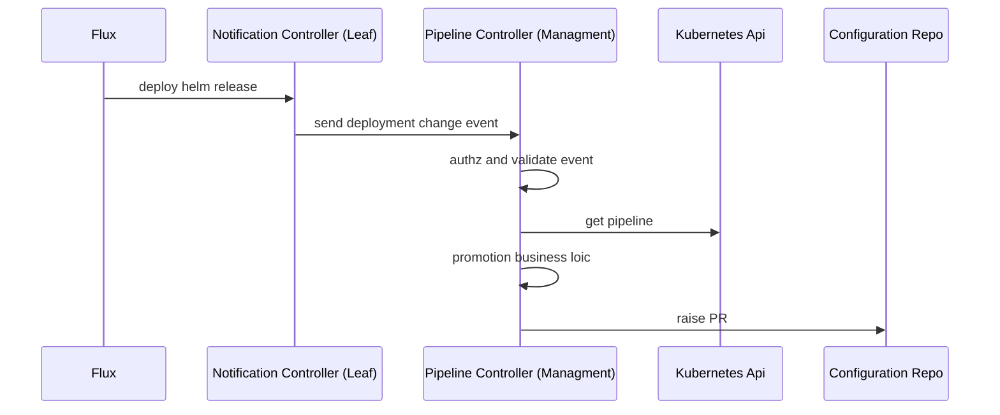
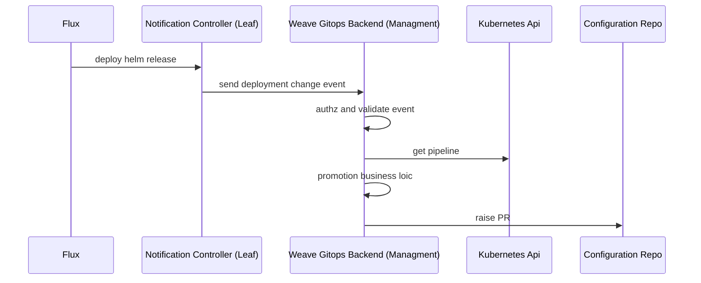
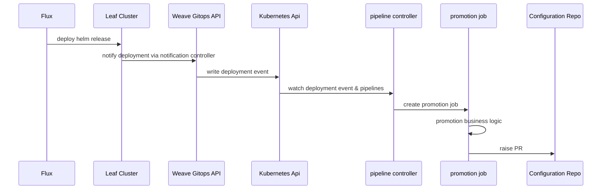
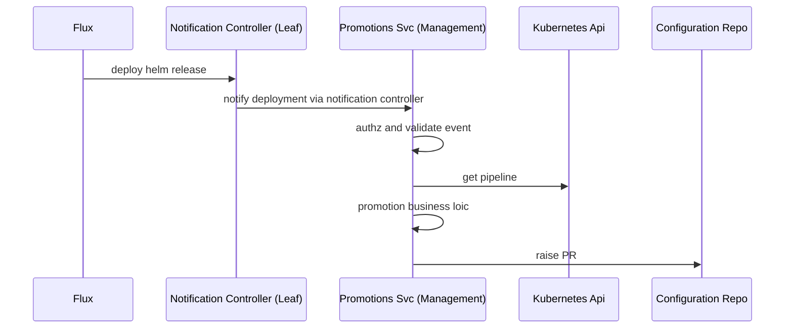

# RFC-0003 Pipeline promotions 

**Status:** provisional

**Creation date:** 2022-10-xx

**Last update:** 2022-10-xx

## Summary

Given a continuous delivery pipeline, the application goes via different environments in its way to production. We 
need an action to sign the intent of deploying an application between environments. That concept is generally known as a
promotion. Current pipelines in weave gitops does not support promotion. This RFC addresses this gap 
as specified in the [product initiative](https://www.notion.so/weaveworks/Pipeline-promotion-061bb790e2e345cbab09370076ff3258)

## Terminology

- **Pipeline**: a continuous delivery Pipeline declares a series of environments through which a given application is expected to be deployed.
- **Promotion**: action of moving an application from a lower environment to a higher environment within a pipeline.
  For example promote stating to production would attempt to deploy an application existing in staging environment to production environment.
- **Environment**: An environment consists of one or more deployment targets. An example environment could be “Staging”.
- **Deployment target**: A deployment target is a Cluster and Namespace combination. For example, the above “Staging” environment, could contain {[QA-1, test], [QA-2, test]}.
- **Application**: A Helm Release.

## Motivation

Given a continuous delivery pipeline, the application goes via different environments in its way to production. We
need an action to sign the intent of deploying an application between environments. That concept is generally known as a
promotion. Current pipelines in weave gitops does not support promotion. This RFC addresses this gap
as specified in the [product initiative](https://www.notion.so/weaveworks/Pipeline-promotion-061bb790e2e345cbab09370076ff3258)

### Goals

- Design the e2e solution for promotions on weave gitops pipelines.
- Should support the [scenarios identified](https://www.notion.so/weaveworks/Pipeline-promotion-061bb790e2e345cbab09370076ff3258#5b514ad575544595b1028d73e5b6dd23) 

### Non-Goals

- Anything beyond the scope of promotions.
- Scenarios other than the identified in the product initiative.

## Proposal
We propose to use a solution as specified in the following diagram. 



With three main activities

1. Notify deployment changes
2. Determine whether a promotion is needed  
3. Execute the promotion 

### Notify deployment changes

The solution leverages [flux native notification capabilities](https://fluxcd.io/flux/components/notification/) for this responsibility. 
An evaluation of different alternatives solutions to this concern could be found [here](detect-deployment-changes.md).

### Determine whether a promotion is needed

This responsibility is assumed by `pipeline controller` living in the management cluster that 
- would expose a webhook to ingest deployment change events.
- process concurrently the deployment events 
- determine whether at the back of the event and a pipeline definition, a promotion is required. 

### To execute the promotion

Once the previous evaluation considers that a promotion is required, pipeline controller would be in charge 
of orchestrating and executing the task according to its configuration.

### Non-functional requirements

As enterprise feature, we try also to understand the considerations in terms of non-functional requirements to ensure 
that no major impediments are found in the future. 

#### Security 

Promotions have a couple of activities that requires to drill down in terms of security:

1. communication of deployment changes via webhook so over the network. 
2. to create pull requests, so write access to gitops configuration repo.

**Security for deployment changes via webhook**

Communications between leaf cluster and management cluster will be protected using HMAC. HMAC shared key 
will be used for both authentication and authorization. Application teams will be able to specify the key to use within 
the pipeline spec as a global value. Key management will be done by the application team.

Both to simplify user experience for key management and other security configuration will be evolved over time.

**Security for pull request creation**

In order to create a pull request in the configuration repo, secrets will be required to both 
- clone the git repo via http or ssh 
- create the pull request via http api

The secrets will be referenced as part of a pull request promotion task configuration. The lifecycle of the secrets
will be managed out of pipelines by the application team.

#### Scalability

The initial strategy to scale the solution by number of request, would be vertically by using goroutines.

#### Reliability 

It will be implemented as part of the business logic of pipeline controller.  

#### Monitoring 

To leverage existing [kubebuilder metrics](https://book.kubebuilder.io/reference/metrics.html). There will be the need 
to enhance default controller metrics with business metrics like `latency of a promtion by application`.

### Why this solution

The current solution has been chosen over its alternatives (see alternatives section) due to

- It enables promotions.
- It allows to separations roles, therefore permissions between the components notifying the change and executing the promotion.
- It follows [notification controller pattern](https://fluxcd.io/flux/guides/webhook-receivers/#expose-the-webhook-receiver).
- It is easier to develop over other alternatives.
- It keeps split user-experience and machine-experience apis.

On the flip side, the solution has the following constraints:

- Platform operators needs to manage another api surface, in this case, the `promotion webhook` endpoint.
- Non-canonical usage of controllers as its behaviour is driven by ingested event than change in the declared state of a resource.
  - We accept this tradeoff as pipeline controller provides us with a balanced approach between tech-debt and easy to start delivering
  over other alternatives (like creating another component).

## Alternatives

Other alternatives solutions have been discovered and discussed. They difference among them is around 
the component serving the promotion logic, therefore the alternatives names are based on it.

- Alternative A: weave gitops backend
- Alternative B: weave gitops api + pipeline controller  + promotion executor
- Alternative C: promotions service (new service)

### Alternative A: weave gitops backend



This solution is different from `pipeline controller` in that the three responsibilities 

1. Notify deployment changes
2. Determine whether a promotion is needed
3. Execute the promotion

are fulfilled within weave gitops backend app.

**Pro**
- Already setup and *should* be more easily exposed. 
- No need to manage other exposed surface, therefore less to secure.
- No need to generate TS client

**Cons**
- Notifier service account needs permissions for promotion resources.
- Current api layer is designed as an experience layer for users (humans) while the promotion webhook is intended for machines. 

### Alternative B: weave gitops api + pipeline controller  + promotion executor



This solution is different from `pipeline controller` in that the three responsibilities are split

1. Notify deployment changes: ingestion is done via weave gitops api. the event is written in pipeline resource. 
2. Determine whether a promotion is needed: pipeline controller watches for changes in pipeline.
3. Execute the promotion: extracted to a kubernetes job layer. 

**Pro**
- Using ingestion layer so not increased operational costs.  
- No need to generate TS client
- Pipeline controller with reconcile loop so canonical usage. 
- Scalability and fault-tolerance by design.

**Cons**
- Needs to write in pipeline resource
- Most complex solution
- Kubernetes jobs not a popular choice

### Alternative C: promotions service

This solution would be to create a new component with the promotions responsibility. 


**Pro**
- Easiest to dev against (vs api solution).
- No controller so no reconcile loop executed (vs pipeline controller solution). 

**Cons**
- Ee would need to create it from scratch. 
- One more component to manage. 

## Design Details

### Pipeline spec changes for promotions

In order to accommodate promotion logic, the pipeline spec would be extended with a `promotion` field as shown below

```yaml
apiVersion: pipelines.weave.works/v1alpha1
kind: Pipeline
metadata:
  name: podinfo
  namespace: default
spec:
  appRef:
    apiVersion: helm.toolkit.fluxcd.io/v2beta1
    kind: HelmRelease
    name: podinfo
    #used for hmac authz - this could change at implementation 
    secretRef: my-hmac-shared-secret 
  promotion:
  - name: promote-via-pr
    type: pull-request
    url: git@github.com:organization/repo
    branch: main
    secretRef: my-other-deployed-secret
  environments:
  - name: dev
     targets:
     - namespace: podinfo
        clusterRef:
          kind: GitopsCluster
          name: dev
```
The promotion field used to capture the promotion tasks for the next environment in the pipeline after a successful deployment has taken place.
Each task will include the following fields:

- `name`: the task name
- `type`: the task type, either webhook or pull-request
- `url` : the git repository url or the webhook url
- `branch`: the branch to use for the update, defaults to main (only applicable when kind is pull-request)
- `secretRef`: a reference to a secret in the same namespace as the pipeline that holds the authentication credentials for the repository or the webhook.

### Promotions Webhook

The endpoint should receive webhook requests to indicate a promotion of an environment.

Each environment of each pipeline has its own webhook URL for triggering a promotion:

```
/pipelines/promotions/{namespace}/{name}/{environment}
```

When a request is received, the handler will look up the environment in the pipeline to:

- `authz` the request via hmac
- `validate` the promotion
- `lookup and execute` the promotion actions

The handler needs to run with it own set of permissions (not user permissions) to be able 
to read app versions across environments in a pipeline.

## Implementation History

- [Promotions Issue](https://github.com/weaveworks/weave-gitops-enterprise/issues/1589)