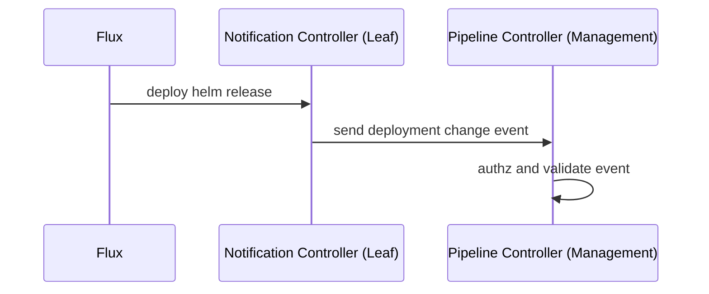

# Detect deployment changes
This document looks in a bit more detail to the part of the solution around detecting or notifying deployment changes.
It is the part of the promotions solution described in the diagram. 



In order to notify deployment changes, we leverage [flux native notification capabilities](https://fluxcd.io/flux/components/notification/).
Notification controllers in leaf clusters notify of deployment events to the management cluster via
a deployment webhook. The management cluster will receive, authorise and validate these events. 

## Sending deployment events 

An [alert](https://fluxcd.io/flux/components/notification/alert/) / [provider](https://fluxcd.io/flux/components/notification/provider/)
would be setup to call a webhook running on the management cluster to notify a Helm release change in a leaf cluster.

An example of how the resources could look like is found below.

```yaml 
apiVersion: notification.toolkit.fluxcd.io/v1beta1
kind: Alert
metadata:
  name: search
  namespace: shopping
spec:
  summary: "foobar"
  providerRef: 
    name: weave-gitops
  eventSeverity: info
  eventSources:
    - kind: HelmRelease
      name: search
---      
apiVersion: notification.toolkit.fluxcd.io/v1beta1
kind: Provider
metadata:
  name: weave-gitops
  namespace: shopping
spec:
  type: generic-hmac
  address: https://weave-gitops/pipelines/promotions/{namespace}/{name}/{environment}
  secretRef:
    name: weave-gitops-secret-secret
```
An example event of how this deployment change event looks like could be found below 

```json
{
  "involvedObject": {
    "kind": "HelmRelease",
    "namespace": "shopping",
    "name": "search",
    "uid": "57c3579b-42da-4f27-afc5-8bd7778286e1",
    "apiVersion": "helm.toolkit.fluxcd.io/v2beta1",
    "resourceVersion": "155540"
  },
  "severity": "info",
  "timestamp": "2022-09-13T16:01:01Z",
  "message": "Helm upgrade succeeded",
  "reason": "info",
  "metadata": {
    "revision": "0.13.4",
    "summary": "foobar"
  },
  "reportingController": "helm-controller",
  "reportingInstance": "helm-controller-7cdc7874f8-9qpft"
}
```

## Promotions Webhook

The endpoint should receive webhook requests to indicate a promotion of an environment.

Each environment of each pipeline has its own webhook URL for triggering a promotion. The path for the URL 
looks like 

```
/pipelines/promotions/{namespace}/{name}/{environment}
```

When a request is received, the handler will look up the environment in the pipeline to:

- `authz` the request via hmac.
- `validate` the event promotion.
- `lookup and execute` the promotion actions.

The handler needs to run with it own set of permissions (not user permissions) to be able
to read app versions across environments in a pipeline.

## Security

Communications between leaf cluster and management cluster will be protected using [HMAC](https://en.wikipedia.org/wiki/HMAC).
HMAC shared key will be used for both authentication and authorization.

At the back [this story](https://github.com/weaveworks/pipeline-controller/issues/31) this section would need to be updated
but current design guidelines state that:

- Application teams will be able to specify the key to use within the pipeline spec as a global value via a secretRef. 
- Key management will be done manually by the application team.

This approach puts a known operational overhead for the application team at this stage. The experience will be
simplified over time by automation to reduce maintenance costs. 


## Delivery semantics/failure scenarios recovery for notifications

The notification-controller is using [rate limiting](https://fluxcd.io/flux/components/notification/options/) that's
only configurable globally with a default of 5m. This might lead to events not being emitted to the webhook.

notification-controller has [at-most once delivery semantics](https://github.com/fluxcd/notification-controller/tree/main/docs/spec#events-dispatching-1):

> The alert delivery method is at-most once with a timeout of 15 seconds. The controller performs automatic retries for
> connection errors and 500-range response code. If the webhook receiver returns an error, the controller will retry
> sending an alert for four times with an exponential backoff of maximum 30 seconds.

## Enrichment of events with custom metadata 

The [Alert spec](https://fluxcd.io/flux/components/notification/alert/) allows for custom metadata to be added to events
by means of the `.spec.summary` field. The content of this field will be added to the event's `.metadata` map with the key "summary".

## Known-Unknowns

1. How does p-c set the correct Provider address?
   2. Configuration (user burden)
   3. Automatic determination (might get complicated quick to account for the different environments (with/without Ingress, external LB, ...)
2. How does p-c create the Provider/Alert resources? If it creates them directly by going through the target clusters'
   API server then it doesn't have a way of making sure they don't get modified/deleted (owner references don't work cross-cluster).
   Having them be committed to Git can be very complicated as the controller would have to know (1) wich Git repository to commit them to,
   (2) in wich location to put them, (3) if there's a `kustomization.yaml` that would have to be patched.
   An alternative could be to use a [remote Kustomization](https://fluxcd.io/flux/components/kustomize/kustomization/#remote-clusters--cluster-api)
   and the management cluster's Git repository.

## References

- [Spike Issue](https://github.com/weaveworks/weave-gitops-enterprise/issues/1487)
- [Pipelines v2 epic](https://github.com/weaveworks/weave-gitops-enterprise/issues/1657)
