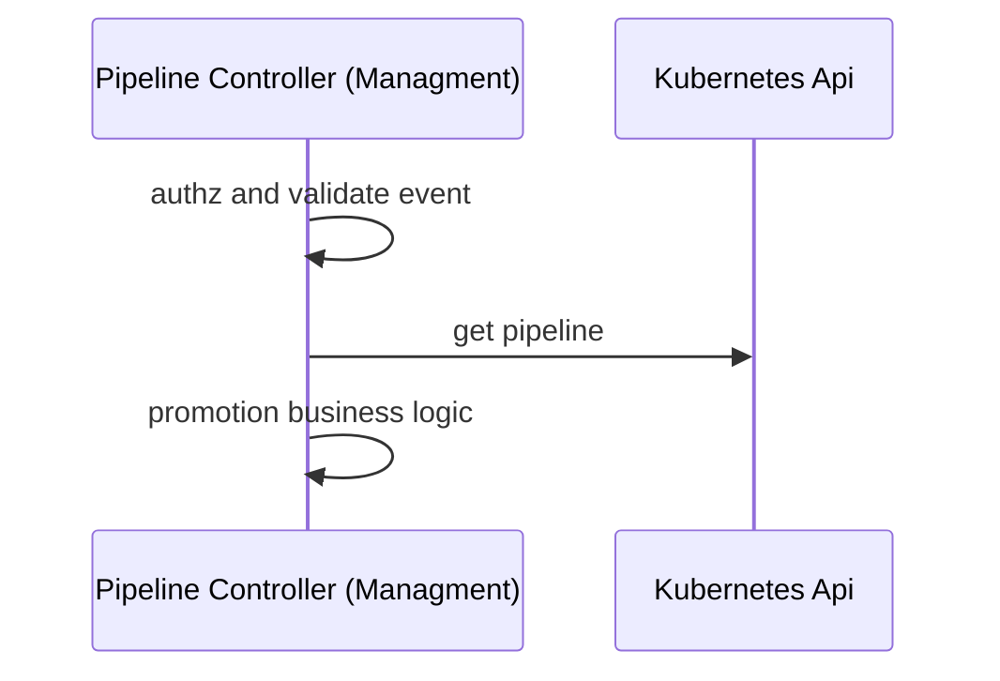

# Determine whether a promotion is needed

This document looks in a bit more detail to the part of the solution around detecting or notifying deployment changes.
It is the part of the promotions solution described in the diagram.



The responsibility of the pipeline controller is to determine whether, at the back of the deployment event and a pipeline definition, a promotion is required and
initialise the promotion. The following elements are required:

1. Context around the last deployment which comes from the [deployment event](detect-deployment-changes.md) 
2. The set of pipeline environments which is defined in the pipeline spec.
3. The promotion tasks to apply which is defined in the pipeline spec.


At the back of the following pipeline 

```yaml
apiVersion: pipelines.weave.works/v1alpha1
kind: Pipeline
metadata:
  name: podinfo
  namespace: default
spec:
  appRef:
    apiVersion: helm.toolkit.fluxcd.io/v2beta1
    kind: HelmRelease
    name: podinfo
  promotion:
    pullRequest:
       url: https://github.com/organisation/gitops-configuration-monorepo.git
       branch: main
  environments:
  - name: dev
     targets:
     - namespace: podinfo
        clusterRef:
          kind: GitopsCluster
          name: dev
  - name: prod
      targets:
        - namespace: podinfo
            clusterRef:
              kind: GitopsCluster
              name: prod
```

Promotion needs by environment will be determined by the environments field

```yaml
environments:
- name: dev
  targets:
    - namespace: podinfo
      clusterRef:
      kind: GitopsCluster
      name: dev
- name: prod
  targets:
  - namespace: podinfo
  clusterRef:
  kind: GitopsCluster
  name: prod
```

reviewhere a deployment event coming from `dev` would end up in the need for a promotion while a deployment event coming 
from `prod` will not. 

Once determined the need, the promotion strategy to use is specified in the `promotion` field. 

```yaml
  promotion:
    pullRequest:
       url: https://github.com/organisation/gitops-configuration-monorepo.git
       branch: main
```

In this case, to create a pull request into a git configuration repo. 

More information about promotion strategies could be found in [here](./execute-promotion.md)