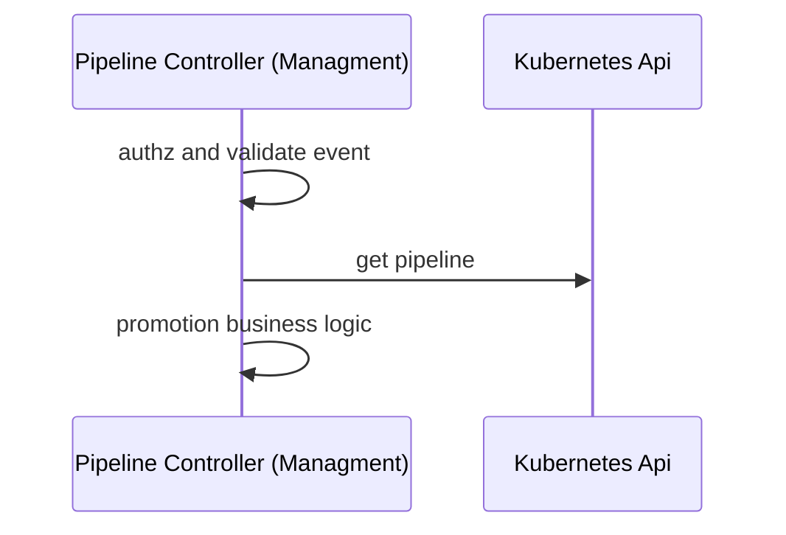

# Determine whether a promotion is needed

This document looks in a bit more detail to the part of the solution around detecting or notifying deployment changes.
It is the part of the promotions solution described in the diagram.



The responsibility of the pipeline controller is to determine whether, at the back of the deployment event and a pipeline definition,
a promotion is required and initialise the promotion. 

## Input for promotions decisions 

The following input elements are required:

1. Context around the last deployment which comes from the [deployment event](detect-deployment-changes.md). 
2. The set of pipeline `spec.environments` which is defined in the pipeline spec.

At the back of the following pipeline

```yaml
apiVersion: pipelines.weave.works/v1alpha1
kind: Pipeline
metadata:
  name: podinfo
  namespace: default
spec:
  appRef:
    apiVersion: helm.toolkit.fluxcd.io/v2beta1
    kind: HelmRelease
    name: podinfo
  promotion:
    pullRequest:
       url: https://github.com/organisation/gitops-configuration-monorepo.git
       branch: main
  environments:
  - name: dev
     targets:
     - namespace: podinfo
        clusterRef:
          kind: GitopsCluster
          name: dev
  - name: qa
      targets:
          - namespace: podinfo
            clusterRef:
              kind: GitopsCluster
              name: qa
          - namespace: podinfo
            clusterRef:
              kind: GitopsCluster
               name: perf
  - name: prod
      targets:
        - namespace: podinfo
          clusterRef:
            kind: GitopsCluster
            name: prod
```

## Promotion decisions business logic 

Given the previous input, the following requirements will be met for promotions.

1. Promotion tasks are applied to deployment targets.

For example, given the previous example, when a deployment to `dev` deployment cluster has been received, 
a promotion for environment `qa` will start by executing the promotion strategy `pullRequest` to the two 
deployment targets `qa` and `perf`

2. Promotion between environment will happen when at least one of lower-environment deployment targets has been successfully deployed. 

In the previous example, it means that we just need to wait for either `qa` or `perf` deployment targets
has been successfully deployed (event has been received), in order to start the promotion from environments `qa` to `prod`.

3. Promotions will happen for all the environments but the last one. 

Once a deployment event for `prod` has been received, no further promotions will be executed.

Once determined the need, the promotion strategy to use is specified in the `promotion` field. 

Once a promotion is required, next is to execute. More information about promotion strategies could be found in [here](./execute-promotion.md)