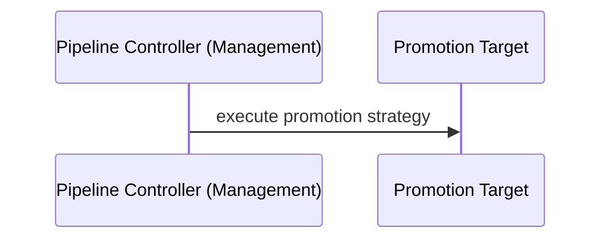

# To execute the promotion

It is the part of the solution whose end goal is to execute a promotion strategy against a promotion target.


An example of promotion strategy could be opening a pull request against a configuration repo. This document looks
deeper details to this part of the solution.

## Define a promotion strategy

A promotion strategy is defined as part of the pipeline spec in the field `spec.promotion`.
```yaml
apiVersion: pipelines.weave.works/v1alpha1
kind: Pipeline
metadata:
  name: podinfo
  namespace: default
spec:
  appRef:
    apiVersion: helm.toolkit.fluxcd.io/v2beta1
    kind: HelmRelease
    name: podinfo
  promotion:
    pullRequest:
       url: https://github.com/organisation/gitops-configuration-monorepo.git
       branch: main
       secretRef: my-gitops-configuration-monorepo-secret #contains the github token to clone and create PR
  environments:
  - name: dev
     targets:
     - namespace: podinfo
        clusterRef:
          kind: GitopsCluster
          name: dev
```

- `spec.promotion`: is an optional field that app teams could use to enhance their pipeline with promotion capabilities provided.

Under promotion, a single promotion strategy could be defined to use for promotions. The available promotions strategies are:

- `spec.promotion.pullRequest`: to promote by creating a pull request in a configuration repo.
- `spec.promotion.webhook`: to promote by calling an external system that will be in charge of the promotion logic.

### Create a PR

It creates a PR indicating the promotion of an application in a git configuration repo.

An example of this promotion task looks like

```yaml
apiVersion: pipelines.weave.works/v1alpha1
kind: Pipeline
metadata:
  name: podinfo
  namespace: default
spec:
  appRef:
    apiVersion: helm.toolkit.fluxcd.io/v2beta1
    kind: HelmRelease
    name: podinfo
  promotion:
    pullRequest:
       url: https://github.com/organisation/gitops-configuration-monorepo.git
       branch: main
       secretRef: my-gitops-configuration-monorepo-secret #contains the github token to clone and create PR
  environments:
  - name: dev
     targets:
     - namespace: podinfo
        clusterRef:
          kind: GitopsCluster
          name: dev
```
where pullRequest configuration has

- `url`: https URL for the git repo to clone.
- `branch`: git branch to do the promotion.
- `secretRef`: secret containing the tokens or keys required to clone and create the PR against the provider. See security below for more details.

#### Security

In order to create a pull request in a configuration repo to action would be mainly required:

1. To clone the configuration git repo via http or ssh.
2. To create a pull request with promoted changes.

Both actions would require a secret to use that ends in a combination of possible scenarios to eventually support.
This document assumes the simplest scenario possible which is having a single token for both
cloning via http and to create a pull request. The token will be present as kubernetes secrets and accessible by pipeline controller.

An example to visualise this configuration is shown below.

```yaml
  promotion:
    pullRequest:
      url: https://github.com/organisation/gitops-configuration-monorepo.git
      branch: main
      secretRef: my-gitops-configuration-monorepo-secret #contains the github token to clone and create PR
```
### Notification

It sends a notification to Notification Controller to delegate the promotion action to an external system. An example of this promotion task looks like

```yaml
apiVersion: pipelines.weave.works/v1alpha1
kind: Pipeline
metadata:
  name: podinfo
  namespace: default
spec:
  appRef:
    apiVersion: helm.toolkit.fluxcd.io/v2beta1
    kind: HelmRelease
    name: podinfo
  promotion:
    notification: {}
  - name: dev
     targets:
     - namespace: podinfo
        clusterRef:
          kind: GitopsCluster
          name: dev
```

To effectivelly make the call to an external system, the user will need to configure some Custom Resources so Notification Controller can properly forward those notifications. An example of it:

```yaml
apiVersion: notification.toolkit.fluxcd.io/v1beta1
kind: Provider
metadata:
  name: jenkins
  namespace: jenkins-system
spec:
  type: generic
  address: https://JENKINS_URL/generic-webhook-trigger/invoke
---
apiVersion: notification.toolkit.fluxcd.io/v1beta1
kind: Alert
metadata:
  name: podinfo
  namespace: default
spec:
  providerRef:
    name: jenkins
  eventSeverity: info
  eventSources:
    - kind: Pipeline
      name: podinfo
```

More info on the payload sent [here](https://fluxcd.io/flux/components/notification/provider/#generic-webhook).
