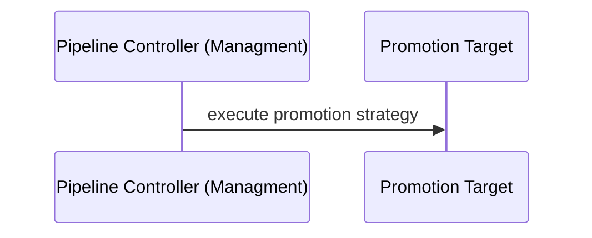

# To execute the promotion

It is the part of the solution whose end goal is to execute a promotion strategy against a promotion target. 



Example of promotion strateglike raise a PR, 
call an external webhook, etc. This document aims to look in deeper detail to this section by promotion task.


## Define a promotion strategy

A promotion strategy is defined as part of the pipeline spec in the field `spec.promotion` as you could see below.
```yaml
apiVersion: pipelines.weave.works/v1alpha1
kind: Pipeline
metadata:
  name: podinfo
  namespace: default
spec:
  appRef:
    apiVersion: helm.toolkit.fluxcd.io/v2beta1
    kind: HelmRelease
    name: podinfo
  promotion:
    pullRequest:
       url: https://github.com/organisation/gitops-configuration-monorepo.git
       branch: main
       secretRef: my-gitops-configuration-monorepo-secret #contains the github token to clone and create PR  
  environments:
  - name: dev
     targets:
     - namespace: podinfo
        clusterRef:
          kind: GitopsCluster
          name: dev
```

spec.promotion: is an optional field that app teams could use to enhance their pipeline with promotion capabilities provided.
Under promotion, a single promotion strategy could be defined to use for promotions. The available promotions strategies are: 

- Create a PR: define `spec.promotion.pullRequest` in order to create a PR indicating the promotion of an application in a git configuration repo.
- Call a webhook: define `spec.promotion.webhook` in order to call a webhook to delegate the promotion action to an external system.

### Create a PR

It creates a PR indicating the promotion of an application in a git configuration repo. 

An example of this promotion task looks like 

```yaml
apiVersion: pipelines.weave.works/v1alpha1
kind: Pipeline
metadata:
  name: podinfo
  namespace: default
spec:
  appRef:
    apiVersion: helm.toolkit.fluxcd.io/v2beta1
    kind: HelmRelease
    name: podinfo
  promotion:
    pullRequest:
       url: https://github.com/organisation/gitops-configuration-monorepo.git
       branch: main
       secretRef: my-gitops-configuration-monorepo-secret #contains the github token to clone and create PR  
  environments:
  - name: dev
     targets:
     - namespace: podinfo
        clusterRef:
          kind: GitopsCluster
          name: dev
```
#### Security

In order to create a pull request in a configuration repo to action would be mainly required:

1. To clone the configuration git repo via http or ssh.
2. To create a pull request with promoted changes.

Both actions would require a secret to use that ends in a combination of possible scenarios to eventually support.
This document assumes the simplest scenario possible which is having a single token for both
cloning via http and to create a pull request. The token will be present as kubernetes secrets and accessible by pipeline controller.

An example to visualise this configuration is shown below.

```yaml
  promotion:
    pullRequest:
      url: https://github.com/organisation/gitops-configuration-monorepo.git
      branch: main
      secretRef: my-gitops-configuration-monorepo-secret #contains the github token to clone and create PR  
```
### Call a webhook 

It calls a webhook to delegate the promotion action to an external system. An example of this promotion task looks like

```yaml
apiVersion: pipelines.weave.works/v1alpha1
kind: Pipeline
metadata:
  name: podinfo
  namespace: default
spec:
  appRef:
    apiVersion: helm.toolkit.fluxcd.io/v2beta1
    kind: HelmRelease
    name: podinfo
  promotion:
    webhook:
       url: https://my-jenkins.prod/webhooks/XoLZfgK
       secretRef: my-jenkins-promotion-secret #secretontains the github token to clone and create PR  
  environments:
  - name: dev
     targets:
     - namespace: podinfo
        clusterRef:
          kind: GitopsCluster
          name: dev
```

#### Security

For the `webhook` promotion step we follow the same configuration as flux [notification controller provider](https://fluxcd.io/flux/components/notification/provider/#generic-webhook)
where the secret contains 

```
	// Secret reference containing the provider details, valid key names are: address, proxy, 
	// token, headers (YAML encoded)
```