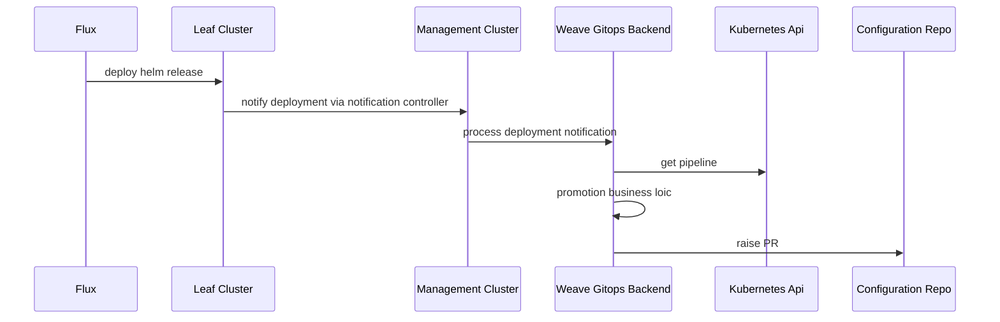
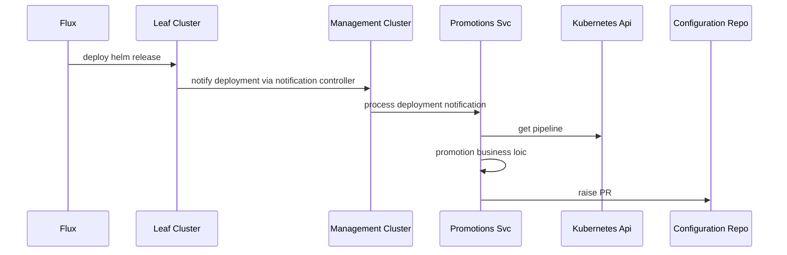
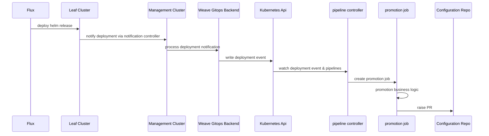

# RFC-0003 How promotions solution looks like 

<!--
The title must be short and descriptive.
-->

**Status:** provisional

<!--
Status represents the current state of the RFC.
Must be one of `provisional`, `implementable`, `implemented`, `deferred`, `rejected`, `withdrawn`, or `replaced`.
-->

**Creation date:** 2022-10-05

**Last update:** 2022-10-05

## Summary

<!--
One paragraph explanation of the proposed feature or enhancement.
-->

Given a continuous delivery pipeline is comprised of diffferent environments the application goes trough in
its way to production, there is need for an action to move the application among environments. That concept is known as
promotion and it is a one of the core concepts of a pipelines domain.

This RFC looks at different e2e solutions for promotions.

## Terminology

- **Pipeline**: a continuous delivery Pipeline declares a series of environments through which a given application is expected to be deployed.
- **Promotion**: action of moving an application from a lower environment to a higher environment within a pipeline.
  For example promote stating to production would attempt to deploy an application existing in staging environment to production environment.
- **Environment**: An environment consists of one or more deployment targets. An example environment could be “Staging”.
- **Deployment target**: A deployment target is a Cluster and Namespace combination. For example, the above “Staging” environment, could contain {[QA-1, test], [QA-2, test]}.
- **Application**: A Helm Release.

## Motivation

<!--
This section is for explicitly listing the motivation, goals, and non-goals of
this RFC. Describe why the change is important and the benefits to users.
-->

This RFC looks at different e2e solutions for promotions.

### Goals

<!--
List the specific goals of this RFC. What is it trying to achieve? How will we
know that this has succeeded?
-->

- Discover different e2e solutions for promotions.
- Recommend the one that seems better suited for the role.

### Non-Goals

<!--
What is out of scope for this RFC? Listing non-goals helps to focus discussion
and make progress.
-->
- Anything no promotions related

## Solution Alternatives 

The following solutions has been identified
- Alternative A: weave gitops backend
- Alternative B: pipeline controller
- Alternative C: new service called promotions service
- Alternative D: cluster services + pipeline controller  + promotion executor

### Alternative A: weave gitops backend

#### Diagram

#### Pro
- already setup and *should* be more easily exposed
- no need to generate TS client

#### Cons
- service account needs extra permissions
- need to work around entitlements/user auth

### Alternative B: pipeline controller

#### Diagram

#### Pro
- separate service account and permissions
- easier to dev against

#### Cons

- need service/ingress resource to expose it
- feels weird for a controller to not run a reconcile loop and instead host a webhook server

### Alternative C: new service called promotions service
#### Diagram

#### Pro
- easiest to dev against

#### Cons
- 1 more component for the team to maintain
- new repo/CI (?)

### Alternative D: cluster services + pipeline controller  + promotion executor
#### Diagram

#### Pro
- separation of concerns with scalability and fault-tolerance by design

#### Cons
- most complex solution (might be over complex?)
- kubernetes jobs not a popular choice 