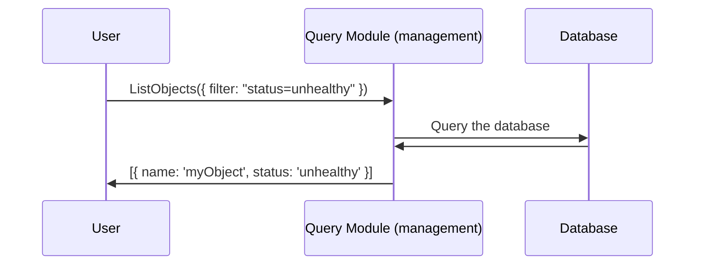
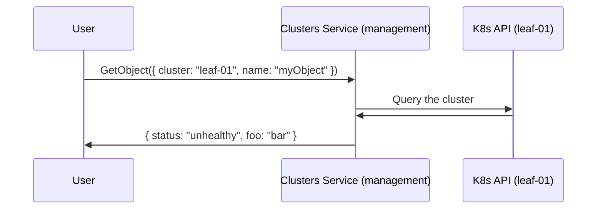
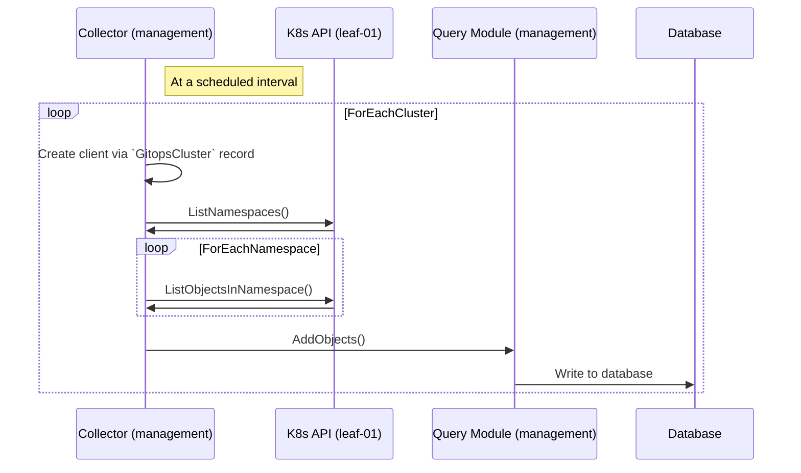
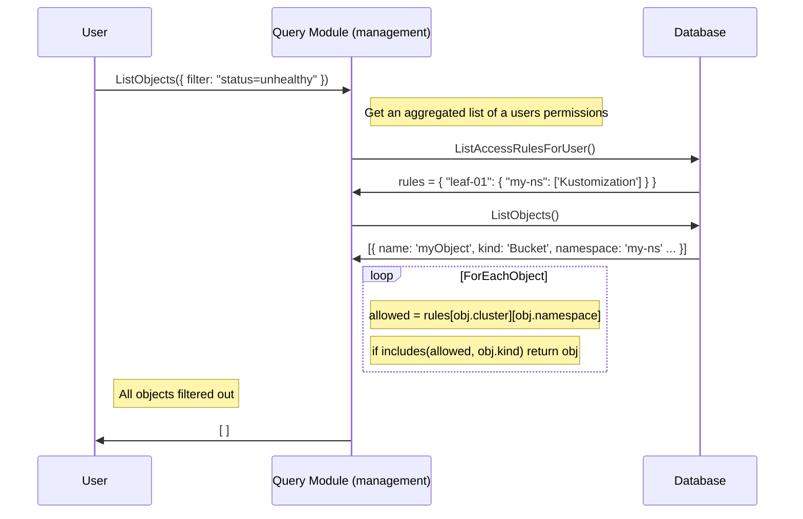

# RFC-0004 Multi-cluster Query Scaling (Observability Phase 3)

**Status:** provisional

## Summary

Our current approach to querying data from leaf clusters will not scale well in situations where clusters have a high quantity of namespaces. Our current architecture was always a temporary solution and was never meant to scale to hundreds of clusters with thousands of namespaces each.

We will need to design and implement the next iteration of our cross-cluster querying that will scale to these levels of clusters, namespaces and objects.

The previous initiative is described here: https://docs.google.com/document/d/1kxcyznya57gAW28_jUU4ZQVffAyrSze7Py_y0T_z6jE/edit?usp=sharing

## Motivation

- Users want to see a "single pane of glass" across all their clusters to quickly navigate to Kubernetes objects
- Users want to identify objects with unhealthy statuses in a single view

### Goals

- Provide a view of all Flux objects across leaf clusters with standard navigation elements (pagination, filtering)
- Scale to hundreds of clusters with thousands of namespaces each (roughly)
- Provide basic status data for Flux objects that can be filtered so that users can see problems quickly
- Adhere to Kubernetes RBAC, meaning that users only see objects that they are permitted to see as defined by the leaf cluster RBAC

### Non-Goals

- Full-text search across all Flux objects: we are only trying to improve the navigation and filtering experience
- Full Kubernetes object data replication: we only want to show a "list" view with a few columns; detail views are still directed to the cluster API server (this will be clarified in the design section)

## Proposal

**TLDR:** store a standardized subset of Flux object data from leaf clusters in a centralized store that can be queried without accessing the individual leaf cluster Kubernetes API server.

The main problem with this approach is **authorization**. We should not show objects that a user would not be able to see if they query the cluster API directly. Since the RBAC rules are stored and replicated in the leaf cluster, there isn't an obvious or easy way to apply those rules to a centralized store.

## Design Details

The technical architecture for this initiative can be organized into three parts:

### Querying

The only way to effectively scale to hundreds of clusters with thousands of namespaces each is to centralize the objects in a database. We would need to collect the relevant data from each of the clusters and bring it back to a database to queried later (more on this in the Data Collection section).

This allows us to provide a listing/filtering/paginated experience so that users can explore their data across their clusters (known as the `Query` module).

**Listing objects would look like this (note that we do not hit the cluster directly):**



**Getting object details would remain the same as it is today (bypasses Query Module):**



Rather than replicating the entire document in a centralized store, we would instead store a subset of the data to allow for standardization across objects. Since we are only concerned with providing a list view to the user (rather than the object detail), we do not need to store the entire object document in the store. For detailed information on an object, users would access the K8s API directly via existing methods.

Each object can be represented in a normalized structure for easier querying:

```
Cluster    | Namespace | Kind          | Name    | Status    | Message                 |
----------------------------------------------------------------------------------------
my-cluster | cool-ns   | Kustomization | my-kust | unhealthy | "There was a problem!"  |
```

This data would then need to be filtered so that the user only sees what they would see if they were querying the cluster directly (more on this in the Authorization (RBAC) section).

**Risk Factors**:

- Database maintenance: what happens when a new version of WeGO starts up? (migrations, backups, etc)

  - Mitigation: we can decide that this data is ephemeral and rebuild the data set when necessary (for example, on application start). Something like Redis will give us an in-memory database with low maintenance, as well as good querying capability. This removes the operational overhead that would fall on customers if we used a persistent data store.

#### Alternatives Considered

- SQLite/Postgres: the scope of this project should mean that we don't need a highly relational, persistent database, so persistent SQL solutions are being ignored for now.

- Memcached: memcached does not provide view-like querying options (key/value only), so it is probably not viable as a storage solution.

- Note that if we go for an in-memory database, there will be times when we have to restart the database. While the data is being rebuilt, the query service will need to operate in a degraded state, which could be communicated via the UI: "Rebuilding indices...35/100 clusters queried"

### Data collection

To collect data from each of the leaf clusters, a scheduled process (known as the `Collector` module) will poll each of the clusters via the Kubernetes API. This process will use the credentials specified in the `GitOpsCluster` object on the management cluster to list namespaces and objects on the leaf cluster and populate the central store.



Future optimizations are possible where many Collector replicas are "sharded" against a set of clusters to further increase performance. This is considered out of scope for v1.

**Alternatives Considered:**

- Agent Push: it would be possible to have an agent running on each leaf cluster to push data back to a central store. This approach has the same drawbacks as most push-based architectures:

  - **Client trust**: we would have to add extra logic to ensure the client that is pushing data can be trusted
  - **Heartbeat**: we would have to add extra logic to understand when an agent has failed or not reported. Pull-based architecture has this built in by default.
  - **Throttling**: extra logic would be needed to ensure that the agent does not saturate the server with too much data (in the event that the agent is malfunctioning)
  - **Networking**: it is more likely that the management cluster has an existing network path to the leaf than the inverse

- Prometheus-style agent scraping: we could have an agent on the cluster that collects the data we want, then collect from that agent via HTTP client request

  - This has the advantage of not exposing the leaf-cluster Kubernetes API server
  - Might be an ideal end-goal, but requires more work to build the agent

- Event Reciever:
  - This collector implementation could listen for incoming events using the event-publishing infrastructure being implemented in other initiatives. The incoming events would alter the state of of the data based on the paylod of the event (via the query service APIs, ie not operate directly on the data store).
    - This approach has some of the same pitfalls as the "Agent Push" method, in addition to a fault-tolerance problem where if an event is missed, the state will remain out of sync in the data store (potentially forever).

### Authorization (RBAC)

**Caveat: There is not "good" or "clean" way to provide a single pane of glass across all clusters and maintain compliance with Kubernetes RBAC. We are choosing the least bad option. See Risk Factors below**

Our solution to ensuring that users cannot see objects to which they would not be able to see via `kubectl` consists of two main parts:

1. Store a record of the access rules in the central store
1. Replicate the steps that K8s RBAC would do to filter out the data

The `Collector` module explained above would also need to query each cluster for each `Role` and `ClusterRole` present on the server, then convert that into a matrix that will be used to filter out objects that a user should not be able to see.



The rows in the access rules collection might look something like this:

```
Cluster | Role | Namespace | AccessibleKinds       |
---------------------------------------------------
leaf-01 | OrgA | my-ns     | Kustomization, Bucket |
```

One benefit of this approach is that it allows us to add additional logic or concepts to Kubernetes RBAC. For example, we could decide to introduce an `Application` concept that controls access to resources across clusters to form a logical unit. This would be considered out of scope for v1, but may be useful in the future.

**Risk Factors**

- Data Drift: The permissions in the central store will inevitably get out of sync with the cluster, leading to prohibited data being visible until the permissions are synced again
  - Mitigations:
    - All access is read-only
    - Jobs to update permissions data could run more frequently than other collection jobs, or possibly utilize a `watch` for faster updates.
- RBAC Logic Drift: Since we are replicating the behavior of Kubernetes RBAC, there may be situations where K8s RBAC behvior changes between versions, such as via a security fix. In these cases, it would take time and effort to remain compliant.
  - Mitigations:
    - All access is read-only
    - When a user navigates to an object, they will still be subject to the RBAC of the cluster.

## Other Implementation Notes

- We don't need to split up the `Query` and `Collection` modules into separate microservices to start. They can start out as part of the same runtime and then split into microservices later. This will speed up development time.

- This feature can be rolled out behind a feature flag, and I would recommend a new set of UI components to accommodate the new capabilities and code path.

- The `Collector` can be simple at first, using simple parallel HTTP requests. Future optimizations might include utilizing `watch` logic, if that proves to be more efficient for either the leaf-cluster API servers or provide more frequent updates.

## Implementation History

The current implementation was completed in [Observability Phase 2](https://docs.google.com/document/d/1kxcyznya57gAW28_jUU4ZQVffAyrSze7Py_y0T_z6jE/edit#heading=h.lx604oyg19lq)
