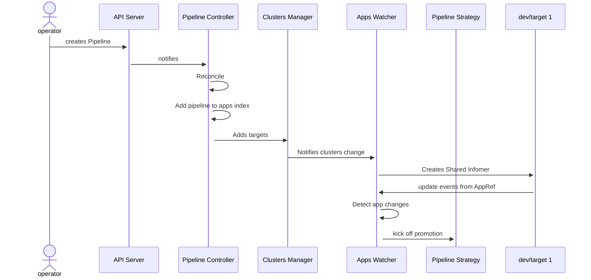

# Pipeline Controller: Watch Architecture design

## Summary

Currently, our pipeline workflow is heavily reliant on static configurations. Users are tasked with creating several resources across all clusters. These resources are vital for transmitting update events to the management cluster, where the pipeline controller operates. However, due to the sheer quantity of resources required, the task quickly becomes unmanageable.

We aim to engineer a new architecture that simplifies this process while retaining its functionality. We plan to design an architecture that requires less manual configuration, making it more efficient and manageable to operate. By doing so, we hope to reduce the complexities of the workflow and improve the overall user experience.

## Proposal

Use a watch approach, instead of waiting for events coming from leaf clusters via webhook mechanisms, the controller is now responsible for detecting the changes in the clusters.

We can detect those changes by using two approaches:
- Polling
	- List all pipelines
	- Loop through all environments and targets and pull the status of the app
	- Detect any change and act
- Watching
	- List all pipelines
	- Filter used targets
	- Create an informer for each target
	- Receive update events from each informer
	- Detect any change and act

### Polling
This approach provides some scaling challenges since we'll need to request the status of an app in all targets, which will potentially add a lot of pressure on k8s api of the leaf clusters. To overcome that we could use a cached client, which under the hood creates informers, so, it ends up not being a real polling mechanism.

Additionally, there's the issue of change detection. To ascertain if something has changed, you'd have to maintain the current state of an app and compare it with the newly polled state to determine the differences. Ensuring reliable state storage is always a significant concern.

### Watching

In this method, we employ [Shared Informers](https://www.cncf.io/blog/2019/10/15/extend-kubernetes-via-a-shared-informer/) to set up watches for app resources in each target cluster. These informers instantly notify us of Add, Delete, and Update events as they occur. Because there's no polling required, the strain on the k8s API is significantly diminished.

Furthermore, the update hook is defined as `UpdateFunc: func(old interface{}, new interface{})`, which lets us directly compare the previous state (old) with the current state (new). This directly addresses the state storage concern inherent in the polling approach.

## Design Details

### Clusters Management

When reconciling pipelines, the controller will create a set of **used** clusters by listing the pipeline's targets and making sure to create clients only for clusters that belong to at least one pipeline. With that, we avoid watching clusters that don't be long to any pipeline.

### Events Management

Whenever a new app update event comes in, the controller will use `app + cluster` name as the key to identifying which pipeline that app belongs to.

It will then detect if a change has happened, in the case of `HelmReleases``, it will check if the new `lastAppliedRevision` is different from the old one and trigger the promotion accordingly.

### Diagram

