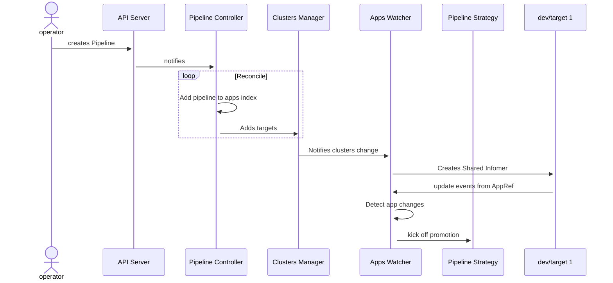

# Pipeline Controller: Watch Architecture design

## Summary

Currently, our pipeline workflow is heavily reliant on the addition of multiple resources beyond just the Pipeline CRDs. Users are tasked with creating several Notification resources (typically 2 per cluster) across all clusters. These resources are vital for transmitting update events to the management cluster, where the pipeline controller operates. However, due to the sheer quantity of resources required, the task quickly becomes unmanageable.

We aim to engineer a new architecture that simplifies this process while retaining its functionality. We plan to design an architecture that requires less manual configuration, making it more efficient and manageable to operate. By doing so, we hope to reduce the complexities of the workflow and improve the overall user experience.

## Proposal

Use a watch approach, instead of waiting for events coming from leaf clusters via webhook mechanisms, the controller is now responsible for detecting the changes in the clusters.

We can detect those changes by using two approaches:
- Polling
	- List all pipelines
	- Loop through all environments and targets and pull the status of the app
	- Detect any change and act
- Watching
	- List all pipelines
	- Determine which clusters are referenced in pipeline definitions and therefore need to be watched
	- Create an informer for each target
	- Receive update events from each informer
	- Detect any change and act

### Polling
This approach provides some scaling challenges since we'll need to request the status of an app in all targets, which will potentially add a lot of pressure on k8s api of the leaf clusters. To overcome that we could use a cached client, which under the hood creates informers, so, it ends up not being a real polling mechanism.

Additionally, there's the issue of change detection. To ascertain if something has changed, you'd have to maintain the current state of an app and compare it with the newly polled state to determine the differences. Ensuring reliable state storage is always a significant concern.

### Watching

In this method, we employ [Shared Informers](https://www.cncf.io/blog/2019/10/15/extend-kubernetes-via-a-shared-informer/) to set up watches for app resources in each target cluster. These informers instantly notify us of Add, Delete, and Update events as they occur. Because there's no polling required, the strain on the k8s API is significantly diminished.

Furthermore, the update hook is defined as `UpdateFunc: func(old interface{}, new interface{})`, which lets us directly compare the previous state (old) with the current state (new). This directly addresses the state storage concern inherent in the polling approach.

## Design Details

### Clusters Management

When reconciling pipelines, the controller will create a set of **used** clusters by listing the pipeline's targets and making sure to create clients only for clusters that belong to at least one pipeline. With that, we avoid watching clusters that don't be long to any pipeline.

### Events Management

During the informer creation, we inject the cluster name, so, whenever a new app update event comes in, the informer function will be able to use `app + namespace + cluster` name as the key to identifying which pipeline that app belongs to.

It will then detect if a change has happened, in the case of `HelmReleases``, it will check if the new `lastAppliedRevision` is different from the old one and trigger the promotion accordingly.

### Diagram

### Specific functions

This section explains functions that need to be adapted to work in the proposed architecture.

#### Manual approval

At present, the Promotion type includes a field ".Manual" which indicates that a promotion may not proceed until a webhook in invoked. This is a state machine:

 - when a promotion notification is received: if manual approval is not required, the promotion is triggered, else a marker with the expected revision is put in `.Status.Environments[env]`;
 - if an approval webhook is invoked and the marker matches, a promotion is triggered.

An HTTP endpoint accepts POST requests, and extract the pipeline namespace, name, environment, and revision from the path. The handler checks a signature in the header of the request, against a secret given in the Promotion value. So, to set this up, you create a secret with a shared key, and make that key available to any process that needs to do an approval.

TODO: determine whether this machinery can also work with the proposed machinery.

**Glossary**:

- **Clusters Manager**: Entity that manages clusters config. It will be responsible for keeping cluster configuration up to date and notifying other entities of cluster changes.
- **Apps Watcher**: Creates informers to watch app changes.
- **Pipeline Strategy**: Responsible for promoting an app.
- **Apps Index**: It holds the association between Cluster <> Pipelines <> Apps. Given update events, it will help to query which pipeline a particular app belongs to.
