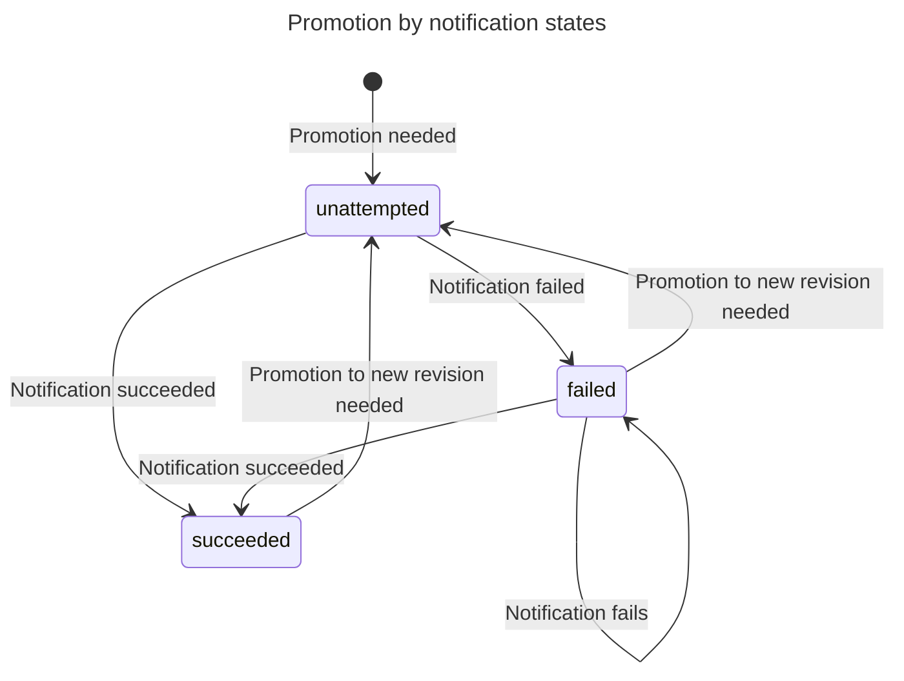
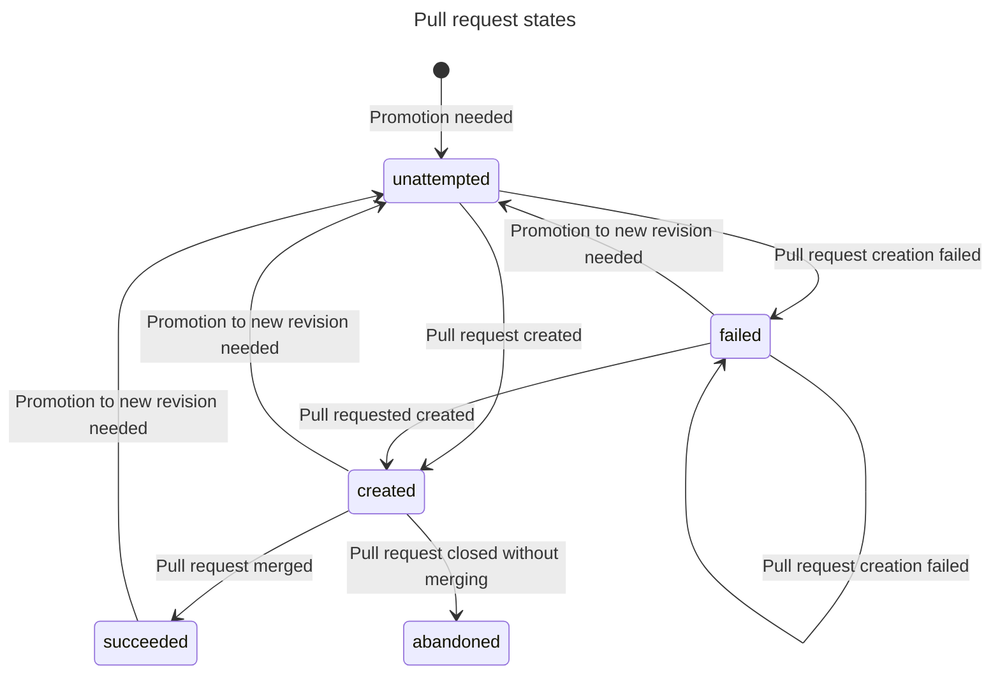
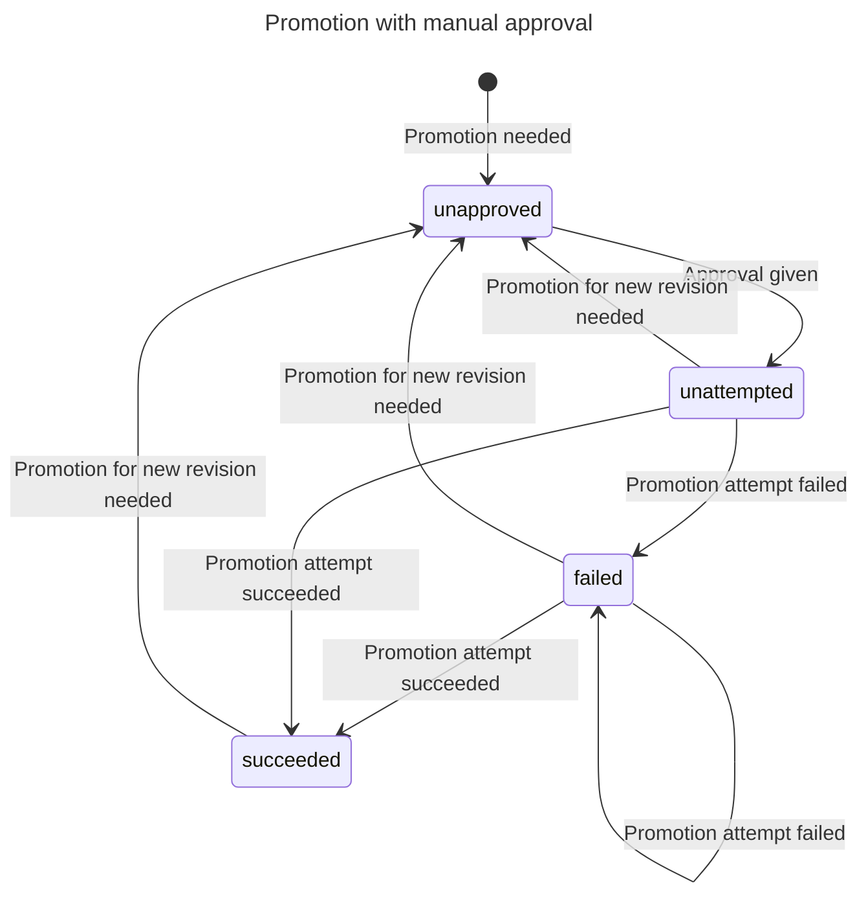

# Pipelines: level-triggered architecture

## Summary

Currently, the Pipelines feature of Weave GitOps Enterprise relies on receiving webhook invocations to trigger changes. This has several problems, explained below. This RFC proposes a level-triggered architecture that simplifies the system and avoids the pitfalls of using notifications.

In the changed architecture, state in leaf clusters is cached in the management cluster where the pipeline controller runs, and the controller relies only on the current specification of the Pipeline and the applications mentioned in the spec, to decide if needs to run a promotion or not. This removes the need for notifications to trigger promotions, making it more secure, reliable and manageable.

## Motivation

The problems with using notifications are:

**Promotions are attempted at most once**

Flux notifications are not intended to be reliable, and there is one chance to succeed at each promotion. If the endpoint is unavailable, or the promotion fails <!-- check if Flux does retries on 500s -->, then it will not be attempted again. Since the Pipeline status does not record promotion attempts, a missed promotion may be invisible to the user even if attempted.

**You can make the promotion endpoint trigger promotions that are not intended**

The promotion webhook handler acts on the information contained in the URL and in the request body. Only the request body is included in the HMAC, so it's possible to replay a request against a different URL. Since there's a shared key in each target cluster, there's an increased chance a shared key will be compromised, in which situation a notification can be forged.

**It necessitates the addition of several resources beyond just the Pipeline object**

Users must create several resources, usually in leaf clusters, to make notifications work (typically two per environment, a Provider and an Alert). These resources are needed for transmitting update events to the management cluster, where the pipeline controller operates. The notifications usually have their own secrets, and must target a specific URL per Pipeline per environment. Getting these exactly right and in place is onerous.

## Goals

 - Remove the requirement for notification hooks, and 
 - Make the triggering of promotions reliable to the point of "usually once": barring long-running failures, most of the time a promotion that can happen will happen, and a promotion will succeed at most once; and,
 - Make sure existing deployments of Pipelines will work when this is rolled out, with at most minor changes to configuration.

## Non-goals

 - It is not a goal to support systems in which the management cluster is not able to connect to leaf cluster API servers. This kind of connectivity does get used, but the rest of Weave GitOps Enterprise (e.g., the Application view) does not support it so we make no effort to do so here either.

## Design Details

This section explains the algorithm for running promotions "usually once", which assumes the state of all applications mentioned in pipelines is available. Then it explains how to make sure that state is available efficiently.

### Promotion algorithm

The algorithm for deciding on a promotion is given the specification for the pipeline, and the specification and status of each application (Kustomization, HelmRelease, or other) mentioned in the pipeline.

The basic idea is to calculate the revision that should be carried through the pipeline by looking at the first step in the pipeline; then check each successive step to see whether that revision is running there. If step N+1 does not have the revision, a promotion is triggered.

In pseudo-code,

```
start with the first environment
if all targets are healthy and run the same revision, proceed with that revision as the "current revision"
while there's a next environment:
  if all targets are healthy and run the current revision, go to the next environment
  if any target is running the current revision, healthy or otherwise, stop
  otherwise, trigger a promotion to the next environment
```

The health of a target application is determined by its [`Ready` condition](https://fluxcd.io/flux/components/kustomize/kustomizations/#ready-kustomization). The revision run by a target application is determined by the application object's [`.status.lastAppliedRevision`](https://fluxcd.io/flux/components/kustomize/kustomizations/#last-applied-revision). The `Kustomization` and `HelmRelease` types have that condition and field in common.

The behaviour of this algorithm is that it treats a successful deployment of a revision in the first environment as signalling a "run" of that revision through the pipeline. The revision moves to the each successive environment by triggering a promotion as specified in the Pipeline. This has the effect that successfully deploying a _new_ revision to the first environment will interrupt the current pipeline run, starting again with the new revision.

#### Alternative algorithms

Another reasonable algorithm would be to examine each successive pair of environments (`N` and `N+1`), and trigger a promotion if `N` is running a different revision to `N+1`. This effectively means several revisions can be moving through the pipeline at once. Deploying a new revision to the first environment does not interrupt other revisions making progress. There would need to be additional thought on what to do when environment `N+1` already has a promotion outstanding.

While this alternative seems more flexible, thinking of a single revision running through the pipeline is less complex, and not known to be less useful. The choice of algorithm does not need to have implications for the API, so it is possible to change it later, or to make it a choice for the user.

#### Efficiently querying application state

The algorithm assumes it has all application state to hand. Usually when using controller-runtime to write a controller, you would use a caching client and watches to query for dependent objects and be notified when they change. But the application objects will often be in different clusters, and controller-runtime does not provide a convenient API for that (though it has the required parts).

Therefore the controller will need to manage a set of clients and watchers itself. A similar piece of machinery is in [Cluster API](https://github.com/kubernetes-sigs/cluster-api/blob/v1.5.1/controllers/remote/cluster_cache_tracker.go) (but unfortunately it's not usable as it is, because you can't explicitly destroy a client). This must maintain the invariant that only clusters with application objects of interest should have a watcher, which may entail some bookkeeping so that, for example, a client is destroyed when no Pipeline is using it any more.

We would also want to use watches to notify us when an application object changes, so the Pipeline using that application can be examined. To be able to take an application object event and figure out the relevant pipeline object, we need to keep an map of `{cluster, api version and kind, application name} -> pipeline name`. This is possible by using controller-runtime's indexing and (in the func given to the indexer) extracting the tuple for each application from the pipeline object's targets. Then, it remains to provide a source which will queue pipeline objects by consulting the index.

### Promotion reliability

In the current architecture, promotions are triggered _at most once_. If a notification is missed, or fails, the promotion will not be attempted again. Flux notifications are not intended to be reliable, and the pipeline machinery does not record the fact of a notification -- so if a promotion fails it does not know to retry it.

The design proposed here has the opportunity to improve on this by making promotion attempts _exactly once_, or at least "usually once", since exactly once is in general impossible. By examining the state, rather than relying on being triggered by events, the controller is able to retry if a promotion is missed (the controller was offline when a update happened), or fails.

To know what is the case with a particular promotion, we keep a record in the status under the specific environment. A promotion is particular to an environment and revision, so it must be recorded against the environment, and with the revision as a field.

For a notification promotion, the notification either succeeds or fails, and if it fails, it is retried:



For a pull request promotion, the success or failure depends on what happens to the pull request once it's created:



If a promotion is abandoned, it proceeds no further until there is another revision to attempt.

To be able to check the status of a pull request after creation, the URL for the pull request is recorded in the status as well. If a new revision is to be promoted, and there is already a pull request for a previous promotion, it should be closed and a new PR opened*.

*This is simpler that trying to repurpose a PR for a new promotion.

#### Alternatives

**Keep promotion records in a separate object**

The usual advice is that `.status` is only for caching information that you can reconstruct from cluster state. For example, a `Deployment` keeps track of the state of `ReplicaSet` objects it has created, so they can be seen at a glance, but you could get the same information by finding all the ReplicaSet objects and examining _their_ status. Keeping promotion state in the Pipeline status goes against this advice.

A different way would be to record the fact of a triggered promotion in its own object -- a Promotion, say, owned by the Pipeline. The success or failure of a promotion can be recorded in the Promotion object's status, when processing a Pipeline object. This means the Pipeline controller can decouple the processes of enacting promotions from that of calculating pipeline runs.

This may be useful for reasons that are out of scope for this PR, like being able to process promotions independently. However, it introduces complexity -- the system has more possible states to account for. It will be more straight-forward to disregard the advice and store state in the Promotion status. The trade-off is that restoring an object from a backup might result in duplicate promotions, because the status will either be discarded or reinstated after the spec. There's an [informative note about state versus status](https://cluster-api.sigs.k8s.io/developer/providers/implementers-guide/controllers_and_reconciliation.html#a-note-about-the-status) in the Cluster API book.

Writing promotion state directly to the Pipeline status should not prejudice against using a separate object and controller later, since in that case it could be read from that separate object and written to the Pipeline status.

### Manual approval

At present, the Promotion type includes a field ".Manual" which indicates that a promotion may not proceed until a webhook in invoked. This is a state machine:

 - when a promotion notification is received: if manual approval is not required, the promotion is triggered, else a marker with the expected revision is put in `.Status.Environments[env]`;
 - if an approval webhook is invoked and the marker matches, a promotion is triggered.

An HTTP endpoint accepts POST requests, and extract the pipeline namespace, name, environment, and revision from the path. The handler checks a signature in the header of the request, against a secret given in the Promotion value. So, to set this up, you create a secret with a shared key, and make that key available to any process that needs to do an approval.

This can work similarly in the proposed design, using a similar model:

 - when a promotion is determined to be needed: if manual approval is not required, trigger the promotion (make the transition from "unattempted"); else, mark the status as above;
 - if an approval webhook is invoked and the marker matches, make the transition from "unattempted".



#### Questions

**What about types other than HelmRelease and Kustomization?**

The Pipeline type does allow references to any kind. To be able to support a kind, we must be able to cache its state, calculate its health, and determine the revision that it is running. Types that follow the scheme used by Kustomization and HelmRelease (`.status.lastAppliedRevision` and a `Ready` condition) will be relatively easy to support; other types may need special cases. The [`Terraform` type used by tf-controller](https://github.com/weaveworks/tf-controller/blob/v0.15.1/api/v1alpha2/terraform_types.go#L340) uses this scheme, for example.

For the purpose of this RFC we will assume support for only `Kustomization` and `HelmRelease`, since that is what is de facto supported now (in fact in the web user interface it's just `HelmRelease`).

**What happens with outstanding promotions when a pipeline is restarted with a new revision?**

In the case of pull requests, if an outstanding promotion pull request has not been merged, it can be closed. The new promotion can create a fresh pull request. It may be worth doing this eagerly, that is once an environment is updated, all subsequent incomplete promotions are abandoned.

**What about if the first environment is following a branch, and there are lots of merges, will it just restart the pipeline all the time?**

If you are following `main` branch in the first environment, and people are merging to `main` faster than you can approve promotions (or PRs), then your pipeline is not going to make progress. This could be a common situation, when teams share a monorepo with Kustomization manifests for each cluster, as Weave GitOps encourages.

This is one situation in which there is a marked difference with the alternative model (of comparing environments pair-wise, rather than setting the revision from the first environment). In that case, a revision can make progress through the pipeline when there are new revisions being deployed in the first environment. As indicated in the section discussing promotions though, this is not the prefered model for other reasons.

The best advice at present is "don't use pipelines with an environment following a git branch". Experience with using it may suggest workarounds or better models.
