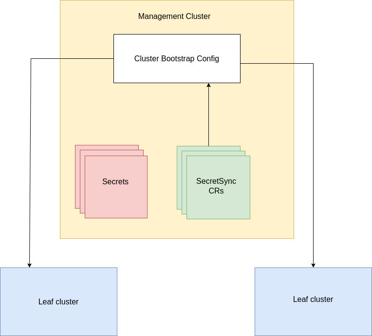
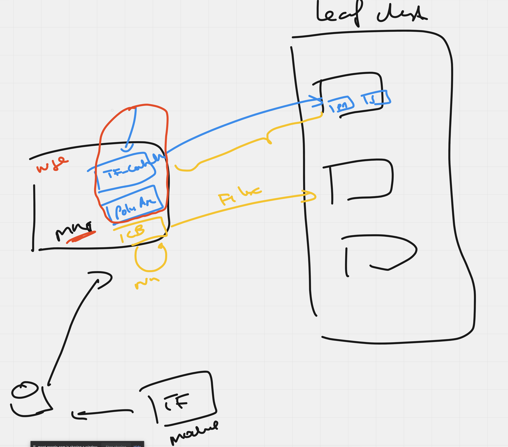

# RFC-000N Enterprise Bootstrapping 

**Status:** provisional

**Creation date:** 2023-01

**Last update:** 2023-01

## Definitions

- **Bootstrapping**: in Weave Gitops Enterprise (WGE) context, we define bootstrapping as the workflow to make a kubernetes cluster
  to join the platform that WGE manages, meeting all requirements that makes it ready for enterprise teams to run their application onto.

## Summary

There is no a single definition of what an enterprise platform is not what bootstrapping a platform is. However,
we have been running Weave Gitops Enterprise in 2022 that has created a body of knowledge on the limitations
that enterprise customers has found while bootstrapping its platform with WGE. This RFC 
looks at them and proposes a solution to allow solving what we know now allowing a degree of flexibility to  
adapt to the unknowns.

## Motivation

In order weave gitops to manage a cluster, we need to bootstrap it. this is currently done via
[cluster bootstrapping](https://docs.gitops.weave.works/docs/cluster-management/getting-started/#add-a-cluster-bootstrap-config)
that mainly bootstrap flux within the leaf cluster.

With the evolution of weave gitops and the increase number of use cases, customers have raised different conditions
before the control could be delegated to flux. A couple of examples on these needs are:

1. The cluster meets security and compliance requirements before any application lands. This could be represented now as
   there is the need to have a security and compliance runtime present before applications. In our context, would be
   policy agent and policies to be present.
2. Access to resources are protected. Application needs to have available the secrets granting the access to them. An example
   of this could be installing profiles from a private helm repository so a secret to access the helm repository would be required to be present.

More on [this doc](https://docs.google.com/document/d/1NcVBlFDIr8vqxkxXyAVgXZuvmfYNqQlMjbBnVOyb10U/edit#heading=h.4g3pdvp9i9c4)

Also, bootstrapping it is focused to be executed once at joint time but does not work beyond that point, therefore
when in the previous scenarios, there is an update in a secret that needs to be updated in X leaf clusters, that
needs to be leveraged to the customer, for example, by providing a cronjob to sync from management to leaf or similar. 

This RFC looks at them and proposes a solution to allow solving what we know now allowing a degree of flexibility to  
adapt to the unknowns. 

We will be using a concrete scenario to drive the RFC. It helps us to make a concrete picture of the enterprise and 
bootstrapping problem that we need to solve, with a set of requirements to achieve the different solutions 
and to come out with a recommendation.

### Goals

- Iterate WGE infrastructure bootstrapping process to include 2022 customers needs. 
- Enable a solution that could absorb 2023 needs without major iterations.

## Scenario

Kokado is an online retailer that user Weave Gitops Enterprise (WGE) for running their online grocery shop. Over 2022 they have 
PoC using their shopping experience in dev and test. After successful experience, they are ready to move shopping production traffic 
under WGE, and they expect to migrate their other parts of the user journeys checkout and post-checkout right after.

Kokado tenancy model is based business capability following a hard tenancy model at the level of a kubernetes cluster. It
also has three main delivery environments: dev, test and prod. This means that any team needs at least 3 kubernetes
clusters to be provisioned and managed via WGE. For example search team owns the clusters: search-dev, search-test and search-prod. 
They are running in their private cloud, manage secrets via Vault, using Github Enterprise as git provider, and 
using Artifactory as private repository for helm charts and container images.   

Given the dynamic nature of the business capabilities could be onboarded at any time via a self-serve
automated onboarded workflow that:

1. Provisions the `cloud infrastructure layer` to provide the baseline of the container platform. 
   It includes private cloud accounts, enterprise networking, DNS, security and compliance, etc ...  
   - They have implemented this compliance layer using function as a service (like aws lambda but custom)  and have bundled as terraform modules. The rules you could
   find in this layer are like checking compliance for private cloud object storage, access control rules, etc ... 
2. Provisions the `platform infrastructure layer` to create kubernetes clusters for dev, test and prod.
   - They are currently provisioning eks clusters via terraform, but they have shown interest to explore liquid metal in the future.
   - They have a set of terraform modules for ensuring the compliance of this layer.
3. Provisions the `platform security and compliance layer` to ensure that any platform or business application meet compliance requirements  
   - They don't currently use security runtime for containers, so they would like to use weave gitops policy agent. 
   - They are currently managing secrets via Sops and Vault with segmentation following the tenancy model.
   - In order to bootstrap the secrets runtime, the onboarding process should generate the clusters authz/authz secrets
   without manual intervention. For example
     - In the context of `sops`, the [decryption key](https://fluxcd.io/flux/guides/mozilla-sops/#encrypting-secrets-using-age) should be associated 
     to the cluster identity (for example `search-dev` different to `search-test`) and generated without manual need.
     - In the context of `vault`, they have integrated with their company [ldap](https://developer.hashicorp.com/vault/docs/auth/ldap)
4. Provisions the `platform delivery layer` including the gitops delivery capabilities.
   - This should include the access to any central service with the clusters identity: artifactory, enterprise, etc ... 
5. Provisions the `application layer` with all application resources like continuous delivery pipelines.

### Context, Assumptions and Limitations 

- Kokado would like in the future to be able to provision the onboarding workflow using a single tool like WGE, 
but currently they are happy to start by using WGE for everything but the cloud infrastructure layer.
- Note that we are using terraform in the previous example to represent the scenario that there is already an existing 
platform solution that we need to reuse. You could replace terraform for any other significant infra as code solution.

### Requirements 

From the previous scenario we could state the following requirements:

Kokado is looking that WGE: 

- [ ] enables a team to self-serve the application onboarding workflow.
- [ ] covers all the platform and application layers.
- [ ] allows extension points by layer to reusing existing solutions or artifacts where required. 
- [ ] meets enterprise security and compliance expectations.
- [ ] able to integrate with existing central services like identity, secrets management, monitoring or artifacts.
- [ ] no manual intervention is required. 

## Proposal

The main problems derived from the analysis is that not all the alternatives were able to deliver a fully automated
workflow without manual intervention. This is mostly associated to the need of generating identity and authn/authz mechanism 
to access central services like secrets.

In order to incorporate that dynamism to glue the workflows, we could:
1. to leverage terraform and provide modules or extensions for the missing concerns.
2. to leverage kubernetes job / cronjobs and provide templates for the missing concerns.
3. to create controllers and provide templates for the missing concerns.

At the back of the alternatives, the recommendation would be:
1. to extend cluster bootstrapping to support bootstrapping via kustomization to leverage kustimization's health
to understand the status of the bootstrapping.
2. kustomization leverages [flux remote cluster](#leverage flux remote cluster as platform bootstrapping layer)
for the static elements of the provisioning and 
3. terraform modules deployed via tf-controller for the dynamic aspects of the provisioning.

The recommendation could be adapted to customers with other preference than terraform by providing an extension
mechanism that better fits their situation.

The motivation behind this recommendation over other alternatives are
- uses flux native capabilities to provides the core of the solution supporting weave gitops product direction.
- complements where flux cannot reach with tf-controller as another strategic asset for weave gitops and flux ecosystem. 
- once hooked into terraform, given the feature set and rich ecosystem, we reduce the extension and operational 
costs vs building our own solutions.

More on understanding the background of this recommendation could be seen in the [alternatives](#Alternatives) section.

## Alternatives

The following alternative has been considered:

1. Existing approach based on CAPI/Terraform, cluster bootstrap controller and profiles
2. Extend approach 1) but enabling syncing secrets from management to leaf for bootstrapping    
3. Leverage terraform and tf-controller for bootstrapping layer  
4. Leverage flux remote cluster as platform bootstrapping layer
5. Extend flux remote cluster solution (4) with terraform 

In order to deliver the end to end workflow, we leverage gitops templates to leverage the solution. therefore
that is common to any alternative. An example of the template for onboarding looks as follows

```yaml

apiVersion: templates.weave.works/v1alpha2
kind: GitOpsTemplate
metadata:
  name: onboard-capability  
  namespace: default
spec:
  description: Template for onboarding a new capability to WGE.
  renderType: templating
  params:
     ...
  resourcetemplates:
    - path: clusters/management/applications/{{ .params.applicationName }}/
      content:
        # this represents the cluster layer, it could be a terraform module too
        - apiVersion: cluster.x-k8s.io/v1beta1
          kind: Cluster
          ....
        - apiVersion: gitops.weave.works/v1alpha1
          kind: GitopsCluster
          metadata:
            name: '{{ .params.applicationName }}-dev' # would require also other for dev, test, prod
            namespace: '{{ .params.applicationName }}'
          spec:
            secretRef:
              name: '{{ .params.applicationName }}-dev-kubeconfig'
```

### Alternative: Existing approach based on CAPI/Terraform, cluster bootstrap controller and profiles

We use the following platorm infra layer resources:
```yaml
        - apiVersion: cluster.x-k8s.io/v1beta1
          kind: Cluster
          metadata:
            name: '{{ .params.CLUSTER_NAME }}'
        ...
        - apiVersion: gitops.weave.works/v1alpha1
          kind: GitopsCluster
          metadata:
             name: '{{ .params.applicationName }}-dev' # would require also other for dev, test, prod
             namespace: '{{ .params.applicationName }}'
             labels:
               weave.works/capi: bootstrap
          spec:
             secretRef:
                name: '{{ .params.applicationName }}-dev-kubeconfig'
```
and `ClusterBootstrapConfig` to bootstrap the cluster follows  
```yaml
apiVersion: capi.weave.works/v1alpha1
kind: ClusterBootstrapConfig
metadata:
  name: capi-gitops
  namespace: default
spec:
  clusterSelector:
    matchLabels:
      weave.works/capi: bootstrap
  jobTemplate:
    generateName: "run-gitops-{{ .ObjectMeta.Name }}"
    spec:
      containers:
        - image: ghcr.io/fluxcd/flux-cli:v0.29.5
          name: flux-bootstrap
          resources: {}
          volumeMounts:
            - name: kubeconfig
              mountPath: "/etc/gitops"
              readOnly: true
          args:
            [
              "bootstrap",
              "github",
              "--kubeconfig=/etc/gitops/value",
              "--owner=$GITHUB_USER",
              "--repository=fleet-infra",
              "--path=./clusters/{{ .ObjectMeta.Namespace }}/{{ .ObjectMeta.Name }}",
            ]
          envFrom:
            - secretRef:
                name: my-pat
      restartPolicy: Never
      volumes:
        - name: kubeconfig
          secret:
            secretName: "{{ .ObjectMeta.Name }}-kubeconfig"
```
and profiles to provision the rest of the platform layer

```yaml
apiVersion: source.toolkit.fluxcd.io/v1beta2
kind: HelmRepository
metadata:
   name: weaveworks-charts
   namespace: flux-system
spec:
   interval: 1h0m0s
   provider: generic
   secretRef:
      name: profiles-repo-auth
   timeout: 1m0s
   url: https://jfrog.kokado.com
---
apiVersion: helm.toolkit.fluxcd.io/v2beta1
kind: HelmRelease
metadata:
  labels:
    weave.works/applied-layer: layer-0
  name: cluster-name-observability
  namespace: wego-system
spec:
   chart:
      spec:
         chart: observability
         sourceRef:
            apiVersion: source.toolkit.fluxcd.io/v1beta2
            kind: HelmRepository
            name: weaveworks-charts
            namespace: flux-system
         version: 5232.0.13
```
#### Validation

- [x] enables a team to self-serve the onboarding workflow.
We could have a single template that provisions the different resources
- [x] covers all the architectural layers: cloud, platform and application.
  - platform infrastructure layer: via terraform 
  - platform delivery layer: flux is installed via cluster bootstrapping
  - platform security and compliance layer: via profiles
  - application layer: pipeline as part of the template 
- [ ] allows extension points by layer to reusing existing solutions or artifacts where sensible.
Partially, allows extensions once flux is available but no earlier. For example, 
terraform module for platform infrastructure layer cannot be reused. 
- [ ] meets enterprise security and compliance expectations
  - Given that flux installs the compliance and security runtime, it means that a security exception should be created
  to allow flux to be installed in a not-yet compliant infrastructure. This would require to manage the exception which might require
  manual intervention.
  - Given that artifacts are stored jfrog and no credentials for jfrog exists in the leaf cluster. There is a need
  to create that secret either manually or extending the cluster bootstrapping logic to cover this part.
- [x] able to integrate with existing central services like identity, secrets management, monitoring or artifacts. 
- [ ] there has been no manual intervention.
  - There might be need for manual intervention around a) flux exception, b) secret to bootstrap the secret runtime and c) secrets
  to access artifactory

### Alternative: Extend approach 1) but enabling syncing secrets from management to leaf for bootstrapping

The idea is to extend the cluster bootstrapping config to sync secrets from management cluster to leaf clusters.

> A working POC already implemented.




- Introduce new CRD `SecretSync`.
- `SecretSync` CR references the secret on management cluster to be synced to matched leaf clusters.
- `SecretSync` has a selector to select group of clusters based on their labels.
- Secrets will be re-synced to leaf clusters when updated.

*Example of `SecretSync` CRD*

```yaml
apiVersion: capi.weave.works/v1alpha2
kind: SecretSync
metadata:
 name: my-secret-syncer
 namespace: default
spec:
 clusterSelector:
   matchLabels:
     environment: dev|staging|prod
 secretRef:
   name: dev-secret|staging-secret|prod-secret
```

The workflow would look like as follows 

- We configure the secrets `SecretSync` CRDs.
- Secrets are created in the leaf cluster.
- Flux is installed using the same approach as now (cluster bootstrapping).
- Flux is available and secrets are available in the leaf cluster.
- External Secret Operator or Policy agents get deployed as regular profiles in layer-0.

#### Validation

- [x] enables a team to self-serve the onboarding workflow.
  We could have a single template that provisions the different resources
- [x] covers all the architectural layers: cloud, platform and application.
   - platform infrastructure layer: via terraform or capi
   - platform delivery layer: flux is installed via cluster bootstrapping
   - platform security and compliance layer: yes, via profiles
   - application layer: pipeline as part of the template
- [ ] allows extension points by layer to reusing existing solutions or artifacts where sensible.
  - Partially, allows extensions once flux is available but no earlier. For example,
  terraform module for platform infrastructure layer cannot be reused.
- [ ] meets enterprise security and compliance expectations
   - Partially, improves the previous scenario by making the secret available to Flux, so it could 
  deploy apps from jfrog. However, given that flux installs the compliance and security runtime, 
  it means that a security exception should be managed to allow flux to be installed in an infrastructure
  which is not yet compliant.
- [x] able to integrate with existing central services like identity, secrets management, monitoring or artifacts.
- [ ] there has been no manual intervention.
  - Might be, depending on how the cluster bootstrapping secret is generated.   

### Alternative: Leverage terraform and tf-controller as platform bootstrapping layer

Same approach as take for cluster bootstrap controller but bootstrapping via terraform and terraform controller.
This is the patterns used for dish https://github.com/weaveworks-20276/  

#### How the solution looks like 

1. A weave gitops enterprise leaf cluster module exists. 
2. It includes a compliance and security module that 
   1. provisions compliance via policy agent
   2. provisions security with sops and external secrets 
      1. for sops, it generates [age key](https://registry.terraform.io/providers/clementblaise/age/latest/docs/resources/secret_key)
      2. for external secrets, using wge management user access, generates bootstrapping resources and syncs it or checks in
3. It includes flux module
4. cluster bootstrapping is extended to provisions via terraform using the module
5. gitops cluster is marked as bootstrapped based on the terraform execution 

An example based on dish implementation is used for illustration purposes of the steps before

**1. we have a weave gitops enterprise leaf cluster module.**

```yaml
        - apiVersion: infra.contrib.fluxcd.io/v1alpha1
          kind: Terraform
          metadata:
            name: '{{ .params.CLUSTER_NAME }}'
            namespace: flux-system
          spec:
            dependsOn:
              - name: '{{ .params.CLUSTER_NAME }}-core'
            interval: 1h
            retryInterval: 20s
            path: ./cluster-templates/leaf-cluster
            approvePlan: auto
            vars:
              - name: cluster_name
                value: '{{ .params.CLUSTER_NAME }}'
...
            varsFrom:
              - kind: ConfigMap
                name: leaf-cluster-config
              - kind: Secret
                name: leaf-cluster-auth
            sourceRef:
              kind: GitRepository
              name: terraform
              namespace: flux-system
```

A PoC could be found [here](https://github.com/weaveworks/clusters-config/tree/cluster-wge2205/)

#### How the provisioning flow looks like

An ideal workflow could be 

1. I have my wge management cluster 
2. I add/connect a new gitops cluster 
3. I select that I want to connect the cluster via terraform with module `connect wge leaf`
4. A PR gets raised into the configuration repo pointing to the management cluster
5. When PR merged, tf-controller / cluster bootstrap applies the module and cluster gets bootstrapped 
6. As a result 
   1. secrets is bootstrapped
   2. policy is bootstrapped
   3. flux is bootstrapped
   4. resources are bootstrapped
7. cluster bootstrap marks the cluster as ready and profiles can be installed 

A diagram of the architecture looks like as follows



#### Validation

- [x] enables a team to self-serve the onboarding workflow.
  We could have a single template that provisions the different resources
- [x] covers all the architectural layers: cloud, platform and application.
    - platform infrastructure layer: via terraform or capi
    - platform security and compliance layer: yes, via terraform modules
    - platform delivery layer: yes, via terraform modules other capabilities via flux.
    - application layer: pipeline as part of the template
- [x] allows extension points by layer to reusing existing solutions or artifacts where sensible.
    - allows extensions via terraform and via flux 
- [x] meets enterprise security and compliance expectations
  - an exception is not required for flux as land in an already compliant platform
  - given security runtime is already in the leaf cluster before other platform components
  when an application needs a secrets: its manifests lives in git, flux syncs it and decrypts it if sops 
  or the secrets runtime pull it from the store.
- [x] able to integrate with existing central services like identity, secrets management, monitoring or artifacts.
- [x] there has been no manual intervention.
  - bootstrapping business logic is leveraged to terraform for fully automated flow

### Alternative: Leverage flux remote cluster as platform bootstrapping layer

This solution assumes that flux installed in the management cluster and uses 
[flux remote clusters](https://fluxcd.io/flux/components/kustomize/kustomization/#remote-clusters--cluster-api) feature 
to leverage the solution.  This is the pattern used in [corp-fleet](https://github.com/weaveworks/corp-fleet) for example
to provision [secrets](https://github.com/weaveworks/corp-fleet/blob/ffe53a069bb6d5c8906df47fd985b6bf05a47ded/templates/components/aws/eks/external-secrets/external-secrets-remote-helmrelease.yaml#L13)

#### How the provisioning flow looks like

1. we have wge management cluster with flux
3. we have a leaf cluster gitops template that contains the full onboarding workflow
   1. we have a gitops cluster that we want to bootstrap
   2. a kustomization for the security and compliance to install secrets, policy
   3. it contains also the encrypted secrets (sops) or external references to sync 
   4. a kustomization to install flux  
4. cluster bootstrap controller checks that the cluster has been bootstrapped and marks it as ready

An example could be found [here](https://github.com/weaveworks/corp-fleet/blob/ffe53a069bb6d5c8906df47fd985b6bf05a47ded/clusters/management/clusters/corp/prod-us-east-1-corp-eks.yaml)

#### Validation

- [x] enables a team to self-serve the onboarding workflow.
- [x] covers all the architectural layers: cloud, platform and application.
    - platform infrastructure layer: via terraform or capi
    - platform security and compliance layer: yes, using flux in the management cluster and pointing to the remote 
  cluster, for example [here](https://github.com/weaveworks/corp-fleet/blob/ffe53a069bb6d5c8906df47fd985b6bf05a47ded/templates/components/aws/eks/external-secrets/external-secrets-remote-helmrelease.yaml#L1) 
    - platform delivery layer: flux is installed via [cluster bootstrapping](https://github.com/weaveworks/corp-fleet/blob/1cf5165f26ef6b66d702b00bed8ed2f3ea914f01/templates/components/cluster-bootstrap-config/capi-bootstrap-config.yaml#L1)
    - application layer: pipeline as part of the template
- [x] allows extension points by layer to reusing existing solutions or artifacts where sensible.
  - Allows extensions before flux by leveraging flux remote or terraform.
  - Allows extensions after via flux. 
- [ ] meets enterprise security and compliance expectations
    - Security and compliance runtime could be provisioned via flux remote. However, the secrets bootstrapping for sops or 
  external secrets is not supported out of the box. To overtake this it would require to 
      - a) leverage to a terraform module 
      - b) create a job to generate and sync the credentials. 
      - c) a custom resource that implements the capability. 
      - d) manual intervention
    - Secrets for jfrog and other components have been provisioned via remote flux (sops) 
    or [external](https://github.com/weaveworks/corp-fleet/blob/1cf5165f26ef6b66d702b00bed8ed2f3ea914f01/apps/external-secrets-store/stores.yaml#L36) 
- [x] able to integrate with existing central services like identity, secrets management, monitoring or artifacts.
- [ ] there has been no manual intervention.
  - Depending on how the secrets bootstrapping problem is addressed, it might require manual intervention. 

### Alternative: Leverage flux remote cluster + terraform as platform bootstrapping layer
Joining the two previous solutions by having flux as main solution and complementing 
with terraform for those concerns that flux is not able to provide, like 
dynamic generation of identities and secrets required during bootstrapping. 

#### Validation

- [x] enables a team to self-serve the onboarding workflow.
- [x] covers all the architectural layers: cloud, platform and application.
    - platform infrastructure layer: via terraform or capi
    - platform security and compliance layer: yes, using flux in the management cluster and pointing to the remote
      cluster, for example [here](https://github.com/weaveworks/corp-fleet/blob/ffe53a069bb6d5c8906df47fd985b6bf05a47ded/templates/components/aws/eks/external-secrets/external-secrets-remote-helmrelease.yaml#L1)
    - platform delivery layer: flux is installed via [cluster bootstrapping](https://github.com/weaveworks/corp-fleet/blob/1cf5165f26ef6b66d702b00bed8ed2f3ea914f01/templates/components/cluster-bootstrap-config/capi-bootstrap-config.yaml#L1)
    - application layer: pipeline as part of the template
- [x] allows extension points by layer to reusing existing solutions or artifacts where sensible.
    - Allows extensions before flux by leveraging flux remote or terraform.
    - Allows extensions after via flux.
- [x] meets enterprise security and compliance expectations
- [x] able to integrate with existing central services like identity, secrets management, monitoring or artifacts.
- [x] there has been no manual intervention.

## Summary 

1. Existing approach based on CAPI, cluster bootstrap controller and profiles
   (-) requires manual intervention
   (-) fire and forget: does not support updates
   (-) depending on compliance, exception might be required for provisioning flux
2. Extend approach 1) but enabling syncing secrets from management to leaf for bootstrapping
   + Simple flow for CREs.
   + Doesn't need to change the current flow.
   + When secrets on management got updated. It will be re-synced to leaf clusters.
   (-) Adds maintenance cost to the cluster-bootstrapping-config.
   (-) Not addressed the problem of how to generate the bootstrapping secret. 
   (-) Depending on compliance, exception might be required for provisioning flux
3. Leverage terraform and tf-controller as platform bootstrapping layer
   (+) enables the flow with needs for manual intervention 
   (+) introduces terraform so enterprise-proven solution with flexibility to face future requirements due to ecosystem 
   (+) supports weave gitops product direction by tf-controller as first-class citizen
   (-) introduces terraform so increased the overall costs of the solution
4. leverage flux remote cluster as platform bootstrapping layer
   (+) flux-native solution
   (-) requires manual intervention or additional logic for bootstrapping identities and secrets
5. leverage flux remote cluster + terraform as platform bootstrapping layer
   (+) enables the flow with needs for manual intervention
   (+) uses flux native capabilities to provides the core of the solution supporting weave gitops product direction.
   (+) complements where flux cannot reach with tf-controller as another strategic asset for weave gitops and flux ecosystem.
   (-) introduces terraform so increased the overall costs of the solution

## Implementation History

Not implemented`