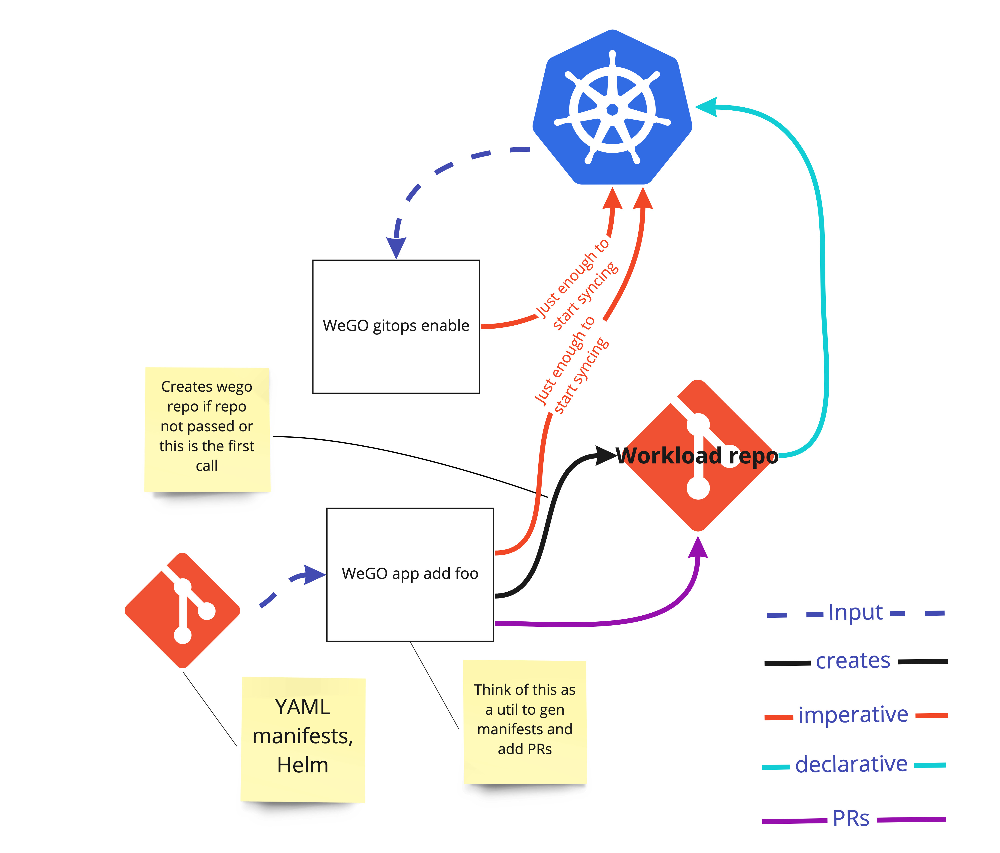
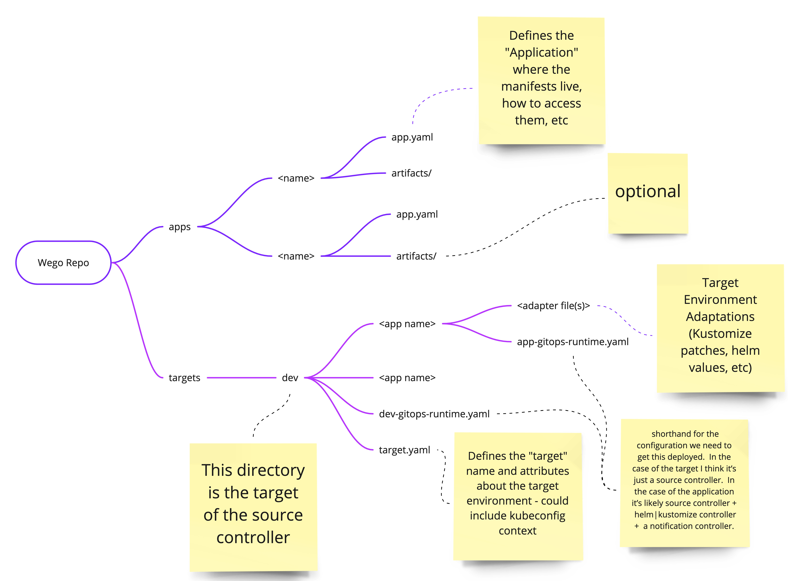

## WEP-001: Weave GitOps Core, Phase 1
### Glossary 

*   **Adapter** - refers to the process of "adapting" an application for a specific target.  For example, combining a base configuration from the application folder with environment specific values needed for the target environment. This could be kustomize, helm values, and in the near future profile values.
*   **Application** - a workload that the GitOps runtime will deliver
*   **Application Repo** - a git repository that holds all the Kubernetes manifests in order to execute the application.  e.g., services, deployments, configmaps.
*   **Environment** - primarily used to describe a Kubernetes cluster.  Becomes more useful when we support a platform layer.  Current thinking is the environment + platform layer becomes a target.
*   **GitOps Runtime** - Consists of flux and all the tools in the GitOps toolkit.  i.e., kustomize controller, notification controller, image automation controller, etc.
*   **Infra Repo** - repo containing the GitOps runtime (Flux + WeGO manifests).  Output from `flux bootstrap` plus WeGO CRDs and controllers
*   **Target** - where the workload will be delivered - can be a Kubernetes cluster or a Team workspace
*   **Wego Repo** - repo containing resources for GitOpsing applications.  e.g., source resources, kustomization resources, helm resources.  Additionally, the wego repo can contain application manifests directly.  A user may choose to combine the infra repo and wego repo by taking the repo created in `wego install` and using that repo for `wego add` calls.

### Summary 

Build out phase 1 of the [Weave Gitops strategy][strat] that focuses on leveraging GitOps to deliver one or more Cloud Native applications to a Kubernetes cluster. The target user will be application operators with limited knowledge of GitOps and Flux.

Four commands will be created 


*   Add - used to configure an application for delivery to a cluster
*   Install - used to install the GitOps runtime into a cluster
*   Status - provide status information to the user about applications and the GitOps runtime
*   Version - provide version information for weave-gitops and the GitOps runtime

The results of these commands will reflect the opinions and best practices Weaveworks has for running applications on Kubernetes by leveraging GitOps. Whenever possible and practical, these opinions can be overridden by the end-user.  In the design details section, each command lists the opinions which will be overridable.

This will be developed in the open and become the foundation for Weave GitOps Teams and enterprise editions.

<!--

_Leaving in for the transfer from googledoc to markdown_

_[documentation style guide]: https://github.com/kubernetes/community/blob/master/contributors/guide/style-guide.md_

_-->


### Motivation 

Flux is a generic gitops toolkit that focuses on experienced engineers who understand GitOps and what it provides DevOps.  It has a modular design and can be assembled in multiple ways to accomplish your GitOps goals.  WeGO looks to reduce the experience required to get GitOps working for customers.  WeGO will be a packaging of the best practices and opinions of Weaveworks into an easy-to-use system.  We will favor convention over configuration to accelerate adoption and deployment.  In phase 1, this will amount to sensible defaults.

WeGO adds high level entities to GitOps so users are assembling these entities instead of the primitives provided by Flux.


#### Goals 


*   Simple on-ramp to GitOps from the leaders in GitOps
*   Free to use and get started
*   Telemetry, phone home (with a switch to disable)
*   Feature flags for experimental / alpha functionality
*   Flux2 packaging with opinions baked in
*   Support for Kubernetes manifests, helm charts, Kustomizations, and profiles
*   All operations are idempotent 


#### Non-Goals 

*   Parity with ArgoCD (we want to compete, but not copy)
*   Replacing some/any parts of WKP
*   Cluster bootstrapping
*   Replace flux
*    - but only due to this WEP only covering the CLI.  When we add the UI, we will require parity between the two.
*   The ability to perform all operations within a Kubernetes cluster without using the CL or UI.  i.e., using only WeGO operators.  All capabilities will have manifests but phase 1 will require some imperative calls.
    * **This will be one of the first areas addressed in the the next phase.  We will need the ablity to add applications without the UI or CLI. i.e., declaratively.** 
*   The ability to run on ARM architectures


#### Product documents 

PRFAQ/Lean Canvas/GitHub issue/ Jira issue

*   [WeGO breakdown notes][bd-notes]
*   [Miro board][miro-board] 
*   [Weave GitOps kickoff deck][kickoff-deck]
 


### Proposal 

Phase 1 of the core product will provide the following capabilities 

*   An idempotent CLI to install the GitOps runtime
*   An idempotent CLI to check the version of the CLI and inform the user if there is an update
    *   (updating WeGO will be covered in a future WEP)
*   An idempotent CLI to add an application for GitOps delivery
*   A CLI for displaying the status of an appplication and progress of the application within the GitOps pipeline (i.e. the application has been sync'd but no other actions have occurred)
*   A configuration file 
    *   Arguments to pass to Flux on bootstrap 
    *   Use of branches or commits directly to a git repository
    *   Branch naming pattern
    *   Logging level
    *   Directory structure


##### Story 1 

As an application operator, I would like to be able to put a helm release in the repository and have the software properly installed in my namespace in the cluster.


##### Story 2 

As an application dev, I want to use GitOps to deploy my application, which is a fairly significant application containing multiple microservices and persistent storage (the Weaveworks sock shop app is similar) so that I can learn about gitops and how I can leverage it for my applications.


##### Story 3 

As an app developer, I want to view the status of my application in the GitOps process so that when things go wrong with the GitOps deployment I have an idea where to look without immediately resorting to the logs.


#### Notes/Constraints/Caveats  


*   Supported Kubernetes versions only
*   GitHub and GitLab only - we won’t explicitly support (test) other Git providers such as BitBucket
*   Latest browsers only
*   Helm 3 only 
*   CLI on Linux and os/x
*   Manifest generation (pulumi, jsonnet, jk) not supported
*   Secrets managed outside weave-gitops for phase 1
*   X86 architecture only support (i.e., no arm support initially)


#### Risks and Mitigations 


*   We won’t be able to push secrets off from the initial version.  i.e. secrets won’t be GitOps automatically.  i.e., we won’t be installing SealedSecrets or leveraging SOPS


### Design Details 


#### Wego config 

Whenever possible, we will allow the user to override the default opinion(s) being used in commands.  To do this, wego will have a configuration file with parameters and default values in it.  This configuration file will also be stored in the cluster as a configmap.  The first wego command issued should create this config file.

This configuration will live in the Wego repo so that other users who might be running additional wego commands against the repo will be using the same configuration.  

Each target cluster will have this configmap installed in it.  However, in phase 1 there is only a single target cluster.

**Wego Install and Add**




_See original at [miro board][miro-orig] and the frame titled “WeGO Core phase 1 wep”_


#### Wego install 

This installs the GitOps runtime into an environment.  In this phase, we execute the flux bootstrap command with --verbose which prints the manifests necessary to install the GitOps runtime. Assuming the user has a cluster, and their kubeconfig is pointing to it, the user will execute 

```console
wego install | kubectl apply -f -
```

In addition to installing the GitOps runtime, install will add the WeGO CRDs.  We need the WeGO CRDs installed so users can `kubectl` the list of wego objects in their cluster.  Additionally, this will help the wego status command.   In phase one, this will consist of the WeGOApp CRD.  See WeGO App Definition in the WeGO Add section for additional details. 

When a user issues this command, an entry is made into the checkpoint SaaS service which provides us metrics on usage.  Wksctl control does this today and we will need similar data in our readme.  [Wksctl faq on checkpoint][wksctl-faq]


##### Opinions 

*   Adding the gitops runtime manifests is performed in an imperative manner.  We won’t create an Infra Repo to house those manifests. We believe most customers will want to store the infrastructure manifests separately from application manifests
    *   This may be overridden by setting infraRepo=true in the wego config file.  However, being able to override this in phase 1 is not required...


#### Wego add

See Wego Install and Add

This command is used to configure the GitOps runtime to deliver an application to a cluster.

The user starts with an existing application repo containing Kubernetes manifests.  The user also has a Kubernetes cluster configured with the GitOps runtime i.e., has issued `wego install` against it.  If this is the first time running add for this cluster, wego add will 

1. create a git repo with the structure identified in [Wego Directory Structure](#wego-directory-structure)
    1. The user may provide a repo for use as the wego repo.  This is important for environments (like Weaveworks) that restrict repo creation.  In this instance, we will add a wego top-level directory and a cluster name underneath which will house this information.
2. create a branch for these changes
    2. Using a branch is the default behavior for wego.  This will be configurable in the config file.  Users might want to configure wego to push directly to the main branch so they don’t have to go through a PR review cycle.  Application developers running wego against a local k8s cluster likely won’t need the overhead.
    3. generate an app.yaml file to capture the application metadata.  See Wego application
    4. generate a source and kustomize resources into the wego repository under the named target.  These will live in the &lt;targetname>-gitops-runtime.yaml file.  
    5. create an &lt;app name>-gitops-runtime.yaml file in the target/&lt;app name> directory containing the source, notification, helm, kustomize resources as necessary
    6. Commit changes to the branch
    7. Push to a git server (defined in Step 1) (will need to be defined in the gitops-runtime file 
    8. Create PR for branch (MR in GitLab)
3. Apply the target/&lt;target name>-gitops-runtime.yaml to the cluster
    9. Which is pointing at the main branch and therefore the application won’t be automatically deployed
4. When PR is approved and merged, gitops runtime from the previous step will deploy the &lt;app name>-gitops-runtime.yaml which will deliver the app to the cluster.
    10. If wego has been configured to commit to the main branch, this step will be unnecessary 
5. GitOps runtime engages to deliver the WeGOApp to the cluster

Additional `wego add` invocations using the same cluster and wego repo will 


1. _skipped_
2. create a branch for these changes
    1. Using a branch is the default behavior for wego.  This will be configurable in the config file.  Users might want to configure wego to push directly to the main branch so they don’t have to go through a PR review cycle.  Application developers running wego against a local k8s cluster likely won’t need the overhead.
    2. generate an app.yaml file to capture the application metadata.  See wego application
    3. create an &lt;app name>-gitops-runtime.yaml file in the target/&lt;app name> directory containing the source, notification, helm, kustomize controllers as necessary
    4. Commit changes to the branch
    5. Push to a git server (will need to be defined in the gitops-runtime file 
    6. Create PR for branch (MR in GitLab)
3. _Skipped_
4. When PR is approved and merged, gitops runtime from the previous step will deploy the &lt;app name>-gitops-runtime.yaml which will deliver the app to the cluster.
    7. If wego has been configured to commit to the main branch, this step will be unnecessary 
5. GitOps runtime engages to deliver the WeGOApp to the cluster

Similar to `wego install` add will interact with the checkpoint system to add metrics on usage.  One difference, `wego add` will inform the user if the version of wego they are using is out of date.


### Wego Directory Structure




_Original [https://miro.com/app/board/o9J_lTe0Pt0=/](https://miro.com/app/board/o9J_lTe0Pt0=/) see the “Phase 1 Alt Proposed Layout frame”_


**Wego Application**


```yaml
apiVersion: wego.weave.works/v1alpha1
kind: App
metadata:
 name: mywego
spec:
 path: /foo/bar
 gitURL: https://github.com/myorg/foo.git
```


The WegoApp custom resource will be used by the UI and an operator in future revisions.  


##### Opinions 


*   The default directory structure for the wego repo is depicted in [Wego Directory Structure](#wego-directory-structure)
*   The application manifests are contained under a single directory within the application repo.  
*   We will perform all git operations on a branch
*   The wego repo will be private 


#### Wego version 

This command will print the version of wego installed and the version of flux that will be utilized by wego install.

Similar to `wego install` add will interact with the checkpoint system to add metrics on usage.  One difference, `wego add` will inform the user if the version of wego they are using is out of date.


#### Wego status 

Wego status is used to inform the user about applications and the GitOps runtime.  The command will 


*   Inform the user if the correct CRD versions for wego are installed
*   Print the output of `flux check`
*   For each WegoApp
    *   Print the app name
    *   Show last sync time
        *   If it doesn’t have a sync time, is it awaiting the PR?
    *   Show the last 3 events since the last sync time that have a type of `warning` for the source, kustomize, or helm controller used in the delivery of this app.  
*   Inform the user if a newer version of wego is available 


##### Opinions 


*   none


### Installing wego itself 

Wego will be installed either via curl or homebrew. 


### Test Plan 

We will utilize a combination of unit tests and BDD tests at the integration level.  We will test against SaaS versions of the GitHub [https://github.com/](https://github.com/) and GitLab [https://about.gitlab.com/](https://about.gitlab.com/) servers. In a future phase, we will expand this to include enterprise or on-prem versions.

We will unit test all public interfaces in our go package code with a line coverage goal of 80%. 

All tests must be passing before merging into the main code line.

We will execute tests using GitHub actions.  

We will add nightly tests which will test the different permutations of environments.  E.g., Kubernetes 1.19, 1.20, EKS, GKE, GitLab, etc.


### Graduation Criteria 

When we have completed all 4 commands and have end 2 end integration tests passing, then this will be considered an Alpha release.

Alpha -> Beta

TBD - will consist of internal customer testing

Beta -> GA

TBD - will consist of external customer testing


### Upgrade / Downgrade Strategy 

Upgrade will be addressed in a later WEP.


### Version Skew Strategy 

We will address version skew when we address upgrade/downgrade.


### Production Readiness Review Questionnaire 

N/A


#### Feature Enablement and Rollback 

N/A


#### Rollout, Upgrade and Rollback Planning 

Release candidate builds will be made available occasionally throughout development.  We will have an official release at the completion of this work.


#### Monitoring Requirements 

N/A


#### Dependencies 


*   Flux v2


#### Scalability 

No specific requirements.


#### Troubleshooting 

Limited to the `wego status` call


### Implementation History 

Initial version


### Drawbacks 

None


### Alternatives 


*   WKP team workspaces
*   Argo
*   Updating WKP to include this functionality
*   Contributing core functionality into Flux

.

<!-- references -->
[strat]: https://docs.google.com/document/d/1_pAbjw0OuwxRRP-Dn4eCzQOxi0rAh5GQVD35jGe1UbI/edit?ts=60920081
[miro-orig]: https://miro.com/app/board/o9J_lNhvVGA=/
[wksctl-faq]: https://github.com/weaveworks/wksctl/blob/0184323ebc93df96544a1e3b55c84fbd3d292641/docs/faq.md#frequently-asked-questions
[bd-notes]: https://docs.google.com/document/d/1X9CkxwqhTLCcN1ATl_EE3ZSFLYI70odR1seXrHG-1Sw/edit?usp=sharing
[miro-board]: https://miro.com/app/board/o9J_lYUmbQI=/
[kickoff-deck]: https://docs.google.com/presentation/d/1LzHoQJnNoHWlgoHTSzuOwBwa4H1aftoREG5uDWmuJhg/edit?usp=sharing