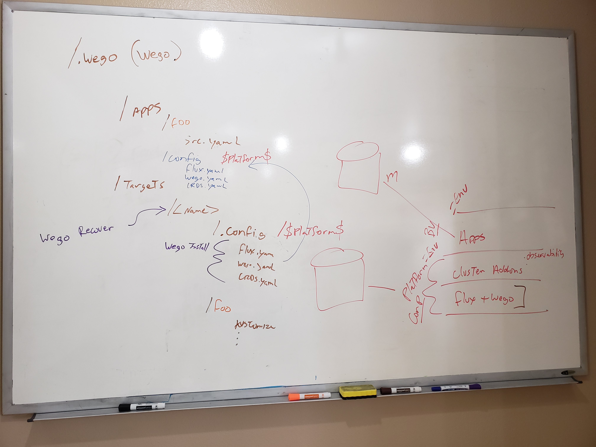
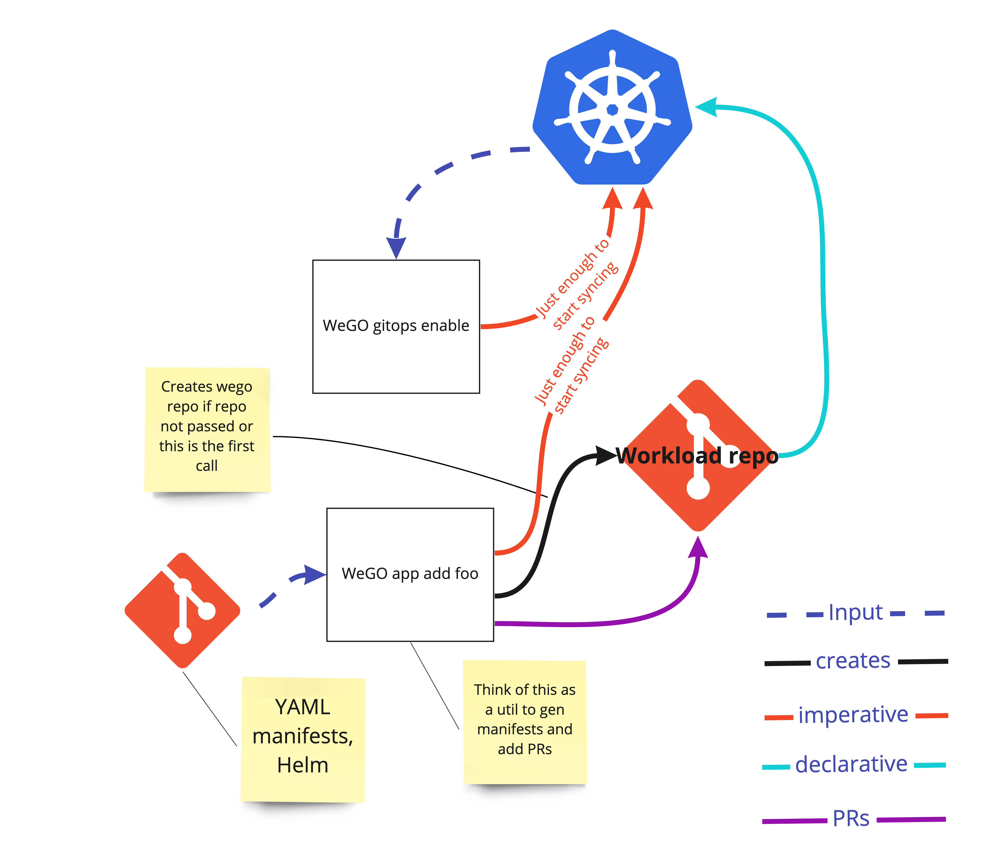
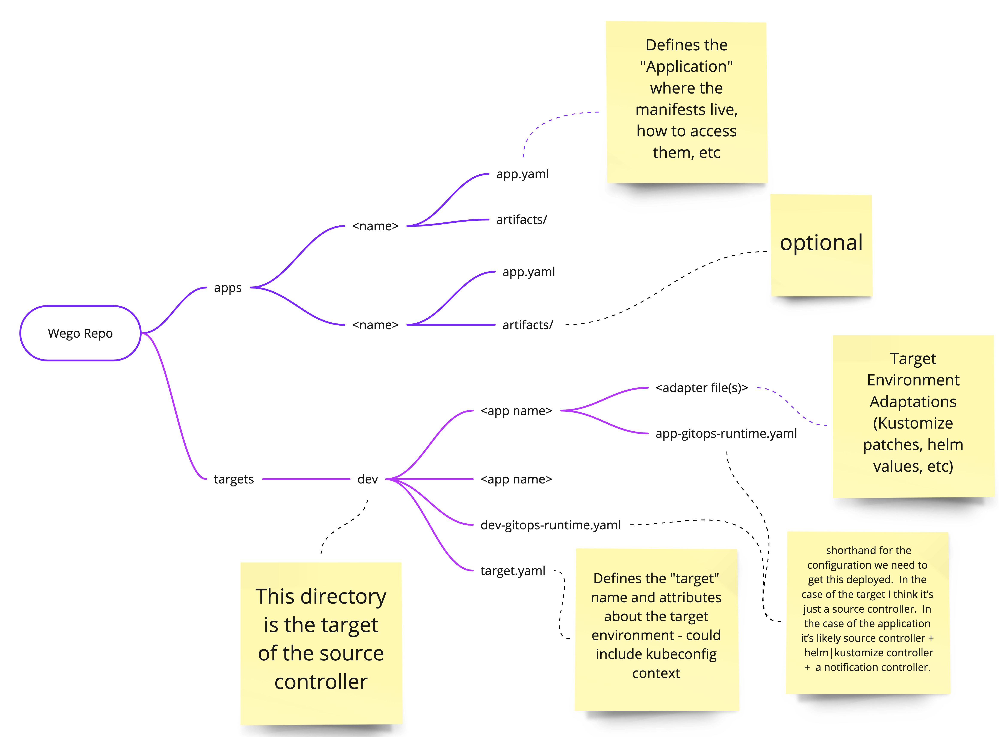

## WEP-002: Weave GitOps Recover
### Glossary 

*   **Adapter** - refers to the process of "adapting" an application for a specific target.  For example, combining a base configuration from the application folder with environment specific values needed for the target environment. This could be kustomize, helm values, and in the near future profile values.
*   **Application** - a workload that the GitOps runtime will deliver
*   **Application Repo** - a git repository that holds all the Kubernetes manifests in order to execute the application.  e.g., services, deployments, configmaps.
*   **Environment** - primarily used to describe a Kubernetes cluster.  Becomes more useful when we support a platform layer.  Current thinking is the environment + platform layer becomes a target.
*   **GitOps Automation** - The resources necessar to install workloads into a cluster. Abbreviated - **GOAT**
*   **GitOps Runtime** - Consists of flux and all the tools in the GitOps toolkit.  i.e., kustomize controller, notification controller, image automation controller, etc.  Abbreviated - **GORT**
*   **Git Ref** - A Git repo URL and optionally branch or tag
*   **Infra Repo** - repo containing the GitOps runtime (Flux + WeGO manifests).  Output from `flux install --export` plus WeGO CRDs and controllers
*   **Target** - where the workload will be delivered - can be a Kubernetes cluster or a Team workspace
*   **Wego Repo** - repo containing resources for GitOpsing applications.  e.g., source resources, kustomization resources, helm resources.  Additionally, the wego repo can contain application manifests directly.  A user may choose to combine the infra repo and wego repo by taking the repo used in `wego gitops enable` and using that repo for `wego app add` calls.

### Summary 

Adding to [Weave GitOps core][WEP-001] created, we need to provide the ability to recover the apps and the GitOps RunTime, or GORT.  In order to do this, we need to save the GORT in a repo and provide the ability to recover using the manifests from git and minimal imperative operations.  

We create a new command `recover` and update the install command to take a Git Ref


*   Recover - used to install the GORT and GOATs from Git Refs
*   Install - additional flags to identify where (git ref) to store the GORT

<!--

_Leaving in for the transfer from googledoc to markdown_

_[documentation style guide]: https://github.com/kubernetes/community/blob/master/contributors/guide/style-guide.md_

_-->


### Motivation 

We want a GitOps way to recover a cluster + workloads.

#### Goals 

*   A single command to re-create a cluster environment
*   Free to use and get started
*   Telemetry, phone home (with a switch to disable)
*   Feature flags for experimental / alpha functionality
*   Flux2 packaging with opinions baked in
*   Support for Kubernetes manifests, helm charts, Kustomizations, and profiles
*   All operations are idempotent 


#### Non-Goals 

*   Parity with ArgoCD (we want to compete, but not copy)
*   Replacing some/any parts of WKP
*   Cluster bootstrapping
*   Replace flux
*    - but only due to this WEP only covering the CLI.  When we add the UI, we will require parity between the two.
*   The ability to run on ARM architectures

#### Product documents 

PRFAQ/Lean Canvas/GitHub issue/ Jira issue

*   [Weave Gitops product documentation][wego-prod]

### Proposal 

Persist the GORT.  Update `install` to take a `--git-ref` flag.  When passed, we will create the directory structure identifed in [WeGO Core WEP][WKP-001] with the addition of an application named `$platform$` - which contains the manifests for the GORT.

Create `Recover` command, which will add a GOAT for the --git-ref *and* install the GORT manifests from the repo.  The GORT is required for GitOps, hence, recover will need to install it.

##### Story 1 

As an application operator, I want to recover my cluster workloads without having to run all the `wego` commands again.


##### Story 2 

As an platform operation, I want the ability to update the GORT of my clusters using PR so that I don't have to manually execute commands on each cluster.


##### Story 3 

As an app developer, I want to store my application GOAT in the same repo as the platform GORT so that I don't have repo sprawl

##### Story 4

As an platform operator, I want to separate the platform workloads and GORT from the application developers so that I can restrict who has access to the platform workloads.

#### Notes/Constraints/Caveats  

<hr>
LEFT OFF HERE
<hr>




*   Supported Kubernetes versions only
*   GitHub and GitLab only - we won’t explicitly support (test) other Git providers such as BitBucket
*   Latest browsers only
*   Helm 3 only 
*   CLI on Linux and os/x
*   Manifest generation (pulumi, jsonnet, jk) not supported
*   Secrets managed outside weave-gitops for phase 1
*   X86 architecture only support (i.e., no arm support initially)


#### Risks and Mitigations 


*   We won’t deal with secrets in the initial version.  i.e. secrets won’t be GitOps automatically.  i.e., we won’t be installing SealedSecrets or leveraging SOPS


### Design Details 


#### Wego config 

Whenever possible, we will allow the user to override the default opinion(s) used in commands.  To do this, wego will have a configuration file with parameters and default values in it.  This configuration file will also be stored in the cluster as a configmap.  The first wego command issued should create this config file.

This configuration will live in the Wego repo so that other users who might be running additional wego commands against the repo will be using the same configuration.  

Each target cluster will have this configmap installed in it.  However, in phase 1 there is only a single target cluster.

The configuration will live in the wego directory as a configmap manifest file.  There will be a single key `wego.properties` containing the configuration values.  In the future, this configmap will be mounted into wego pods.  We are mounting the configmap instead of using individual environment settings so we can dynamically react to updates to the configuration. For more details on mounting config maps see [Mounted configmaps][mounted-configmaps].

```yaml
apiVersion: v1
data:
  wego.properties: |
    foo=bar
    wego.repo=NONE
    infra.repo=NONE
    app.add.use_branches=false
kind: ConfigMap
metadata:
  creationTimestamp: null
  name: wego-config
```


**Wego gitops enable and Wego app add**




_See original at [miro board][miro-orig] and the frame titled “WeGO Core phase 1 wep”_


#### wego gitops enable 

This adds the GitOps runtime into an environment.  In this phase, we execute the `flux install` command to perform the installation of the GitOps runtime. Assuming the user has a cluster, and their kubeconfig is pointing to it, the user will execute 

```console
wego gitops enable
```

In addition to installing the GitOps runtime, `wego gitops enable` will add the WeGO CRDs.  We need the WeGO CRDs applied so users can `kubectl` the list of wego objects in their cluster.  Additionally, this will help the wego status command.   In phase one, this will consist of the WeGOApp CRD.  See WeGO App Definition in the Wego app add section for additional details. 

When a user issues this command, an entry is made into the checkpoint SaaS service which provides us metrics on usage.  Wksctl control does this today and we will need similar data in our readme.  [Wksctl faq on checkpoint][wksctl-faq]


##### Opinions 

*   Adding the gitops runtime manifests is performed in an imperative manner.  We won’t create an Infra Repo to house those manifests. We believe most customers will want to store the infrastructure manifests separately from application manifests
    *   This may be overridden by setting infraRepo=true in the wego config file.  However, being able to override this in phase 1 is not required...


#### Wego app add

See Wego gitops enable and Wego app add image

This command is used to configure the GitOps runtime to deliver an application to a cluster.

The user starts with an existing application repo containing Kubernetes manifests.  The user also has a Kubernetes cluster configured with the GitOps runtime i.e., has issued `wego gitops enable` against it.  If this is the first time adding an app to this cluster, `wego app add` will 

1. add a .wego directory to the App Repo with the structure identified in [Wego Directory Structure](#wego-directory-structure).  
    1. The user may choose to provide a repo for use as the wego repo.  This is important for environments (like Weaveworks) that restrict repo creation and for environments that want to keep application configuration independent of gitops automation.  In this instance, we will add a wego top-level directory and a cluster name underneath which will house this information.
    2. The user may also choose not to have us save the GitOps Automation into a repo by passing `none` as the wego repo url.  
2. create a branch for these changes (unless the user passes `none` as the wego repo)
    1. Using a branch is the default behavior for wego.  This will be configurable in the config file.  Users might want to configure wego to push directly to the main branch so they don’t have to go through a PR review cycle.  Application developers running wego against a local k8s cluster likely won’t need the overhead.
    2. generate an app.yaml file to capture the application metadata.  See Wego application
    3. generate source and kustomize resources into the wego repository under the named target.  These will live in the &lt;targetname&gt;-gitops-runtime.yaml file.  
    4. create an &lt;app name&gt;-gitops-runtime.yaml file in the target/&lt;app name&gt; directory containing the source, notification, helm, kustomize resources as necessary
    5. Commit changes to the branch
    6. Push to a git server (defined in Step 1) NB: will need to be defined in the gitops-runtime file 
    7. Create PR for branch (MR in GitLab)
3. Apply the target/&lt;target name&gt;-gitops-runtime.yaml to the cluster
    1. Which is pointing at the main branch and therefore the application won’t be automatically deployed
4. When PR is approved and merged, gitops runtime from the previous step will deploy the &lt;app name&gt;-gitops-runtime.yaml which will deliver the app to the cluster.
    1. If the user configured wego to commit to the main branch or specified `none` as the wego repo, this step will be unnecessary 
5. GitOps runtime engages to deliver the WeGOApp to the cluster

The operations against the GitServer will be performed using the users credentials from the machine where `wego app add` is executed.  In future phases, we will require SSH keys and/or API tokens stored as secrets within the cluster to perform these operations.

Additional `wego app add` invocations using the same cluster and wego repo will 


1. _skipped_
2. create a branch for these changes
    1. Using a branch is the default behavior for wego.  This will be configurable in the config file.  Users might want to configure wego to push directly to the main branch so they don’t have to go through a PR review cycle.  Application developers running wego against a local k8s cluster likely won’t need the overhead.
    2. generate an app.yaml file to capture the application metadata.  See wego application
    3. create an &lt;app name&gt;-gitops-runtime.yaml file in the target/&lt;app name&gt; directory containing the source, notification, helm, kustomize controllers as necessary
    4. Commit changes to the branch
    5. Push to a git server (will need to be defined in the gitops-runtime file 
    6. Create PR for branch (MR in GitLab)
3. _Skipped_
4. When PR is approved and merged, gitops runtime from the previous step will deploy the &lt;app name&gt;-gitops-runtime.yaml which will deliver the app to the cluster.
    7. If wego has been configured to commit to the main branch, this step will be unnecessary 
5. GitOps runtime engages to deliver the WeGOApp to the cluster

Similar to `wego gitops enable` add will interact with the checkpoint system to add metrics on usage.  One difference, `wego app add` will inform the user if the version of wego they are using is out of date.


### Wego Directory Structure




_Original [https://miro.com/app/board/o9J_lTe0Pt0=/](https://miro.com/app/board/o9J_lTe0Pt0=/) see the “Phase 1 Alt Proposed Layout frame”_


**Wego Application**


```yaml
apiVersion: wego.weave.works/v1alpha1
kind: App
metadata:
 name: mywego
spec:
 path: /foo/bar
 gitURL: https://github.com/myorg/foo.git
```


The WegoApp custom resource will be used by the UI and an operator in future revisions.  


##### Opinions 


*   If no wego repo is passed, the GitOps automation manifests will be put in the application repo
*   The application manifests are contained under a single directory within the application repo.  
*   We will perform all git operations on a branch
*   The wego repo will be private 


#### Wego version 

This command will print the version of wego installed and the version of flux that will be utilized by wego gitops enable.

Similar to `wego gitops enable` version will interact with the checkpoint system and inform the user if the version of wego they are using is out of date.


#### Wego app status 

Wego app status is used to inform the user about application(s).  The command will 

*   For each WegoApp
    *   Print the app name
    *   Show last sync time
        *   If it doesn’t have a sync time, is it awaiting the PR?
    *   Show the last 3 events since the last sync time that have a type of `warning` for the source, kustomize, or helm controller used in the delivery of this app.  
*   Inform the user if a newer version of wego is available 


##### Opinions 

*   none

#### Wego runtime status 

Wego runtime status is used to inform the user about applications and the GitOps runtime.  The command will 

*   Inform the user if the correct CRD versions for wego have been applied to the cluster
*   Print the output of `flux check`
*   Inform the user if a newer version of wego is available 


##### Opinions 

*   none


### Installing wego itself 

Wego CLI will be installed via curl.  Future versions may support other mechanisms such as yum or homebrew. 


### Test Plan 

We will utilize a combination of unit tests and BDD tests at the integration level.  We will test against SaaS versions of the GitHub [https://github.com/](https://github.com/) and GitLab [https://about.gitlab.com/](https://about.gitlab.com/) servers. In a future phase, we will expand this to include enterprise or on-prem versions.

We will unit test all public interfaces in our go package code with a line coverage goal of 80%. 

All tests must be passing before merging into the main code line.

We will execute tests using GitHub actions.  

We will add nightly tests which will test the different permutations of environments.  E.g., Kubernetes 1.19, 1.20, EKS, GKE, GitLab, etc.


### Graduation Criteria 

When we have completed all 4 commands and have end 2 end integration tests passing, then this will be considered an Alpha release.

Alpha -> Beta

TBD - will consist of internal customer testing

Beta -> GA

TBD - will consist of external customer testing


### Upgrade / Downgrade Strategy 

Upgrade will be addressed in a later WEP.


### Version Skew Strategy 

We will address version skew when we address upgrade/downgrade.


### Production Readiness Review Questionnaire 

N/A


#### Feature Enablement and Rollback 

N/A


#### Rollout, Upgrade and Rollback Planning 

Release candidate builds will be made available occasionally throughout development.  We will have an official release at the completion of this work.


#### Monitoring Requirements 

N/A


#### Dependencies 


*   Flux v2


#### Scalability 

No specific requirements.


#### Troubleshooting 

Limited to the `wego status` call


### Implementation History 

Initial version


### Drawbacks 

None


### Alternatives 


*   WKP team workspaces
*   Argo
*   Updating WKP to include this functionality
*   Contributing core functionality into Flux

.

<!-- references -->
[strat]: https://docs.google.com/document/d/1_pAbjw0OuwxRRP-Dn4eCzQOxi0rAh5GQVD35jGe1UbI/edit?ts=60920081
[miro-orig]: https://miro.com/app/board/o9J_lNhvVGA=/
[wksctl-faq]: https://github.com/weaveworks/wksctl/blob/0184323ebc93df96544a1e3b55c84fbd3d292641/docs/faq.md#frequently-asked-questions
[bd-notes]: https://docs.google.com/document/d/1X9CkxwqhTLCcN1ATl_EE3ZSFLYI70odR1seXrHG-1Sw/edit?usp=sharing
[miro-board]: https://miro.com/app/board/o9J_lYUmbQI=/
[kickoff-deck]: https://docs.google.com/presentation/d/1LzHoQJnNoHWlgoHTSzuOwBwa4H1aftoREG5uDWmuJhg/edit?usp=sharing
[mounted-configmaps]: https://kubernetes.io/docs/concepts/configuration/configmap/#mounted-configmaps-are-updated-automatically
[wep-001]: ./WEP-001-Weave-gitops-core.md
[wego-prod]: https://www.notion.so/weaveworks/Product-dfdc789ec38f42159c21bb056f0c6180